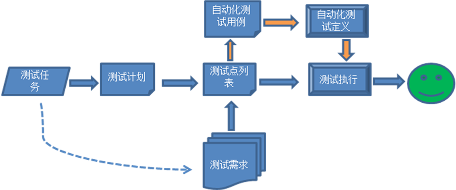
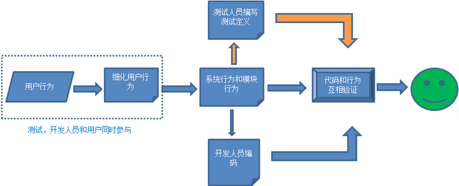
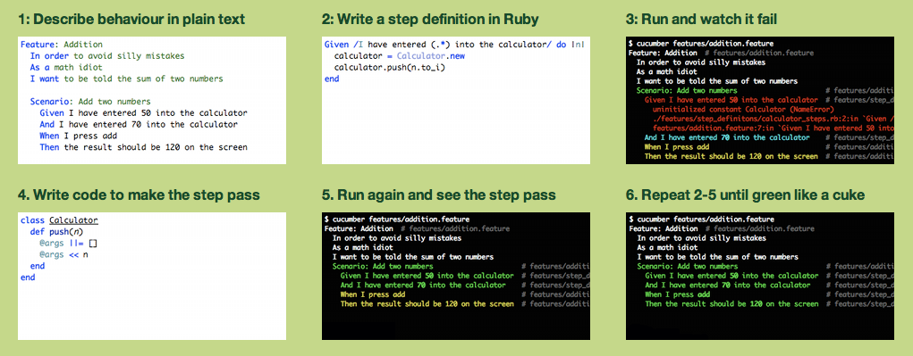
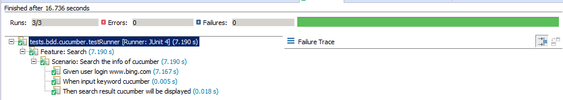
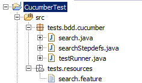
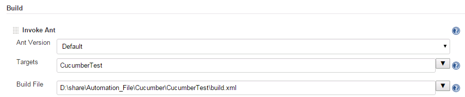
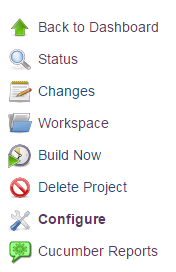
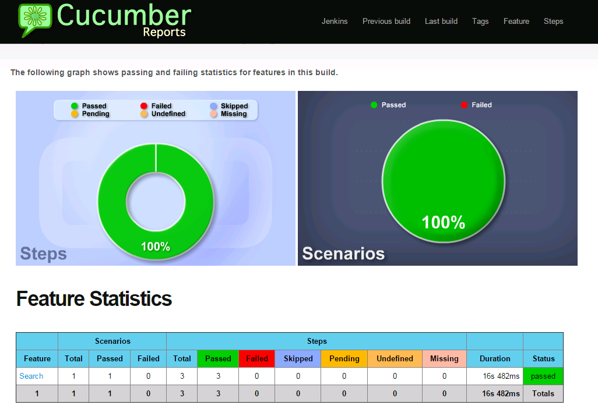

# 利用 Behavior Driven Development 技术加强软件自动化测试

转载：https://www.ibm.com/developerworks/cn/opensource/os-cn-bdd-web-ui-test/


## 软件自动化测试现状

自动化测试在软件测试领域一直在发展，随着 agile 思想在越来越多的项目组中推广，Continous Delivery (CD) 作为 agile 思想的重要组成部分，也被越来越多的项目组采纳并实施，在这个部署实施过程中，自动化测试在软件测试中占有越来越重要的地位，如何让我们的自动化测试能更快，更好的运作，一直是我们探索的目标。在实际的项目中，我们可能随时面对各种不同的需要，而这些也决定了我们采用什么样的开发模式。

### 开发模式

**TDD**

测试驱动开发（Test Driven Development）。它的想法来自于极限编程（Extreme Programming）。TDD 是 Agile 开发中的一项核心实践和技术，也是一种设计方法。引用 Wikipedia 上的关于 TDD 的介绍：

Test-driven development (TDD) is a software development process that relies on the repetition of a very short development cycle: first the developer writes an (initially failing) automated test case that defines a desired improvement or new function, then produces the minimum amount of code to pass that test, and finally refactors the new code to acceptable standards.

TDD 的基本思想是通过测试来推动整个开发的进行，但测试驱动开发并不只是单纯的测试工作，而是把需求分析，设计和质量控制量化的过程。TDD 简单的说就是：每写一段代码之前，先写一个单元测试；在单元测试可以运行并失败后，编写代码；待到代码可以使之前的测试通过后，编码完成；在保持测试通过情况下，重构代码。

**ATDD**

验收性测试驱动开发（Acceptance Test Driven Development）。这种开发模式是整个团队在开发工作之前，一起讨论、制定每个任务的验收标准，并提取测试用例。ATDD 是从 TDD 发展过来的，ATDD 就是为了解决 TDD 的一些缺点而出现。

因为 TDD 只涉及到开发人员，测试人员及业务经理。如果开发人员可能只完成了满足测试的代码却忽略实际需求的实现，那么将会造成开发人员写的测试用例是不够的也有可能是错误的。所以在 ATDD 中首先要求团队定义出期望的质量标准和验收细则，以明确而且达成共识的验收计划（报告测试用例）来驱动开发人员 TDD 实践和测试人员的测试脚本。

**BDD**

行为驱动开发（Behavior Driven Development）。它也是 Agile 开发的技术，引用 Wikipedia 上的关于 BDD 的介绍：

BDD is a second-generation, outside–in, pull-based, multiple-stakeholder, multiple-scale, high-automation, agile methodology. It describes a cycle of interactions with well-defined outputs, resulting in the delivery of working, tested software that matters.

这种开发模式也可以看作是对 TDD 的一种补充，它鼓励软件项目中的开发人员，测试人员和非技术人员或者客户之间的协作，从用户的需求出发，强调系统行为。在 TDD 中，我们并不能完全保证根据设计所编写的测试就是用户所期望的功能，用户并一定能看懂测试用例。BDD 将这一部分用更接近自然语言的形式来描述，让测试用例更自然化和简单，使开发人员，测试人员和客户能在这个基础上达成一致。

### TDD 与 BDD 的自动化测试比较

图 1 显示了在 TDD 技术下测试人员的测试过程，TDD 的测试要求的是单元测试，一般开发人员用什么语言，单元测试就用什么，基本上没有选择，在此其中，测试人员参与的机会不多，通常有了测试任务后，测试人员会将它分成测试计划，然后再细分成测试点列表，每一份测试列表可能又对应着一份自动化测试用例，所以这个阶段就需要保持三份文档： 需求文档 + 测试点文档（计划和测试点）+ 自动化测试用例，整个 TDD 的过程中，自动化测试用例的编写是在测试点列表出来之后。

##### 图 1. TDD 技术下的测试过程




与 TDD 侧重于针对单元测试不同，BDD 以用户的目标以及他们为了实现这些目标而采取的步骤为侧重点，BDD 将三种文档进行了整合，用户行为描述了用户与系统交互的场景，而系统行为描述系统提供的功能场景，模块行为描述模块间交互的场景，整个过程中只需要一份文档，用户行为也是用户需求，也是测试点文档和自动化测试用例，随着系统行为或模块的行为的实现，一系列的测试活动都已经自动化了。

##### 图 2. BDD 技术下的测试过程



[点击查看大图](#N10083)

## Cucumber 的工作原理

目前常用的 BDD 测试框架有 Ruby 中的 Cucumber，Python 中的 Behave，Lettuce 及 Freshen，.Net 中的 SpecFlow 等。

### Cucumber 初步认识

Cucumber 是 BDD 比较盛名的框架，它有着比较高的知名度，对于 Cucumber 的认识，首先一定是来到 Cucumber 的首页（http://cukes.info），在其首页上清楚写着“making BDD fun”还有特别显眼的六张图：

##### 图 3. Cucumber 首页的六张图



[点击查看大图](#N1009B)

用文字描述就是:

\1. 书写用户行为—>2. 步骤定义—>3. 运行测试失败—>4. 编写可以通过测试的实现—>5. 运行成功—>6. 继续 2-5 直到所有的测试完成

描述更加详细的话：

1.  定义用户的行为，也就是验收测试条件
2.  定义步骤
3.  执行验收测试，这时候因为步骤定义的内容没有实现所有测试失败
4.  书写步骤定义的内容，也就是实现产品代码
5.  运行验收测试，如果验收测试通过，产品代码通过
6.  反复执行 2-5 步，直到所有产品代码完成，整个验收测试也通过了

### Cucumber 的重要元素

Cucumber 可以使用文本表示语言来执行自动测试用例，使用的语言叫做 Gherkin。它可以描述包括：需求，系统设计和模块设计等所有行为，它可以作为自动化验收性测试，自动化系统测试和自动化集成测试的脚本。行为描述和步骤定义都是 Cucumber 程序很重要的部分，清楚并理解他们，对书写 Cucumber 程序有很大帮助。

**行为描述**

Cucumber 的用户行为描述在.feature 的文件中，这个文件通常有如下基本元素：

-  Feature，其大小相当于一个 Test Suite（测试用例集），一个 feature 代表一个功能。
-  Scenario，相当于 test case（测试用例）。
-  Step，包含 Given、When、Then、And 和 But 这些词组，尽管 Cucumber 本身在技术上不区分这三个词组，但在使用时推荐按照词组的意思来使用。

Given(给定) 是场景测试所需要的环境，相当于一个前置条件；

When(当) 是触发被测事件，类似点击事件等；

Then(则) 是验证结果，类似于平时用例中的验证步骤；

And（而且）如果存在多个 Given 操作，后面的 Given 可以用 And 替代；

But（但是）如果存在多个 Then 操作，第二个后面的 Then 可以用 But 替代。

这些元素与单元测试的概念相同，类比如下表所示。

##### 表 1. 类比表

| Cucumber | Unit Test  |
| -------- | ---------- |
| Feature  | Test Suite |
| Scenario | Test Case  |
| Given    | setup      |
| When     | test       |
| Then     | assert     |

在清单 1 中描述了一个 feature，但在这个 feature 中只描述了一个 scenario，并且描述了这个 scenario 的三个步骤。

##### 清单 1. 行为描述实例

```
Feature: Search
Background: There is a user want to search info in www.bing.com

Scenario: Search the info of cucumber
Given the user login www.bing.com
When input the keyword
Then the search result will be displayed
```

**步骤定义**

用户行为描述完成后开始进行步骤定义， 步骤定义的过程实际上就是用代码来描述各步骤应该执行什么样的动作，完整的步骤定义是一个函数，它包含：注解 (annotation)、函数名、参数和函数内容。在注解中通常包含有正则表达式，当有匹配值时，匹配值被自动提取出来作为参数传入代码，所有的匹配值都是以字符串的形式传递。比如下面的清单 2 中， ^是正则表达式中匹配字符串的开始，$是匹配字符串的结束，(.*) 代表匹配除换行符以外的任意字符，这个匹配值将会传递给函数参数。

##### 清单 2. 步骤定义实例

```
@When("^input keyword (.*)$")
public void input(String keyword){
result = search.find(keyword);
}
```

### Cucumber - jvm

Cucumber 默认是使用 Ruby 来编写步骤定义中的步骤，但是 Cucumber 通过 Cucumber-jvm 很好地支持了 jvm 平台上的各类语言，包括 Java、Scala、Clojure 等。因为我们所在的产品的代码是 Java，而直接用 Ruby 测试 Java 应用程序有很多不便，所以实际中我们使用的是 Cucumber 和 Java 的测试环境。

下载 Cucumber-jvm 相关 jar 包，可以通过 <http://search.maven.org/> 来下载。通常情况下我们需要下载如下 jar 包：

-  Cucumber-core.jar 核心包
-  Cucumber-java.jar 通过 java 编写需要下载这个包
-  Cucumber-html.jar 生成结果为 html 文件需要下载这个包
-  Cucumber-junit.jar 生成结果为 junit 格式需要这个包
-  Junit.jar 如果代码中使用 junit 相关的类就需要这个包
-  Gherkin 步骤定义时需要这个包

## 实例介绍 Cucumber-jvm project

我以用户登录 [www.bing.cn](http://www.bing.cn/) 并搜索 cucumber 为例子来介绍如何创建一个 Cucumber-jvm project。

首先需要准备好自己的 Eclipse 环境，并下载相应的 Cucumber-jvm 相关的 jar 包。

当环境准备好了之后，在 Eclipse 中建立好测试工程，开始 Cucumber-jvm project 的五个步骤。

### Describe Behavior

我将测试工程取名为 CucumberTest，并且在这个测试工程中建立一个 package (tests.resources) 存储所有的用户行为描述，本例新建一个名为 search.feature 的文件，存储内容如清单 3 所示。

##### 清单 3. search.feature 内容

```
Feature: Search
Background: There is a user want to search info in www.bing.com

Scenario: Search the info of cucumber``Given user login www.bing.com
When input keyword cucumber
Then search result cucumber will be displayed
```

### Step_Definition

有了用户行为描述后，开始进行步骤定义，在 project 再新建一个 package(tests.bdd.cucumber) 并在这个包下新建一个 class 文件，命名为 searchStepdefs.java，详细内容如清单 4 所示。上面的 search.feature 对应了三个 steps，所以在 step_definition 需要三个 method 与三个步骤对应。在第二和第三个步骤中需要输入参数，所以在步骤中用正则表达式来匹配值，这个匹配值可以作为 method 的参数使用，下面的 result() 中的 annotation 使用了匹配值，(.*) 代表匹配除换行符以外的任意字符，这个匹配值将传递给 expectedResult。

##### 清单 4. 三个步骤定义

```
public class searchStepdefs {
private search search = null;
private String result = null;
@Given("^user login www\\.bing\\.com$")
public void login(){
search = new search();
search.login();
}
@When("^input keyword (.*)$")
public void input(String keyword){
result = search.find(keyword);
}
@Then("^search result (.*) will be displayed$")
public void result(String expectedResult){
assertEquals((Object)expectedResult,(Object)result);
}
}
```

### Run

如果这时候想要运行 Cumcumber, 还需要一些简单的代码来驱动 Cucumber，这些驱动 Cucumber 的代码单独放在一个 class 文件中，命名为 testRunner.java，也放在 package(tests.bdd.cucumber) 中，详细内容如清单 5 所示。尽管这时候可以运行，但运行结果是不通过的，因为在 step definition 三个步骤中的对象都还没实现。

##### 清单 5. 驱动 Cucumber 代码

```
@RunWith(Cucumber.class)
@CucumberOptions(features="classpath:tests/resources",plugin=
{"pretty", "html:target/cucumber-html-report","json:target/cucumber-report.json"})
public class testRunner {

}
```

@RunWith 是告诉 Junit 用 Cucumber 的 Runner 来运行测试。

@CucumberOptions 中的 features 指定 features 文件的路径，该例中是的路径是 classpath 下的 tests/resources 目录；而 plugin 是指运行结果生成 html 文件和 json 文件，这个 plugin 不是必须设定的，我在这里设定 plugin option，是为了集成 Cucumber 和 Jenkins 做准备。

### Write Code

本例中我借助 Selenium2 来调用浏览器的接口，模拟用户输入，并读取浏览器页面上显示的内容用于验证结果。

首先需要在 Selenium 的官方网站上下载 Selenium2 的 jar 包，并添加到这个 project 的 build path 中，在 project 的 tests.bdd.cucumber 包下再新建一个 search.java，并实现步骤定义的 login() 和 find() 方法，详细内容如清单 6 所示。

##### 清单 6. 实现步骤定义内容

```
public class search {
public WebDriver driver;
public String baseUrl;

//Deploy the environment
public void setUp(){
driver = new FirefoxDriver();
baseUrl = "http://cn.bing.com";
driver.manage().timeouts().implicitlyWait(30, TimeUnit.SECONDS);
driver.manage().window().maximize();
}

//log in baseUrl
public void login() {
setUp();
driver.get(baseUrl);
}

//Clear existing content and input keyword to search
public String find(String keyword) {
String result = null;
WebElement element = null;

driver.findElement(By.id("sb_form_q")).clear();
driver.findElement(By.id("sb_form_q")).sendKeys(keyword);
driver.findElement(By.id("sb_form_go")).click();
driver.manage().timeouts().implicitlyWait(30, TimeUnit.SECONDS);
//If the result contains cucumber then return "cucumber",otherwise return null
element = driver.findElement(By.xpath("//strong[text()='cucumber']"));
if (element != null){
result = "cucumber";
}
logout();
return result;
}
public void logout(){
driver.quit();
}
}
```

### Run

所有代码书写完成后，再次运行 Cucumber 程序，当所有步骤通过时，这个测试就通过了。

##### 图 4. 最后运行结果



[点击查看大图](#N1018D)

最后，整个测试工程完成后的目录结构如图 5 所示。

##### 图 5. 测试工程目录结构



## 集成 Cucumber 和 Selenium 到 Jenkins

随着软件开发复杂度的不断提高，我们的团队开发成员必须经常集成他们的工作，甚至每天都可能发生多次集成，而每次的集成都是需要自动化的构建来验证，包括自动编译、发布和测试。Jenkins 是一个开源项目，提供了一种易于使用的持续集成系统，使开发者从繁杂的集成中解脱出来，专注于更为重要的业务逻辑实现上，同时 Jenkins 能提供详细的日志文件和提醒功能。依据集成的需要，Cucumber 程序的运行结果如果能在 Jenkins 中展现，自动化测试就会更方便。

本例中通过安装一个 cucumber-reports 的 plugin，来将 Cucumber 运行结果展现到 Jenkins 中实现 Cucumber 与 Jenkins 的集成，这样在 Jenkins 中就可以通过日志文件来查看每一次 Cumcumber 程序的运行结果。

### 为 CucumberTest 建立 build.xml

为了使 CucumberTest 这个 project 能在 Jenkins 通过触发 ant 自动运行，需要生成一个 build.xml 文件，可以在 CucumberTest 上单击右键选择 Export，再选择 Ant Buildfiles 来生成一个 build.xml。

### 下载和启动 Jenkins

打开 Jenkins 的官网 (http://jenkins-ci.org/)，在页面的右侧，点击下载最新版本的 Jenkins 的 war 包。下载完成后，在 command 中进入到 war 包所在目录，执行命令：

java -jar jenkins.war --httpPort=8888

待 Jenkins 启动后，打开浏览器输入地址：

http://localhost:8888/

便可以打开 Jenkins 的管理界面了。

### 安装 plugin

启动 Jenkins 后，在页面的左侧选择 Manage Jenkins，在 Manage Jenkins 中选择 Manage Plugins. 在 Available 选项卡找到 cucumber-reports，选择它并选择 install without restart。

### 配置 project

在 Jenkins 的主页面中选择 New Item，输入一个名字 Cucumber Project 并选择”Freestyle project”。在这个 project 的 Configure 里设置如下几项

Build: Add build stepInvoke Ant，将第一步生成的 build.xml 的文件路径填入 build File 中，如图 6 所示。

##### 图 6. Invoke Ant 设置



[点击查看大图](#N101D2)

Build：Add post-build action Publish cucumber results as a report，将 CucumberTest 运行后生成的 json 文件的路径填入 Json Reports Path 中，通常 json 文件的路径在 project 的 target 文件夹中，**注意这一步的前提是 testRunner.java 中为 @CucumberOptions 设置了 plugin 这个选项**。

##### 图 7. Json Reports path 设置


[点击查看大图](#N101E1)

单击 save 后，在页面左侧会出现一个 Cucumber Reports 的选项，Cucumber 测试的结果可以通过单击这个选项来看到结果。

##### 图 8. 单击 save 后的结果



### 在 Jenkins 中运行 CucumberTest

在页面左侧选择 Build Now 来执行运行 project，当所有程序执行完了之后，可以选择 Cucumber Reports 查看执行结果，通过 Cucumber Reports 可以看到 Scenario 中有几个 step 通过了，又有几个 step 没通过，通过上面的圆环图可以看出通过率是多少。

##### 图 9. Cucumber Reports



[点击查看大图](#N101FE)

## 结束语

本文通过对 BDD 以及 BDD 工具 Cucumber 的介绍，让读者对如何利用 BDD 技术加强自动化测试有了一个初步的了解，并进一步实例介绍集成 Cucumber 到流行的可持续框架 Jenkins 中，让用户能够很快上手，起到抛砖引玉的作用。如果读者需要对 BDD 以及 Cucumber 有更深入的了解，可以参考附录的资源。

------

#### 下载资源

- [示例代码](http://www.ibm.com/developerworks/apps/download/index.jsp?contentid=1017899&filename=CucumberTest.zip&method=http&locale=zh_CN) (CucumberTest.zip | 50.0k)

------

#### 相关主题

- [Cucumber 首页](https://cucumber.io/)，了解 Cucumber 的应用。
- [Selenium 首页](http://docs.seleniumhq.org/)，了解 Selenium 2 中的应用。
- [Jenkins 首页](http://jenkins-ci.org/)，了解和下载 Jenkins 的 war 包。
- [Automated testing with Selenium and Cucumber](http://www.ibm.com/developerworks/library/a-automating-ria/)，了解如何处理不同浏览器的测试。
- [行为驱动开发在 Python 开发测试中的应用](http://www.ibm.com/developerworks/cn/opensource/os-cn-BDDPython/index.html)，了解如何结合 Python 来实现 BDD。
- [developerWorks 开源技术主题](http://www.ibm.com/developerworks/cn/opensource/)：查找丰富的操作信息、工具和项目更新，帮助您掌握开源技术并将其用于 IBM 产品。 