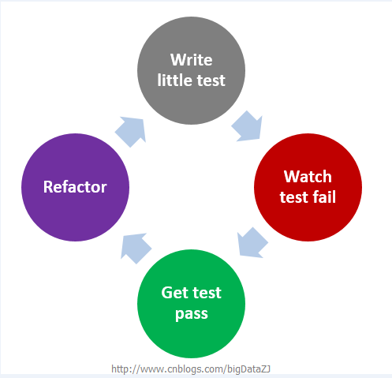
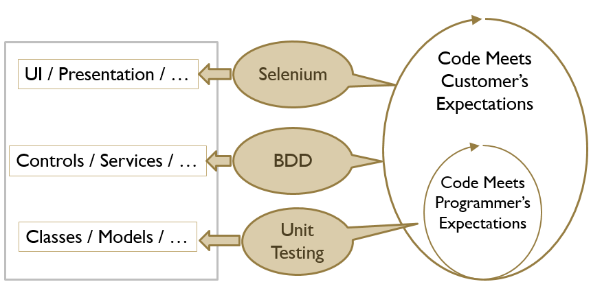
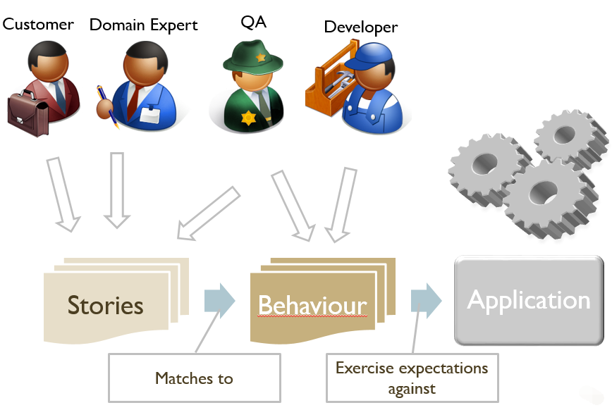

# 开发人员看测试之TDD和BDD

转载：[开发人员看测试之TDD和BDD](https://www.cnblogs.com/Leo_wl/p/4780678.html#_label0)


**前言：**

　　已经数月没有来园子了，写博客贵在坚持，一旦松懈了，断掉了，就很难再拾起来。但是每每看到自己博客里的博文的浏览量每天都在增加，都在无形当中给了我继续写博客的动力。最近这两天有听到Jbehave这个名词，上网查了一通，原来是和测试相关的，之前一直做开发，没有做过真正意义上的测试，对于测试的理解更是少之又少。通过这两天的查阅，现将自己的一些理解以及常见概念罗列出来。

 

**正文：**

　　**Behavior Driven Development**，**行为驱动开发**是一种**敏捷软件开发**的技术，它鼓励软件项目中的**开发者、QA和非技术人员或商业参与者**之间的协作。
在了解Behavior Driven Development之前，先介绍**Test-Driven Development(TDD)**即**测试驱动开发**，它是一种**测试先于编写代码**的思想用于指导软件开发。测试驱动开发是敏捷开发中的一项核心实践和技术，也是一种设计方法论。TDD的原理是在开发功能代码之前，先编写单元测试用例代码，测试代码确定需要编写什么产品代码。
它的工作流程如下所示：

 


**TDD方法的一些特点：**

- 有利于更加专注软件设计；
- 清晰地了解软件的需求；
- 很好的诠释了代码即文档。

 

**我眼中的测试**

　　之前一直对于测试都是一个笼统的认知，觉得测试仅仅是一种验证，类似于部分企业中一些比较省事的测试方法，通常在代码写好之后再实施测试工作，用于验证developer的代码是否符合需求。稍微了解TDD、BDD之后才发现，测试不仅仅是一种对于代码的验证，找出几个bug或者一些诸如压力测试、负载测试，更是一种**约束**，一种**规范**，是与项目需求息息相关，还需要沟通协调客户、开发人员以及QA，从而帮助更加高效的完成软件设计开发工作。

 

　　通过下面一幅图就可以发现对于测试也有不同的层次和流程：

 


　　从图中可以发现，最下面的是**单元测试**（**白盒测试**），主要用于测试开发人员编写的代码是否正确，这部分工作都是开发人员自己来做的。通常而言，一个单元测试是用于判断某个特定条件（或者场景）下某个特定函数的行为。再往上，就是**BDD**（**灰盒测试、黑盒测试**），主要用于测试代码是否符合客户的需求，这里的BDD更加侧重于代码的**功能逻辑**。

 

　　从左边的范畴也可以看出，测试的范围也是逐层扩大，从单元测试的类到BDD里面的服务、控制器等，再到最上层的模拟实际操作场景的Selenium（**Selenium**也是一个用于Web应用程序测试的工具。Selenium测试直接运行在浏览器中，就像真正的用户在操作一样。支持的浏览器包括IE(7、8、9)、Mozilla Firefox、Mozilla Suite等。）对于包括UI界面的测试。之前自己有做过这样的编码测试工作，通过写代码，可以打开IE、FF等浏览器，模拟用户点击、填写数据等操作，从而完成一整套的流程测试。整个测试从小到大，从函数、方法、类到功能模块乃至系统有着一系列严谨的体系。


**再说BDD**

　　BDD是一种敏捷软件开发的技术。它对TDD的理念进行了扩展，在**TDD中侧重点偏向开发**，通过测试用例来规范约束开发者编写出质量更高、bug更少的代码。而**BDD更加侧重设计**，其要求在设计测试用例的时候对系统进行定义，倡导使用通用的语言将系统的行为描述出来，将系统设计和测试用例结合起来，从而以此为驱动进行开发工作。

　　BDD的**通用语言**是一种近乎自然语言的描述软件的形式。传统的开发模式中，客户很难从技术层面理解问题，开发人员很难从业务需求考虑问题，基于这种通用语言形式可以尽可能的**避免客户和开发者在沟通上的障碍，实现客户和开发者同时定义系统的需求**。避免了因为理解需求不充分而带来的不必必要的工作量。

　　BDD描述的行为就像一个个的故事(**Story**)，系统业务专家、开发者、测试人员一起合作，分析软件的需求，然后将这些需求写成一个个的故事。开发者负责填充这些故事的内容，测试者负责检验这些故事的结果。通常，会使用一个故事的模板来对故事进行描述

　　Story：

```
 As a 角色
 I want 特征
 so that 利益
```

　　As a标识出这个系统行为是为哪一个角色而定义的。

　　I want和so that则指明了该角色想做的事， 以及想达到的目的。

　　这三个断句定义了这个系统行为的参与者、范围。

 

　　同样的一个Story，可能会有不同的场景。通过上面的模板描述了故事之后，再通过下面的模板对不同场景进行描述

　　**Scenario**:

```
Given [上下文]
	And [更多的上下文]
When [事件]
Then [结果]
	And [其他结果]
```

　　这些场景中的Given…When…Then…实际上就是设定该场景的状态、适用的事件，以及场景的执行结果。

　　其实通过这样的Story描述和场景设置，基本就完成了一个完整测试的定义。


　　BDD整个测试流程如图所示：

 


 

**常见的BDD框架：**

- C – Cspec
- C++ – CppSpec, Spec-CPP
- .Net – NBehave, NSpecify, SpecFlow
- Groovy – GSpec, easyb, Cuke4Duke
- PHP – PHPSpec
- Python – Specipy
- Ruby – RSpec, Shoulda, Cucumber

 

**与Java相关的BDD测试工具：**

- JBehave – Java annotations based, Test frameworks agnostic
- Cuke4duke – Cucumber support for JVM
- JDave – RSpec (Ruby) inspired, Mojo 2 & Hamcrest based
- beanSpec – Java based
- easyb – Java based, Specifications written in Groovy
- instinct – BDD framework for Java, providing annotations for contexts. Inspired by Rspec
- BDoc - Extracts behaviour from unit tests