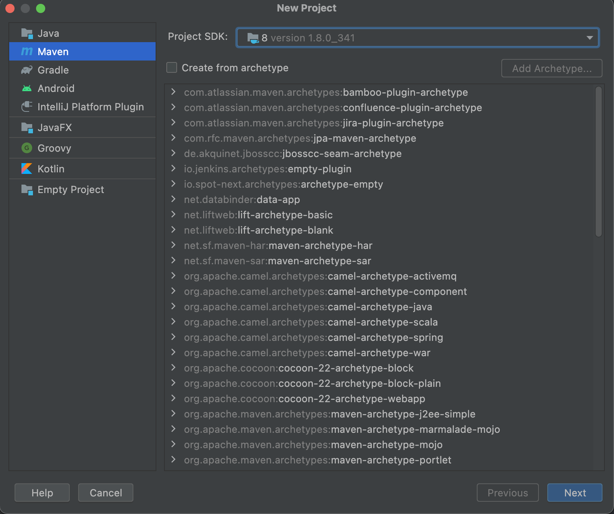
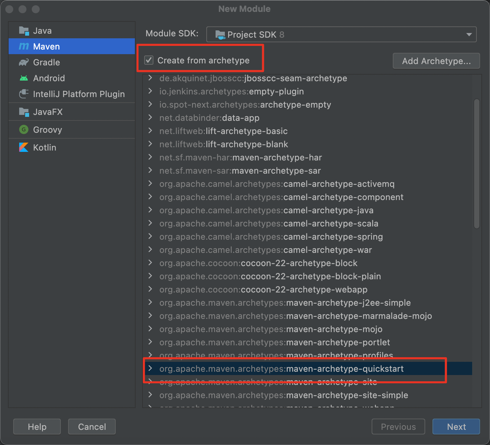
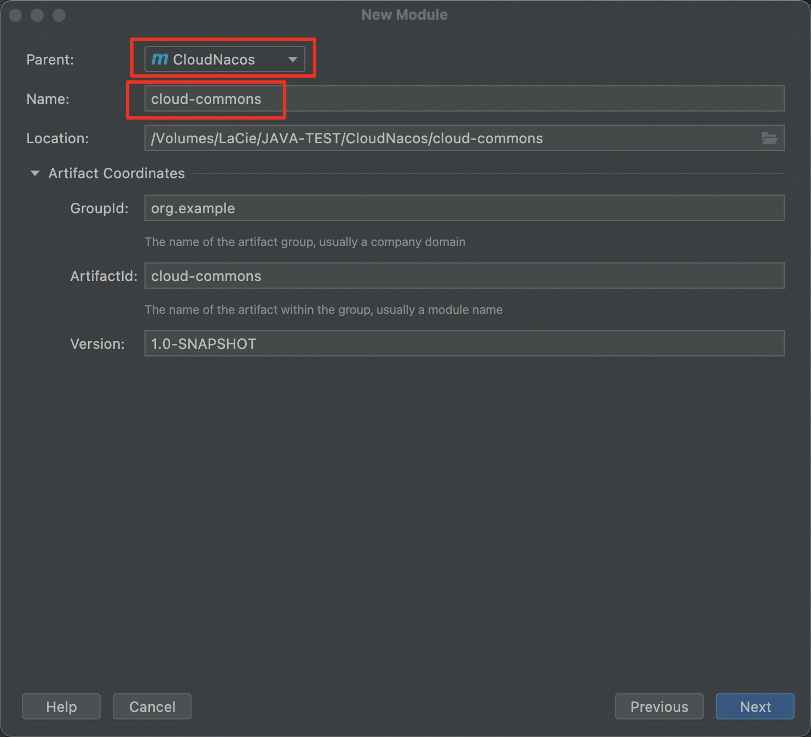
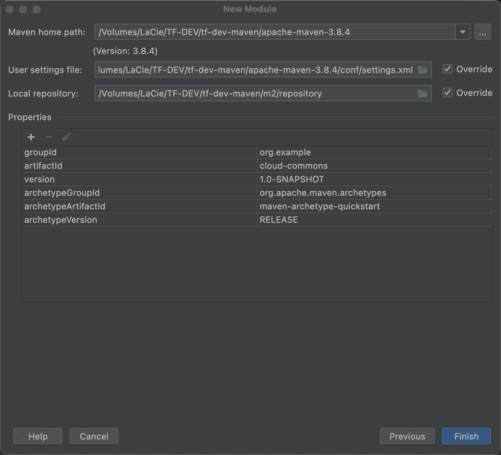
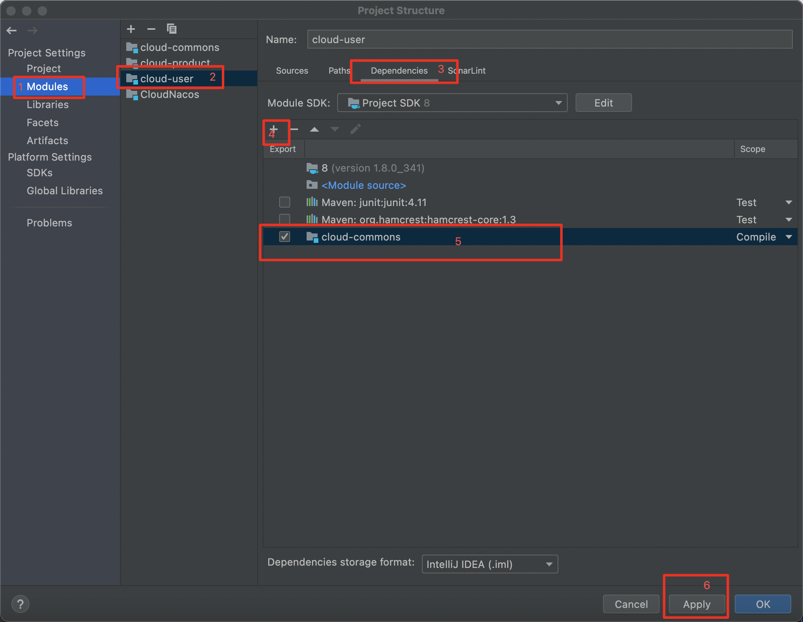
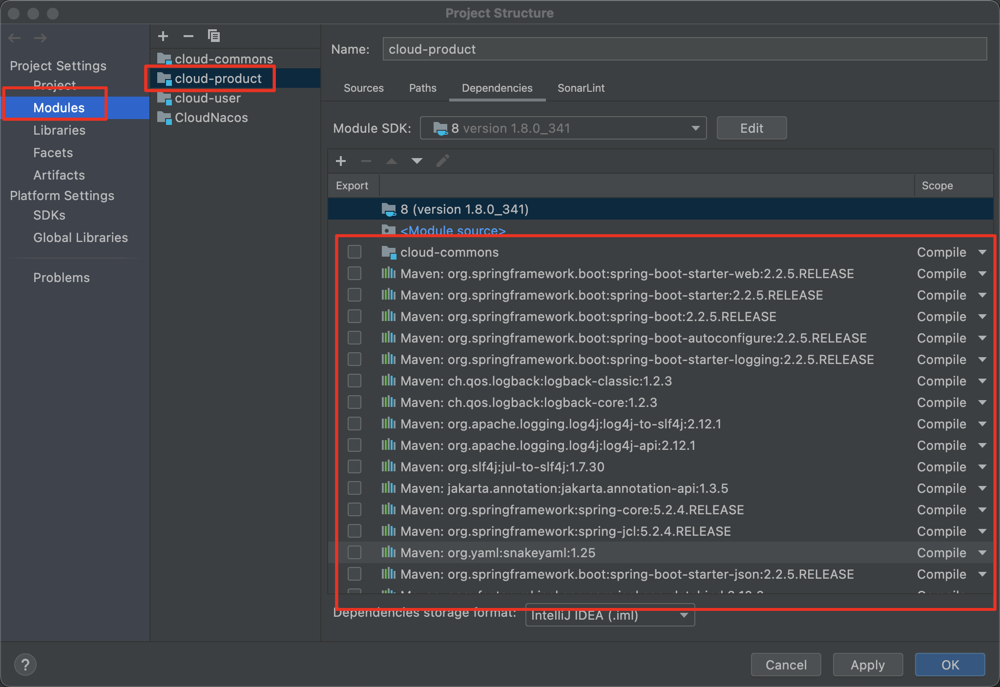
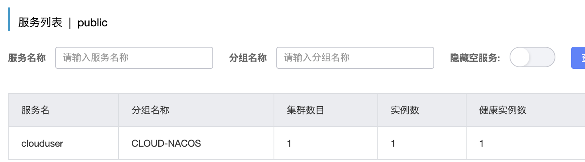
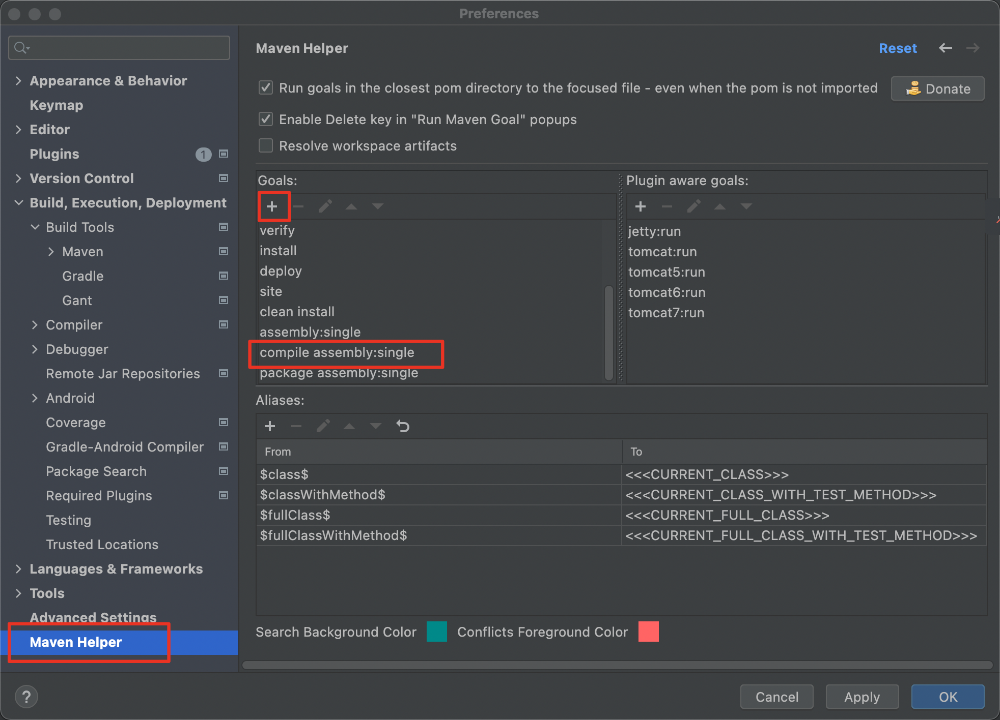

# idea新建Maven + Spring Cloud + Nacos项目

搭建的组件选型

注册中心&配置中心：Nacos

服务调用：OpenFeign

网关：gateway

流量哨兵（监控整个微服务，从流量控制，熔断降级，系统负载等多个维度保护服务）：sentinel

## IDEA安装Spring Assistant插件

Spring Assistant不确定对后面的项目搭建有影响，但建议还是先安装该插件。

菜单 preferences... 打开配置界面

点击 Plugins 页签选项，在 Marketplace 中搜索Spring Assistant插件并进行安装。

## 新建无骨架的Maven项目作为父项目

1、打开IDEA，点击New Project，在弹出的第一个界面选择JDK为1.8版本，直接点击next：



2、输入项目名称，存放的项目目录，以及Maven相关信息，然后点击Finish创建项目：


3、删除项目的src目录。

4、修改项目的pom.xml文件为以下内容：

```xml
<?xml version="1.0" encoding="UTF-8"?>
<project xmlns="http://maven.apache.org/POM/4.0.0"
         xmlns:xsi="http://www.w3.org/2001/XMLSchema-instance"
         xsi:schemaLocation="http://maven.apache.org/POM/4.0.0 http://maven.apache.org/xsd/maven-4.0.0.xsd">
    <modelVersion>4.0.0</modelVersion>

    <groupId>org.example</groupId>
    <artifactId>CloudNacos</artifactId>
    <version>1.0-SNAPSHOT</version>

    <!--集成springboot父项目-->
    <parent>
        <groupId>org.springframework.boot</groupId>
        <artifactId>spring-boot-starter-parent</artifactId>
        <version>2.2.5.RELEASE</version>
    </parent>

    <properties>
        <java.version>1.8</java.version>
        <spring.cloud.alibaba.version>2.2.1.RELEASE</spring.cloud.alibaba.version>
        <spring.cloud.version>Hoxton.SR6</spring.cloud.version>
    </properties>

    <!--全局引入下载依赖地址，并不会引入依赖-->
    <dependencyManagement>
        <dependencies>
            <!--阿里巴巴下载仓库-->
            <dependency>
                <groupId>com.alibaba.cloud</groupId>
                <artifactId>spring-cloud-alibaba-dependencies</artifactId>
                <version>${spring.cloud.alibaba.version}</version>
                <type>pom</type>
                <scope>import</scope>
            </dependency>
            <!--springcloud下载仓库-->
            <dependency>
                <groupId>org.springframework.cloud</groupId>
                <artifactId>spring-cloud-dependencies</artifactId>
                <version>${spring.cloud.version}</version>
                <type>pom</type>
                <scope>import</scope>
            </dependency>
        </dependencies>
    </dependencyManagement>

</project>
```

## 创建commons、user、product模块(Module)

commons模块主要是放置公共实体类以及公共工具类以及公共依赖，不需要启动类，以及test。

user和product用于演示服务代码。

1、在左侧树的父项目上点击右键，选择“New > Module...”，弹出的选项选择SDK 8，勾选“Create from archetype”，然后选择“maven-archetype-quickstart”，再点击next按钮：



2、选择模块的父项目，输入模块名称“cloud-commons”，然后点击next按钮：



3、最后是设置Maven的配置，基本按默认的就好，点击Finish按钮完成模块创建：



4、删除commons模块中src目录下的test目录（不做单元测试）；

5、修改commons模块中pom.xml文件的配置：

（1）删除 <dependencies> 下的 junit 的包依赖（不做单元测试）配置；

（2）在 project 根标签下添加父项目的指定：

```xml
   <!-- 父项目指定 -->
   <parent>
        <groupId>org.example</groupId>
        <artifactId>CloudNacos</artifactId>
        <version>1.0-SNAPSHOT</version>
    </parent>
```

6、按照commons模块的创建方法，将user和product模块也创建出来即可，模块名分别为cloud-user和cloud-product。

7、commons模块引入Nacos注册发现依赖 以及 springboot的web依赖，在其pom.xml文件的 <dependencies> 的标签下添加以下两个依赖包：

```xml
<!-- 引入springboot web -->
<dependency>
    <groupId>org.springframework.boot</groupId>
    <artifactId>spring-boot-starter-web</artifactId>
</dependency>
<!--nacos client-->
<dependency>
    <groupId>com.alibaba.cloud</groupId>
    <artifactId>spring-cloud-starter-alibaba-nacos-discovery</artifactId>
</dependency>
```

8、在user、product两个模块中引入commons模块，步骤如下：

（1）点击IDEA主菜单“File > Project Structure...”，按如下顺序选择和导入依赖的模块：



（2）同时在这个模块设置中，也请选择正确的可用SDK版本（根据实际需要选择版本即可）；

（3）在两个模块的pom.xml文件的的标签下添加以下依赖配置（将commons的包信息复制过来就好）：

```xml
    <!-- 引入commons包 -->
    <dependency>
      <groupId>org.example</groupId>
      <artifactId>cloud-commons</artifactId>
      <version>1.0-SNAPSHOT</version>
    </dependency>
```

9、导入依赖包到模块中（让代码可以自动提示，以及能编译正常），点击IDEA最右边的Maven页签（在最右侧竖边上），然后点击页签左上角的刷新按钮（Reload All Maven Projects），等待加载下载完成。此时重新打开主菜单“File > Project Structure...”，找到模块的Dependencies，看到已经引入了Spring的相关包：



## user & product模块框架设置

以user模块为例，user模块用于启动user服务，跟每个服务的开发流程一样，1 - 引入依赖（引入commons包或其他依赖包），2 - 写依赖包的配置，3 - 写启动类。

1、在模块下的 src/main 目录下，创建resources目录（在main目录上点击右键，然后菜单 New > Directory）；然后在resources目录上点击右键，在菜单中选择“Mark Directory as > Resources Root” （注：有可能创建目录后默认会设置为资源根目录，如果是这样则无需处理）；

2、在resources目录目录下创建application.yaml文件（在main目录上点击右键，然后菜单 New > File），并写入以下配置：

```yaml
# 监听服务配置
server:
  port: 6666

# Spring Boot配置
spring:
  application:
    name: clouduser  # 应用名
  cloud:
    # Nacos 的服务发现配置
    nacos:
      discovery:
        server-addr: 127.0.0.1:8848
        group: CLOUD-NACOS
    # 指定默认网络IP
    inetutils:
      preferred-networks: 127.0.0.1

#management:
#  endpoints:
#    web:
#      exposure:
#        include: '*'
```

3、修改 src/main/java/org.example 目录下的 App.java 文件，文件名修改为UserApplication（在文件名上点击右键，菜单 Refactor > Rename）；

4、编辑 src/main/java/org.example/UserApplication.java 文件，整体代码如下：

```java
package org.example;

import org.springframework.boot.SpringApplication;
import org.springframework.boot.autoconfigure.SpringBootApplication;
import org.springframework.cloud.client.discovery.EnableDiscoveryClient;

/**
 * Hello world!
 * @author lhj
 */

@SpringBootApplication
@EnableDiscoveryClient
public class UserApplication
{
    public static void main( String[] args )
    {
        SpringApplication.run(UserApplication.class, args);
    }
}
```

注：如果发现 org.springframework 的代码自动提示没有出来，有可能是因为所依赖的包还没有通过Maven下载完成，可以尝试做一次运行让IDEA自动获取对应的依赖包，方法是在UserApplication.java上点击右键，运行菜单Run ‘UserApplication.main()’，等待IDEA自动下载编译所需依赖包下载完成即可。

5、此时的user模块已可运行，先打开Nacos服务，然后在UserApplication.java上点击右键，运行菜单Run ‘UserApplication.main()’。等待服务启动完成后，就可以在Nacos看到注册的服务：



6、按照user模块的方式，把product模块的框架也设置完成。

application.yaml文件内容：

```yaml
# 监听服务配置
server:
  port: 6667

# Spring Boot配置
spring:
  application:
    name: cloudproduct  # 应用名
  cloud:
    # Nacos 的服务发现配置
    nacos:
      discovery:
        server-addr: 127.0.0.1:8848
        group: CLOUD-NACOS
    # 指定默认网络IP
    inetutils:
      preferred-networks: 127.0.0.1
```

ProductApplication.java代码：

```java
package org.example;

import org.springframework.boot.SpringApplication;
import org.springframework.boot.autoconfigure.SpringBootApplication;
import org.springframework.cloud.client.discovery.EnableDiscoveryClient;

/**
 * Hello world!
 * @author lhj
 */
@SpringBootApplication
@EnableDiscoveryClient
public class ProductApplication
{
    public static void main( String[] args )
    {
        SpringApplication.run(ProductApplication.class, args);
    }
}
```

## 引入OpenFeign实现服务调用

OpenFeign可以支持服务之间像本地函数一样简单的调用，我们同样把OpenFeign的依赖放到commons模块中，让user，product引用即可。

1、打开commons模块的pom.xml文件，在dependencies标签中增加以下引用配置：

```xml
<!-- openfeign -->
<dependency>
  <groupId>org.springframework.cloud</groupId>
  <artifactId>spring-cloud-starter-openfeign</artifactId>
</dependency>
```

2、点击IDEA最右边的Maven页签（在最右侧竖边上），然后点击页签左上角的刷新按钮（Reload All Maven Projects），等待加载下载完成。

## 开发product服务和user的客户端调用

### product服务端开发

1、在 /src/main/java/org/example 下创建 product.controller 和 product.service 包；

2、在 product.service 下新建 ProductService.java 类文件，该类实现具体的业务逻辑，代码如下：

```java
package org.example.product.service;

import org.springframework.stereotype.Service;

import java.util.Map;
import java.util.HashMap;

/**
 * @program: CloudNacos
 * @description: Service
 * @author:
 * @create: 2022-11-03 17:25
 **/
@Service
public class ProductService {
    /**
     * 获取产品清单
     * @return 产品清单
     */
    public Map<String, Object> getProductList() {
        Map<String, Object> productList = new HashMap<>();
        productList.put("product-a", new String[] { "Tom","Sam","Mimi"});
        productList.put("product-b", new String[] { "Tom-b","Sam-b","Mimi-b"});
        productList.put("product-c", new String[] { "Tom-c","Sam-c","Mimi-c"});
        return productList;
    }

    /**
     * 查询产品信息
     * @param productId
     * @return
     */
    public String[] getProductInfo(String productId) {
        if ("product-a".equals(productId)) {
            return new String[] { "Tom","Sam","Mimi"};
        } else if ("product-b".equals(productId)) {
            return new String[] { "Tom-b","Sam-b","Mimi-b"};
        } else {
            return new String[] { "Tom-c","Sam-c","Mimi-c"};
        }
    }
}
```

3、在 product.controller 包下新建 ProductController.java 类文件，该类主要实现接口的控制层入口和接口转换、数据整合处理，真实的数据和业务处理来自service层提供的服务，代码如下：

```java
package org.example.product.controller;

import org.example.product.service.ProductService;
import org.springframework.beans.factory.annotation.Autowired;
import org.springframework.beans.factory.annotation.Value;
import org.springframework.web.bind.annotation.GetMapping;
import org.springframework.web.bind.annotation.RequestParam;
import org.springframework.web.bind.annotation.RestController;

import java.util.HashMap;
import java.util.Map;

/**
 * @program: CloudNacos
 * @description: controller
 * @author:
 * @create: 2022-11-03 17:11
 **/
@RestController
public class ProductController {

    @Autowired
    private ProductService productService;

    @Value("${server.port}")
    private String port;

    @GetMapping("/product/getProductList")
    public Map<String, Object> getProductList() {
        Map<String, Object> list = productService.getProductList();
        list.put("服务端口号", port);
        return list;
    }

    @GetMapping("/product/getProductInfo")
    public Map<String, Object> getProductInfo(@RequestParam("productId") String productId) {
        Map<String, Object> resp = new HashMap<>();
        String [] info = productService.getProductInfo(productId);
        resp.put("服务端口号", port);
        resp.put("info", info);
        return resp;
    }
}
```

注意：带有参数传递的接口，要通过@RequestParam等注解指定参数传递的方式；否则客户端调用可能会存在不匹配的问题。

4、修改 src/main/java/org/example/ProductApplication.java 代码，在ProductApplication 类定义增加组件扫描注解

```
...
// 添加以下组件扫描注解
@ComponentScan({ "org.example.product.controller", "org.example.product.service"})
public class ProductApplication
{
    ...
}
```

5、以上操作为产品服务添加了2个服务接口，getProductList和getProductInfo，启动服务以后，就可以被外部访问。我们使用linux的curl命令调用接口进行验证（通过浏览器无法打开）：

```shell
curl http://127.0.0.1:6667/product/getProductList
# 返回数据：
{"product-b":["Tom-b","Sam-b","Mimi-b"],"product-c":["Tom-c","Sam-c","Mimi-c"],"服务端口号":"6667","product-a":["Tom","Sam","Mimi"]}%  


curl -G -d 'productId=product-b' http://127.0.0.1:6667/product/getProductInfo
# 返回数据
{"服务端口号":"6667","info":["Tom-b","Sam-b","Mimi-b"]}% 
```

### user客户端调用的开发

1、在 /src/main/java/org/example 下创建 controller 和 client 包；

2、在 client 下新建 ProductClient.java 接口文件，该类实现FeignClient调用product服务的接口，代码如下：

```java
package org.example.client;

import org.springframework.cloud.openfeign.FeignClient;
import org.springframework.web.bind.annotation.GetMapping;
import org.springframework.web.bind.annotation.RequestParam;

import java.util.Map;

/**
 * @program: CloudNacos
 * @description: Product调用客户端
 * @author:
 * @create: 2022-11-03 19:21
 **/
@FeignClient("cloudproduct")
public interface ProductClient {

    @GetMapping("/product/getProductList")
    public Map<String, Object> getProductList();

    @GetMapping("/product/getProductInfo")
    public Map<String, Object> getProductInfo(@RequestParam("productId") String productId);
}
```

3、在 controller 下新建 UserController.java 类文件，实现user服务自己的接口服务，该接口服务调用product的远程服务，并将接口返回，代码如下：

```java
package org.example.controller;

import org.example.client.ProductClient;
import org.springframework.beans.factory.annotation.Autowired;
import org.springframework.beans.factory.annotation.Value;
import org.springframework.stereotype.Controller;
import org.springframework.web.bind.annotation.RequestBody;
import org.springframework.web.bind.annotation.RequestMapping;
import org.springframework.web.bind.annotation.ResponseBody;
import org.springframework.web.bind.annotation.RestController;

import java.util.HashMap;
import java.util.Map;

/**
 * @program: CloudNacos
 * @description: User服务
 * @author:
 * @create: 2022-11-03 19:27
 **/
@Controller
@ResponseBody
public class UserController {
    @Autowired
    private ProductClient productClient;

    @Value("${server.port}")
    private String port;

    @RequestMapping("/user/getProductList")
    public Map<String, Object> getProductList() {
        Map<String, Object> list = productClient.getProductList();
        list.put("from", "user");
        return list;
    }

    @RequestMapping("/user/getProductInfo")
    public Map<String, Object> getProductInfo(String productId) {
        Map<String, Object> info = productClient.getProductInfo(productId);
        info.put("from", "user");
        return info;
    }
}
```

4、启动product和user两个服务，通过curl调用user的服务，执行远程调用：

```shell
curl http://127.0.0.1:6666/user/getProductList
# 返回数据：
{"product-b":["Tom-b","Sam-b","Mimi-b"],"product-c":["Tom-c","Sam-c","Mimi-c"],"服务端口号":"6667","product-a":["Tom","Sam","Mimi"],"from":"user"}% 


curl -G -d 'productId=product-b' http://127.0.0.1:6666/user/getProductInfo
# 返回数据
{"服务端口号":"6667","info":["Tom-b","Sam-b","Mimi-b"],"from":"user"}%
```

# 进阶1：打包分离依赖包

idea默认的打包方式是将所有依赖包一期打包到一个jar文件中，这样文件的体积很大，不利于修改后上传到服务器，同时修改配置也比较麻烦。

可以在打包时将依赖包和主程序包分离，这样当仅修改主程序包且未修改依赖和配置的情况下，可以只传主程序包进行部署。

下面用product服务作为示例：

1、编译分离依赖的主程序包

（1）编译分离的主程序包使用 maven-jar-plugin 插件，修改product模块下的pom.xml文件，修改maven-jar-plugin的配置如下：

```xml
      <plugin>
          <artifactId>maven-jar-plugin</artifactId>
          <version>3.0.2</version>
          <!-- start 分离配置文件和依赖包的打包配置, 使用 maven package 打包 -->
          <configuration>
            <archive>
              <!-- 生成的jar中，不要包含pom.xml和pom.properties这两个文件 -->
              <addMavenDescriptor>false</addMavenDescriptor>
              <manifest>
                <addClasspath>true</addClasspath>
                <!-- MANIFEST.MF 中 Class-Path 加入前缀 -->
                <classpathPrefix>lib/</classpathPrefix>
                <!-- jar包不包含唯一版本标识 -->
                <useUniqueVersions>false</useUniqueVersions>
                <!-- 指定入口类 -->
                <mainClass>org.example.ProductApplication</mainClass>
              </manifest>
            </archive>
            <outputDirectory>${project.build.directory}</outputDirectory>
          </configuration>
          <!-- end 分离配置文件和依赖包的打包配置, 使用 maven package 打包 -->
        </plugin>
```

（2）在pom.xml文件上点击右键，选择 “Run Maven > package” 进行编译，最终生成不含依赖包的单个jar包（仅5k大小）：cloud-product-1.0-SNAPSHOT.jar

2、使用maven-assembly-plugin插件进行依赖包和配置的打包处理

（1）在product模块的 src/main 下创建assembly目录，并在该目录下创建assembly.xml打包配置文件，文件内容如下：

```xml
<assembly xmlns="http://maven.apache.org/plugins/maven-assembly-plugin/assembly/1.1.2"
          xmlns:xsi="http://www.w3.org/2001/XMLSchema-instance"
          xsi:schemaLocation="http://maven.apache.org/plugins/maven-assembly-plugin/assembly/1.1.2 http://maven.apache.org/xsd/assembly-1.1.2.xsd">
    <!--
        必须写，否则打包时会有 assembly ID must be present and non-empty 错误
        这个名字最终会追加到打包的名字的末尾，如项目的名字为 speed-api-0.0.1-SNAPSHOT,
        则最终生成的包名为 speed-api-0.0.1-SNAPSHOT-bin.zip
     -->
    <id>bin</id>
    <!-- 打包后的文件格式,可以是zip,tar,tar.gz,tar.bz2,jar,war,dir -->
    <formats>
        <!-- 指定目录形式, 不压缩 -->
        <format>dir</format>
    </formats>
    <!-- 压缩包下是否生成和项目名相同的根目录 -->
    <includeBaseDirectory>false</includeBaseDirectory>
    <dependencySets>
        <dependencySet>
            <!-- 不使用项目的artifact，第三方jar不要解压，打包进zip文件的lib目录 -->
            <useProjectArtifact>false</useProjectArtifact>
            <outputDirectory>lib</outputDirectory>
            <unpack>false</unpack>
        </dependencySet>
    </dependencySets>
    <fileSets>
        <!-- 把项目相关的说明文件，打包进zip文件的根目录 -->
        <fileSet>
            <directory>${project.basedir}</directory>
            <outputDirectory></outputDirectory>
            <includes>
                <include>README*</include>
                <include>LICENSE*</include>
                <include>NOTICE*</include>
            </includes>
        </fileSet>
        <!-- 把项目的配置文件，打包进zip文件的config目录 -->
        <fileSet>
            <directory>${project.basedir}/src/main/resources</directory>
            <outputDirectory>config</outputDirectory>
        </fileSet>
        <!-- 把项目的脚本文件，打包进zip文件的bin目录
        <fileSet>
            <directory>${project.basedir}/src/main/bin</directory>
            <outputDirectory>bin</outputDirectory>
        </fileSet>
        -->
        <!-- 把项目自己编译出来的jar文件，打包进zip文件的根目录 -->
        <fileSet>
            <directory>${project.build.directory}</directory>
            <outputDirectory></outputDirectory>
            <includes>
                <include>*.jar</include>
            </includes>
        </fileSet>
    </fileSets>
</assembly>
```

（2）修改product模块下的pom.xml文件，添加maven-assembly-plugin的配置如下：

```xml
<!-- 使用assembly打包 -->
        <plugin>
          <groupId>org.apache.maven.plugins</groupId>
          <artifactId>maven-assembly-plugin</artifactId>
          <configuration>
            <descriptors>
              <!-- assembly配置文件位置 -->
              <descriptor>src/main/resources/assembly.xml</descriptor>
            </descriptors>
          </configuration>
          <executions>
            <execution>
              <id>make-assembly</id>
              <phase>package</phase>
              <goals>
                <goal>single</goal>
              </goals>
            </execution>
          </executions>
        </plugin>
```

（3）在pom.xml文件上点击鼠标右键，点击菜单“ Run Maven > New Goal...”，添加"assembly:single"（打包），同样的操作添加“package assembly:single” （编译加打包）；

（4）在pom.xml文件上点击鼠标右键，点击菜单“ Run Maven > assembly:single “，IDEA会自动下载maven-assembly-plugin插件的相关依赖。

（5）后续只要执行 “package assembly:single” 就可以自动编译并进行打包处理了。

3、启动项目进行验证

打包后的程序在target目录下的 cloud-product-1.0-SNAPSHOT-bin 文件夹，其中配置文件在config目录下，依赖包在lib目录下。我们可以修改config目录下的配置文件，把端口号修改为6668，来看最终配置是否生效。

可以运行以下命令进行启动（通过 -Dloader.path=lib/ 参数加载依赖包）：

```shell
cd /Volumes/LaCie/JAVA-TEST/CloudNacos/cloud-product/target/cloud-product-1.0-SNAPSHOT-bin

java -Dloader.path=lib/ -jar cloud-product-1.0-SNAPSHOT.jar
```

验证服务是否正常：

```shell
curl http://127.0.0.1:6668/product/getProductList
# 得到输出
{"product-b":["Tom-b","Sam-b","Mimi-b"],"product-c":["Tom-c","Sam-c","Mimi-c"],"服务端口号":"6668","product-a":["Tom","Sam","Mimi"]}% 
```

# 进阶2：包含依赖包打包为一个可执行jar

进行进阶1的操作后，不知道为什么没有设置maven-assembly-plugin和maven-jar-plugin的模块也没有办法直接打包成一个jar，需要进行设置，方法如下：

1、在项目或模块上创建 src/main/resources/assembly.xml 打包配置文件，内容如下：

```xml
<assembly>
    <id>bin</id><!-- 配置文件的标识，同时生成的jar包名字会把这个文本包含进去 -->
    <formats>
        <format>jar</format><!-- 打包类型，此处为jar -->
    </formats>
    <includeBaseDirectory>false</includeBaseDirectory>
    <dependencySets>
        <dependencySet>
            <unpack>false</unpack><!-- 是否解压 -->
            <scope>runtime</scope>
        </dependencySet>
    </dependencySets>
    <fileSets>
        <fileSet>
            <directory>${project.build.outputDirectory}</directory>
            <outputDirectory>/</outputDirectory>
        </fileSet>
    </fileSets>
</assembly>
```

2、修改项目的pom.xml文件，增加或修改maven-assembly-plugin配置如下：

```xml
<!-- 配置打包依赖到一个jar中 -->
<plugin>
  <groupId>org.apache.maven.plugins</groupId>
  <artifactId>maven-assembly-plugin</artifactId>
  <configuration>
     <appendAssemblyId>false</appendAssemblyId>
     <descriptorRefs>
        <descriptorRef>jar-with-dependencies</descriptorRef>
     </descriptorRefs>
     <archive>
        <manifest>
           <!-- <addClasspath>true</addClasspath> -->
           <!-- 指定启动类, 无启动类的情况可不设置 -->
           <!-- <mainClass>xxx.xxx.xxx.xxx</mainClass> -->
        </manifest>
      </archive>
      <descriptors>
         <!--这里的意思是依据指定的配置文件进行打包-->
         <descriptor>src/main/resources/assembly.xml</descriptor>
      </descriptors>
   </configuration>
   <executions>
         <execution>
            <id>make-assembly</id>
            <phase>package</phase>
            <goals>
               <goal>single</goal>
            </goals>
          </execution>
    </executions>
</plugin>
```

3、点击右边的Maven页签，点击上面的工具栏“Maven Settings”，在弹出窗口，选择最下面的Maven Helper，点击Goals的+号，添加 “package assembly:single” 的Goal：



3、后续在pom.xml文件上点击右键，先执行 “Run Maven > clean”，再执行“Run Maven > package assembly:singal” 就可以编译并生成jar包。

# 进阶3：服务包与底座分离

java -Dloader.path="lib/, extend/" -jar cloud-product-1.0-SNAPSHOT.jar

[给类字段、方法动态添加注解_shuxiaohua的博客-CSDN博客_动态添加注解](https://blog.csdn.net/shuxiaohua/article/details/119333168?spm=1001.2101.3001.6650.3&utm_medium=distribute.pc_relevant.none-task-blog-2%7Edefault%7ECTRLIST%7ERate-3-119333168-blog-55224498.pc_relevant_multi_platform_whitelistv3&depth_1-utm_source=distribute.pc_relevant.none-task-blog-2%7Edefault%7ECTRLIST%7ERate-3-119333168-blog-55224498.pc_relevant_multi_platform_whitelistv3&utm_relevant_index=4)

[spring4.0以上动态添加/注册Controller和RequestMapping的方法 - JavaShuo](http://www.javashuo.com/article/p-mersmcnx-ez.html)

[SPRINGBOOT 热加载JAR包 - 自由港 - 博客园](https://www.cnblogs.com/yg_zhang/p/15717650.html)

[SpringBoot中获取Bean的三种方式_Java编程_yyds的博客-CSDN博客_spring boot 获取bean](https://blog.csdn.net/DDDYSz/article/details/123525479)

# springboot反射自动注入bean

https://www.dandelioncloud.cn/article/details/1466624561944031234

[springboot动态加载第三方jar包，可随时卸载和添加jar包-Java-CSDN问答](https://ask.csdn.net/questions/7602296)

[SpringBoot第十二篇：热加载第三方jar包（解决嵌套jar读取、加载、动态配置、bean注册、依赖等问题），及其精髓_踩坑又填坑的博客-CSDN博客_springboot动态加载jar](https://blog.csdn.net/zhangtao0417/article/details/125164873)

[Spring Boot 如何热加载 jar 实现动态插件？_ITPUB博客](http://blog.itpub.net/70019616/viewspace-2905339/)

[Spring Boot 如何热加载 jar 实现动态插件？_ITPUB博客](http://blog.itpub.net/70019616/viewspace-2905339/)

[SPRINGBOOT 动态加载JAR包中的Bean到容器_不拘于世的正义感正能量的博客-CSDN博客_springboot 动态加载jar](https://blog.csdn.net/weixin_44581342/article/details/125808548)

代码参考

[spring boot 动态加载模块（加载外部jar包）_哦哇一丝卢脑哇哈急枚喋喋丝捏的博客-CSDN博客_springboot动态加载jar](https://blog.csdn.net/w757227129/article/details/93166401)

[Add or remove Java annotation at runtime - Mingxiang’s blog](https://uzxmx.github.io/add-or-remove-java-annotation-at-runtime.html)

[Javaassist简介 - 简书](https://www.jianshu.com/p/334a148b420a)

主要研究：

[给类字段、方法动态添加注解_shuxiaohua的博客-CSDN博客_动态添加注解](https://blog.csdn.net/shuxiaohua/article/details/119333168?spm=1001.2101.3001.6650.3&utm_medium=distribute.pc_relevant.none-task-blog-2%7Edefault%7ECTRLIST%7ERate-3-119333168-blog-55224498.pc_relevant_multi_platform_whitelistv3&depth_1-utm_source=distribute.pc_relevant.none-task-blog-2%7Edefault%7ECTRLIST%7ERate-3-119333168-blog-55224498.pc_relevant_multi_platform_whitelistv3&utm_relevant_index=4)

https://github.com/uzxmx/javasist-demo

[java - 如何动态加载Spring Controller | jar](https://www.lmlphp.com/user/151118/article/item/2796456/)

[Maven如何打入依赖中指定的部分jar包_java_脚本之家](https://www.jb51.net/article/215960.htm)

[如何创建一个动态的feignClient - 简书](https://www.jianshu.com/p/172e002e0eb4)

[使用FeignClient设置动态Url / 张生荣](https://www.zhangshengrong.com/p/OQNzr2PbNR/)

https://zhuanlan.zhihu.com/p/526427027

自动生成java类：

http://www.360doc.com/content/21/0509/22/29158072_976384522.shtml

动态加载问题：

求解！spring boot 使用StandardJavaFileManager动态加载java文件遇到问题：[求解！spring boot 使用StandardJavaFileManager动态加载java文件遇到问题-CSDN社区](https://bbs.csdn.net/topics/393666979)

[基于Java动态编译实现springboot项目动态加载class文件的一些经历和思考_追风小勺年的博客-CSDN博客_java 动态加载class](https://blog.csdn.net/YouShouRenSheng/article/details/125292113)

[关于web工程实现动态编译代码，出现找不到第三方jar包的解决方案。 - 季末晚枫的个人空间 - OSCHINA - 中文开源技术交流社区](https://my.oschina.net/u/3759677/blog/2995897)

[关于web工程实现动态编译代码，出现找不到第三方jar包的解决方案。 - 季末晚枫的个人空间 - OSCHINA - 中文开源技术交流社区](https://my.oschina.net/u/3759677/blog/2995897)

[fhs_extends/fhs_pagex/src/main/java/com/fhs/pagex/loader/MemoryClassLoader.java · fhs_opensource/fhs-framework - Gitee.com](https://gitee.com/fhs-opensource/fhs-framework/blob/v2.x/fhs_extends/fhs_pagex/src/main/java/com/fhs/pagex/loader/MemoryClassLoader.java)

[springboot 2 下 java 代码 动态编译 动态加载 实现 - 简书](https://www.jianshu.com/p/32a1e01070d7)

[Java是动态语言吗？JavaCompiler实现动态编译，并通过反射赋值-蒲公英云](https://dandelioncloud.cn/article/details/1435704499364237313/)

[Dubbo源码学习--动态代码编译器Compiler-蒲公英云](https://www.dandelioncloud.cn/article/details/1534727740398006274)

ExtensionLoader??

[java类动态编译和加载的实际应用-springBoot下动态加载配置文件的代码并使用_爱笑的k11的博客-CSDN博客_springboot动态编译执行](https://blog.csdn.net/max1231ff/article/details/120099621)
