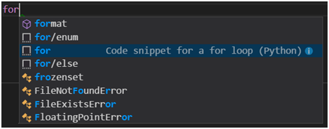

# 设置Javascript开发环境（Windows）

## 前提条件

- 安装VSCode最新版本，下载地址：https://code.visualstudio.com/Download

- 通过npm安装以下插件库：

  ESLint library：npm install eslint 或者 npm install -g eslint (全局安装模式)

- 在VSCode安装以下插件，如果服务器不能联网，下载以下VSCode的插件离线安装：

  JavaScript (ES6) code snippets（编码提示）：https://marketplace.visualstudio.com/items?itemName=xabikos.JavaScriptSnippets

  ESLint（代码规范）： https://marketplace.visualstudio.com/items?itemName=dbaeumer.vscode-eslint

  Beautify（美化格式）： https://marketplace.visualstudio.com/items?itemName=HookyQR.beautify

  JavaScript Booster（重构代码）： https://marketplace.visualstudio.com/items?itemName=HookyQR.beautify

  Bootstrap 4, Font awesome 4, Font Awesome 5 Free & Pro snippets：https://marketplace.visualstudio.com/items?itemName=thekalinga.bootstrap4-vscode

  jQuery Code Snippets： https://marketplace.visualstudio.com/items?itemName=donjayamanne.jquerysnippets

  Add jsdoc comments： https://marketplace.visualstudio.com/items?itemName=stevencl.addDocComments

- 安装常量替换控件
  autodocstring4snakerpy：到本作者的GitHub获取源码及安装包（从autoDocstring拆出的一个分支版本）：https://github.com/snakeclub/autoDocstring.git，下载插件离线安装，安装完后可使用该插件的变量替换功能（支持所有语言），支持变量值的替换（快捷键ctrl+shift+1）。

  自定义的替换参数设置见：autoDocstring.replacePreDefinedConfig:

  ```
  "autoDocstring.replacePreDefinedConfig": {
      "/\\{\\$AUTHOR\\$\\}/g": "Huijian Li",
      "/\\{\\$VERSION\\$\\}/g": "0.1.0",
      "/\\{\\$DATE\\$\\}/g": "{$DATE$}",
      "/\\{\\$TIME\\$\\}/g": "{$TIME$}",
      "/\\{\\$FILENAME\\$\\}/g": "{$FILENAME$}",
      "/\\{\\$MODULENAME\\$\\}/g": "{$MODULENAME$}",
      "/\\{\\$LINE\\$\\}/g": "{$LINE$}"
    }
  ```


## 设置tab为4个空格

1、点击vscode底部的"space:4"文字

2、在命令窗口选中“Indent Using Spaces”


## Beautify使用

### 全文档美化

1、按F1调出命令菜单

2、搜索Beautify file并执行

### 部分段落美化

1、选中要美化的段落

2、按F1调出命令菜单

3、搜索Beautify selection并执行


## JavaScript Booster使用

1、选中需要重构的代码

2、点击提示灯泡或快捷键“ctrl+.”弹出修复提示菜单

3、执行菜单中的修复命令执行修复

```
例如：
if (cond) {
    return a;
} else {
    return b;
}
// ==>
return cond ? a : b;
```


## Add jsdoc comments使用

1、选中要增加注释的内容（例如函数定义行）

2、按F1调出命令菜单

3、搜索Add Doc Comments并执行


## Snippets代码片段

我们可以在VS Code上自行设置Snippets，实现输入自动提示和补充代码。比如我们输入for，在提示框中选择对应的snippet：



点击回车或者tab，就变成了：

```
for target_list in expression_list:
  pass
```

我们如果要定义自己的Snippets，比如我们想要快速输入for xx in enumerator()方式遍历，该如何做呢。首先打开文件—首选项—用户代码片段。vscode会提示你选择语言，我们输入javascript并回车，打开了javascript.json。内容格式为json，在根级下面新增一个自己的object，内容如下：

```
"For in enumerator": {
    "prefix": "for/enum",
    "body": [
      "for ${1:index}, ${2:item} in enumerate(${3:array}):",
      "  ${4:pass}"
    ],
    "description": "For statement with enumerator"
  }
```

这样在我们输入for/enum再按回车后，就自动生成了：

```
 for target_list in expression_list:
  pass
```

光标停留在index上并选中该词，我们可以直接修改完，按tab切换到item，然后是array、pass。


## VS Code常用快捷键

| 按 Press             | 功能 Function                                               |
| -------------------- | :---------------------------------------------------------- |
| Ctrl+X               | 剪切行（空选定） Cut line (empty selection)                 |
| Ctrl+C               | 复制行（空选定）Copy line (empty selection)                 |
| Alt+ ↑ / ↓           | 向上/向下移动行 Move line up/down                           |
| Shift+Alt + ↓ / ↑    | 向上/向下复制行 Copy line up/down                           |
| Ctrl+Shift+K         | 删除行 Delete line                                          |
| Ctrl+] / [           | 缩进/缩进行 Indent/outdent line                             |
| Ctrl+Shift+[         | 折叠（折叠）区域 Fold (collapse) region                     |
| Ctrl+Shift+]         | 展开（未折叠）区域 Unfold (uncollapse) region               |
| Ctrl+K Ctrl+[        | 折叠（未折叠）所有子区域 Fold (collapse) all subregions     |
| Ctrl+K Ctrl+]        | 展开（未折叠）所有子区域 Unfold (uncollapse) all subregions |
| Ctrl+K Ctrl+0        | 折叠（折叠）所有区域 Fold (collapse) all regions            |
| Ctrl+K Ctrl+J        | 展开（未折叠）所有区域 Unfold (uncollapse) all regions      |
| Ctrl+K Ctrl+C        | 添加行注释 Add line comment                                 |
| Ctrl + F             | 查找 Find                                                   |
| Ctrl + H             | 替换 Replace                                                |
| F3 / Shift + F3      | 查找下一个/上一个 Find next/previous                        |
| Ctrl + 空格          | 触发建议 Trigger suggestion                                 |
| Ctrl + Shift + Space | 触发器参数提示 Trigger parameter hints                      |
| Tab                  | Emmet 展开缩写 Emmet expand abbreviation                    |
| Shift + Alt + F      | 格式化文档 Format document                                  |
| Ctrl + K Ctrl + F    | 格式选定区域 Format selection                               |
| Ctrl+N               | 新文件 New File                                             |
| Ctrl+O               | 打开文件... Open File...                                    |
| Ctrl+S               | 保存 Save                                                   |
| Ctrl+Shift+S         | 另存为... Save As...                                        |
| Ctrl+K S             | 全部保存 Save All                                           |
| Ctrl+F4              | 关闭 Close                                                  |
| F9                   | 切换断点 Toggle breakpoint                                  |
| F5                   | 开始/继续 Start/Continue                                    |
| Shift+F5             | 停止 Stop                                                   |
| F11 / Shift+F11      | 下一步/上一步 Step into/out                                 |
| F10                  | 跳过 Step over                                              |
| Ctrl+K Ctrl+I        | 显示悬停 Show hover                                         |

## 作者推荐安装的Snippets代码片段

[javascript.json](javascript.json)

修改位置：文件>首选项>用户代码片段，然后选择javascript.json

- 输入“.c”获取代码片段（c代表code）

- 输入“.n”获取注释片段（n代表note）

[keybindings.json](keybindings.json) ：

  修改位置：文件>首选项>按键快捷方式

  - ctrl+shift+3 : 调出注释标签选择菜单（可以在鼠标定位在注释中执行）
  - ctrl+shift+4 : 调出数据类型（type）选择菜单（可以在鼠标定位在注释中执行）
