# Nexus 私有仓库搭建与 Maven 集成

**|**作者：RexFang

**|**出处：<http://www.cnblogs.com/rexfang/>

**|**关于作者：Java 程序员一枚

**|**版权：本文版权归作者和博客园共有，欢迎转载，但未经作者同意必须保留此段声明，且在文章页面明显位置给出原文连接。如有问题，可以邮件：fangruitao.work@foxmail.com

　　Maven 是日常开发过程中，都会接触到的项目管理工具。Maven 可以将开发人员从繁杂的文档管理、项目打包等工作中解放出来，把更多的精力放在业务开发上。Maven 带来的便利这里就不多说了，但是只是单单使用 Maven，有时候也会遇到依赖文件无法下载的情况，原因有很多，有可能是中央仓库的问题，也有可能是网络问题等等；与此同时，有一部分的第三方的类库是没有发布到 Maven 上的，因此并没有 Maven 相关的依赖信息，这就给我们使用 Maven 构建项目带来了一定的麻烦。例如以下的这个例子，就是经常会遇到的问题。

　　在最近的一个测试项目中，由于个人比较喜欢有条不紊，所以一直是使用 Maven 作为项目构建的工具，但是在构建 Hibernate 相关依赖的过程中，发现有一部分相关的 Jar 无法正常下载，中间也换过各种软件仓库，但是最后都是无法正常构建项目。

　　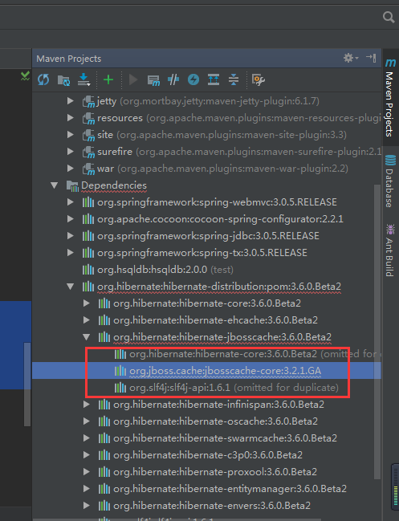

　　最后，实在没辙了，想起了要搭建一个私有仓库。本文主要介绍 Nexus 私有仓库的搭建过程，以及 Nexus 与 Maven 的整合。本文使用的 Nexus 版本为 Nexus Repository Manager OSS 2.14.5-02 ，之所以不使用最新的 Nexus Repository Manager OSS 3 是因为个人感觉版本3还没有版本2友好，特别是在图形管理界面的操作上。

　　首先需要到官网上下载 Nexus Repository Manager OSS 2.14.5-02 的安装包，下载地址为：<https://www.sonatype.com/download-oss-sonatype>，解压后的目录结构：

　　 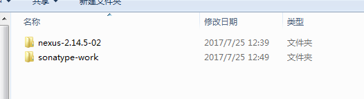

　　在命令行窗口，进入 \nexus-2.14.5-02-bundle\nexus-2.14.5-02\bin 目录，输入 nexus install 命令，安装 Nexus（需要等待一小段时间）。安装成功后，进入服务管理界面，找到一个名为 nexus 的服务，启动该服务，服务启动完成后，打开浏览器，输入 <http://localhost:8081/nexus> ，如果可以看到欢迎界面，说明 Nexus 安装成功了。

 　　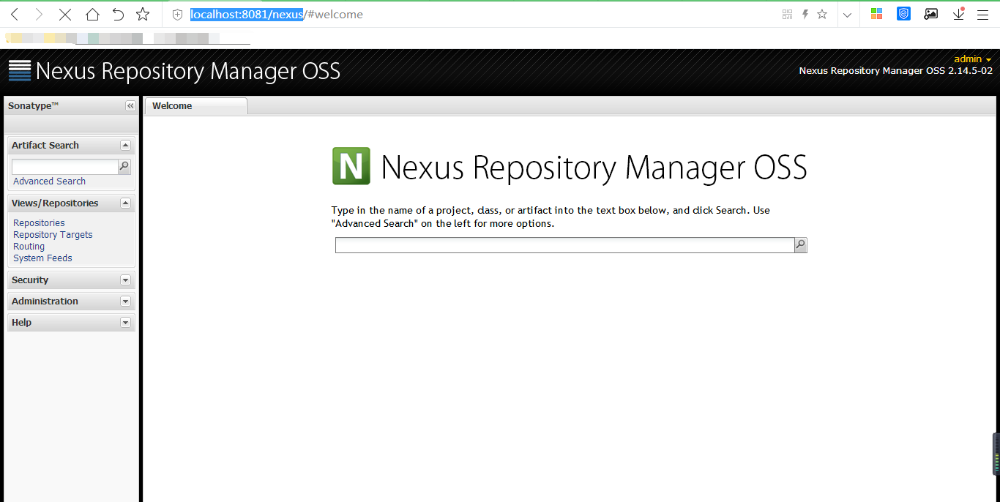

　　点击右上角的登录按钮，输入管理员账号和密码（默认账号：admin，密码：admin123）登录。

　　登录成功后，选择左边 Views/Repositories 菜单下的 Repositories，可以看到一些预设的仓库，我们会用到的一般只有 Public Repositories 和 3rd party ， Public Repositories 为公共仓库，3rd party 为第三方仓库，可以上传第三方的 Jar （当然也可以是自己封装的 Jar）。

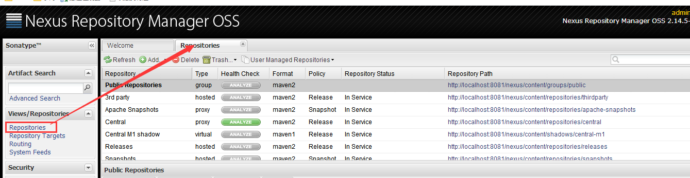

　　Nexus 安装成功后，接下来需要修改 Maven 的配置文件（settings.xml），整合 Nexus。

　　找到 <servers> 标签，添加 Nexus 默认认证信息：

　　找到 <mirrors> 标签，添加镜像：

　　找到 <profiles> 标签，添加仓库信息：

　　激活仓库：

　　配置完成后保存，并重启 nexus  服务。

　　重启  nexus  服务 完成后，在命令行窗口进入一个使用 Maven 构建的项目，输入 mvn package clean 命令，清理完成后，登录 nexus 的 admin 账号可以看到 Public Repositories  下出现了一些 Jar 包。

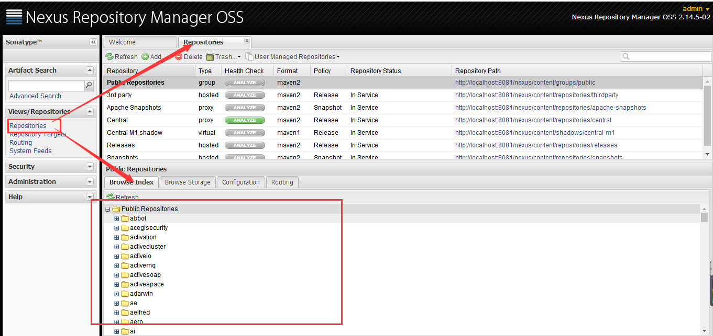

　　此时刷新之前报错的项目，发现 Maven 依赖仍然有问题，无法正常下载 jboss 的一个 Jar 包。这个时候我们可以利用我们刚刚搭建的 Nexus 私有仓库，在网上自己下载缺失的 Jar 包，然后以第三方 Jar 的形式上传到私有仓库，依赖信息可以设置跟中央仓库一样。例如添加 jbosscache-core-3.2.1.GA.jar ，在外网上的依赖为：

　　选择 3rd party，把我们自己下载的  jbosscache-core-3.2.1.GA.jar 上传到 3rd party。在 Artifact Upload 选择卡页面，点击 Select Artifact(s) to Upload 按钮，选择需要上传的 Jar 包，选择完成后点击 Add Artifact 按钮。然后设置 Jar 的 Maven 依赖信息（后续引用 Jar 包需要用到），其中 Maven 依赖的相关信息可以设置成和中央仓库一致，如下图：

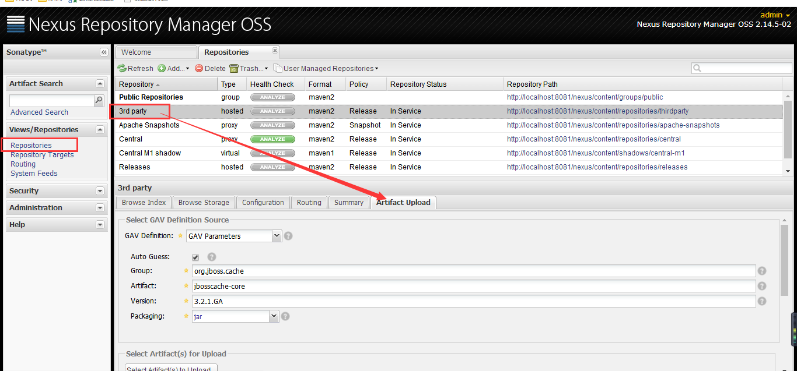

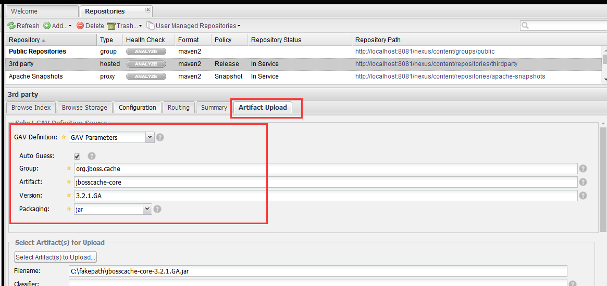

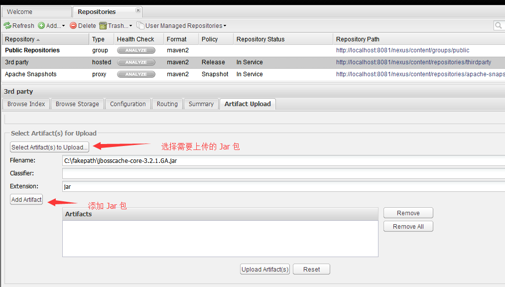

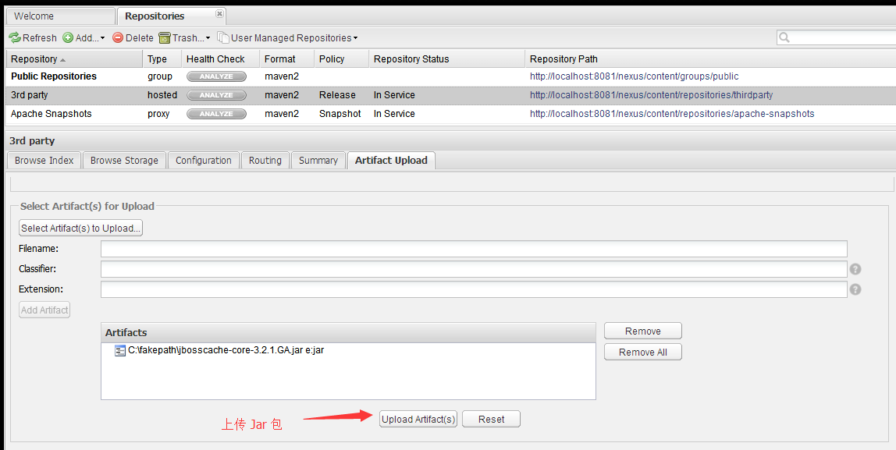

　　Jar 包上传成功后，切换到 Browse Index 选项卡页面，点击刷新按钮，可以看到我们刚刚上传的 Jar 包，选中 Jar 包我们可以在右边看到 Jar 包对应的 Maven 依赖信息，可以用于项目的构建。

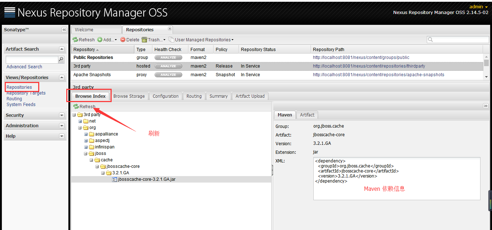

　　进入本地仓库删除 \.m2\org\jboss\cache\jbosscache-core\3.2.1.GA 目录下的所有文件（重要，否则会构建失败），此时，再次回到刚刚构建失败的项目，刷新 Maven，可以看到项目已经可以正常构建了。

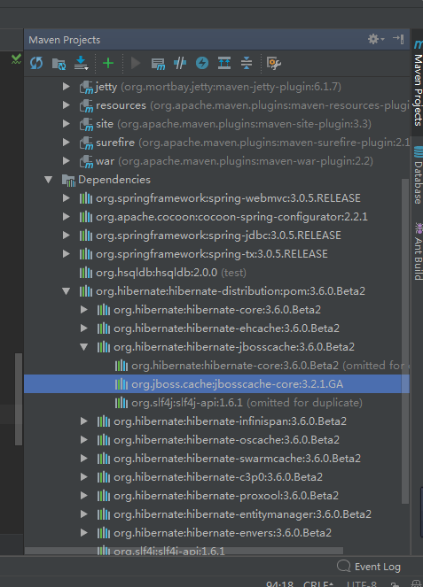

　　如果本地安装了 Maven，可以在 Maven 的安装目录找到一些常用的软件仓库，位置为：${MAVEN_HOME}\lib\maven-model-builder-3.3.3.jar 下 \org\apache\maven\model\pom-4.0.0.xml ，其中 ${MAVEN_HOME} 为 Maven 的安装目录，用编辑器打开 pom-4.0.0.xml 可以看到很多预设的软件仓库。

　　此处，也提供一些常用的软件仓库：

　　<http://maven.aliyun.com/nexus/content/groups/public>（阿里云，推荐）

　　[http://mvnrepository.com](http://mvnrepository.com/)

　　<http://www.sonatype.org/nexus>

　　<http://repo1.maven.org/maven2>

　　这里，也提供一些 Maven 的参考资料：

　　<http://www.codeweblog.com/category/maven-gradle/>