# MediaWiki搭建手册

本手册用于指导企业内部使用开源的MediaWiki进行百科平台的搭建。

## 安装运行环境

MediaWiki是基于PHP开发的，其运行环境要求为：Apache + Mysql + PHP 。

### **数据库**

在SIT环境部署，相关信息如下：

IP：10.7.161.14    PORT：3306    Ver: MySQL5.7.24    DBName:wiki    User:wiki    Password:***

命令行连接：mysql -h10.7.161.14 -P3306 -uwiki -p***

切换使用数据库：use wiki

### **应用服务器**

在SIT环境部署，相关信息如下：

操作系统版本：Red Hat Enterprise Linux Server release 7.6 (Maipo)

IP: 10.7.12.15

User：sxappopt/* 、root/*

**创建服务目录并授权**

使用root用户创建目录并授权给sxappopt用户

```
cd /sxapp
mkdir itwiki
chmod -R 777 itwiki
chown -R sxappopt:sxgp itwiki
```

**验证Apache**

检查Apache运行状态：systemctl status httpd

检查Apache版本：httpd -v

```
Server version: Apache/2.4.6 (Red Hat Enterprise Linux)
```

在浏览器验证HTTP服务： http://10.7.12.15/ 

**验证PHP**

检查PHP安装目录：whereis php

检查PHP版本：php -v

```
PHP 7.3.1 (cli) (built: Nov 28 2019 17:19:04) ( NTS DEBUG )
Copyright (c) 1997-2018 The PHP Group
Zend Engine v3.3.1, Copyright (c) 1998-2018 Zend Technologies
```

查看PHP安装的扩展：php -m

检查需要包含的扩展：pcre、SPL、json

**调整Apache配置**

注：需使用root用户

命令： vi /etc/httpd/conf/httpd.conf 

修改以下配置：

```
# 根目录路径
DocumentRoot "/sxapp/itwiki"

# 禁止在http请求头暴露服务器信息
ServerTokens ProductOnly
ServerSignature Off 

# 添加对应的目录配置
<Directory "/sxapp/itwiki">
    #
    # Possible values for the Options directive are "None", "All",
    # or any combination of:
    #   Indexes Includes FollowSymLinks SymLinksifOwnerMatch ExecCGI MultiViews
    #
    # Note that "MultiViews" must be named *explicitly* --- "Options All"
    # doesn't give it to you.
    #
    # The Options directive is both complicated and important.  Please see
    # http://httpd.apache.org/docs/2.4/mod/core.html#options
    # for more information.
    #
    Options Indexes FollowSymLinks

    #
    # AllowOverride controls what directives may be placed in .htaccess files.
    # It can be "All", "None", or any combination of the keywords:
    #   Options FileInfo AuthConfig Limit
    #
    AllowOverride None

    #
    # Controls who can get stuff from this server.
    #
    Require all granted
</Directory>
```


修改上传文件大小限制，修改文件路径：/usr/local/php7.3.1/etc/php.ini

注：路径按安装不同，如果找不到，可以通过以下命令查找： find / -name php.ini

修改以下两个参数项，调整为50M

post_max_size = 50M

upload_max_filesize = 50M


重启Apache： systemctl restart httpd

### 附：Windows环境的安装方法

简化安装，我们使用XAMPP来进行相应环境的安装和准备。

#### 安装XAMPP

XAMPP官方下载地址：https://www.apachefriends.org/zh_cn/download.html 

注：官网上还提供了 Bitnami的通用工具链接Add-ons，可以使用XAMPP直接安装 MediaWiki，链接为： https://bitnami.com/stack/xampp#mediawiki ，出于研究及允许安装特定版本考虑，本手册不采用这个方式。

安装步骤如下：

1、建议把安装包放在硬盘根目录进行安装，例如\" D\\: \"

2、运行安装程序，可能会有如下提示，先忽略继续处理：

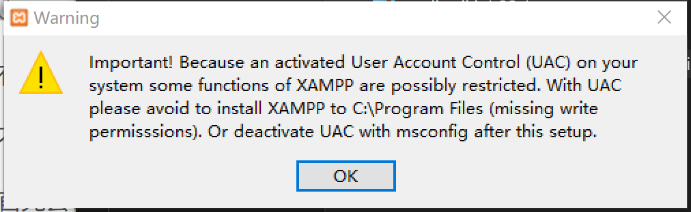

3、选择要安装的组件，FTP和Mail服务对MediaWiki没有用，可以不安装：

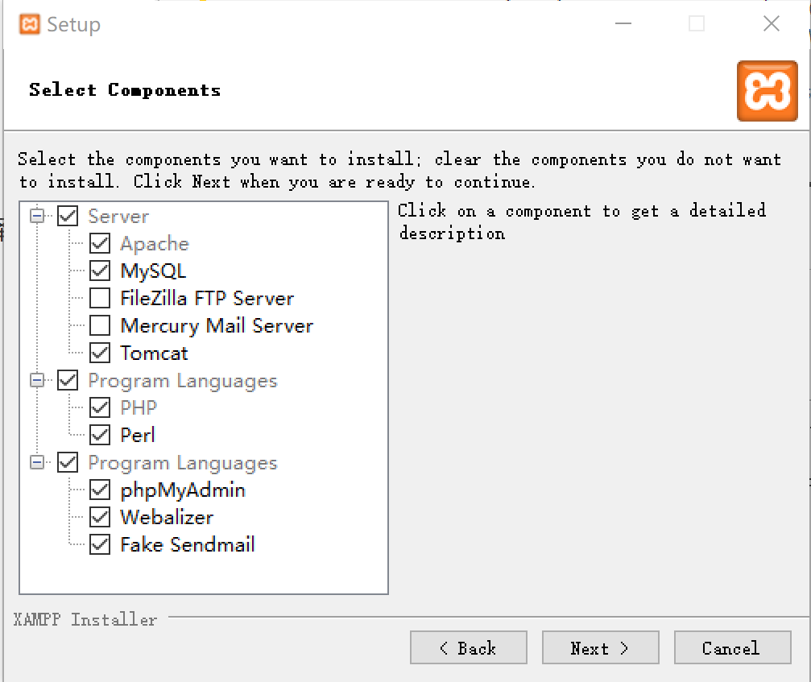

4、接下来选择安装目录，回应开始的提示，不要装在“c:\\Program Files”目录下，我们装在“D:\xampp”中：

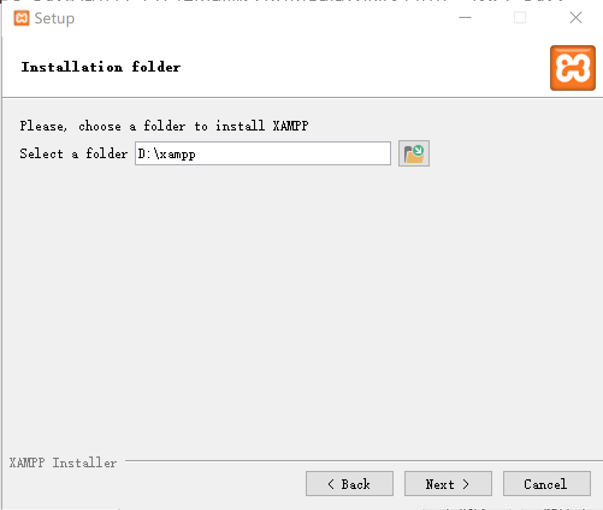

5、然后一路Next就安装好了。


#### 启动服务

1、打开XAMPP界面可以管理相应的服务，例如通过Config维护相应的配置，通过Start启动服务：

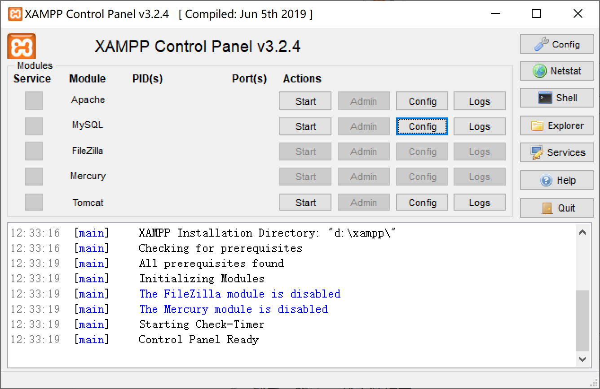


2、在XAMPP界面启动Apache和MySQL服务，通过以下方式验证：

通过浏览器打开地址： http://127.0.0.1/dashboard/  ，可以看到以下界面，说明Apache服务正常

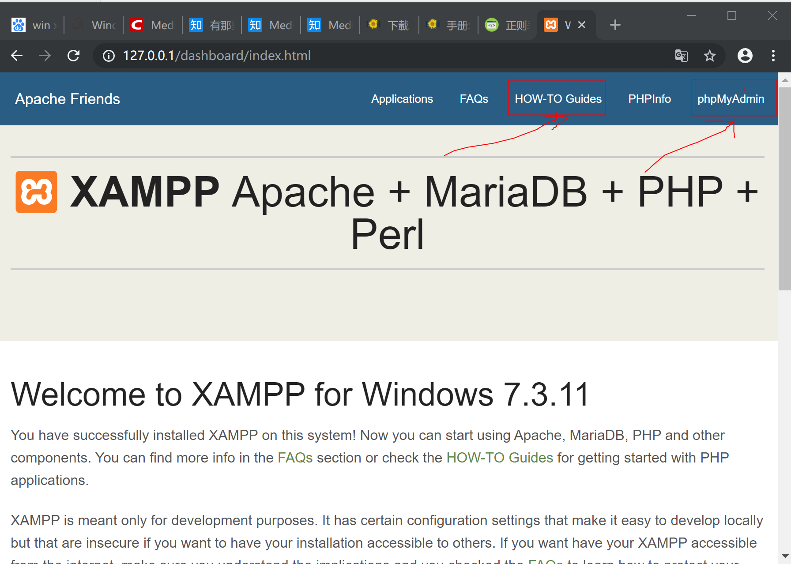

注：截图中的HOW-TO Guides是XAMPP的帮助文档；phpMyAdmin集成了一些工具，用于管理PHP和数据库。


3、重置数据库root用户密码（本文档为方便，所有密码统一设置为“123456”，后面所有密码均用这个），参考操作文档可以点击dashboard上的“HOW-TO Guides”，然后点击“Reset the MySQL/MariaDB Root Password”：

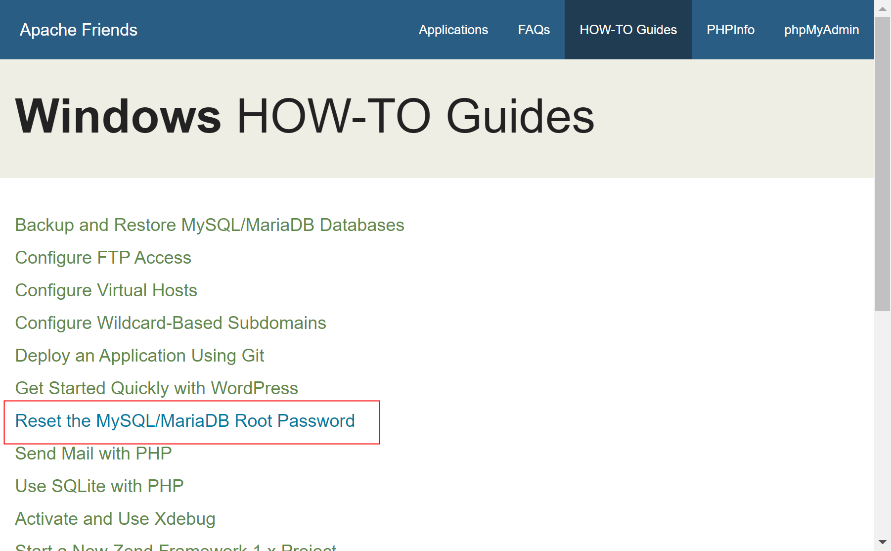

注意：修改root密码后，需要修改XAMPP的phpMyAdmin的配置，否则phpMyAdmin无法正常使用；修改的配置文件在“D:\xampp\phpMyAdmin\config.inc.php”，配置项为：

```
$cfg['Servers'][$i]['password'] = '123456';
```


4、新创建一个专用的wiki数据库

```javascript
# mysql -u root -p123456
MariaDB [(none)]>CREATE DATABASE it_wiki;
MariaDB [(none)]>CREATE USER 'it_wiki'@'localhost' IDENTIFIED BY '123456';
MariaDB [(none)]>GRANT ALL ON it_wiki.* TO 'it_wiki'@'localhost' IDENTIFIED BY '123456';
```


## 安装MediaWiki

1、到官网上下载MediaWiki的安装包，下载地址： https://www.mediawiki.org/wiki/Download 

2、将下载的MediaWiki的安装包上传到“/sxapp/itwiki”目录；

3、执行以下命令进行解压缩及文件移动

```
tar xvzf mediawiki-1.33.1.tar.gz
mv mediawiki-1.33.1/* /sxapp/itwiki/
rm mediawiki-1.33.1.tar.gz
rm -rf mediawiki-1.33.1
```

4、在浏览器打开  http://10.7.12.15/  ，由于还没有进行配置，显示的是以下界面，点击链接进行安装：

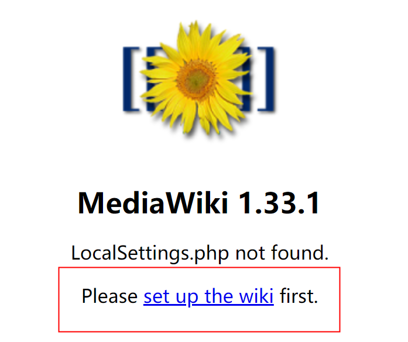

5、进行安装的基础配置，按照页面提示进行配置并继续就好（没有截图或说明的，代表使用默认值）：

语言：使用中文就好

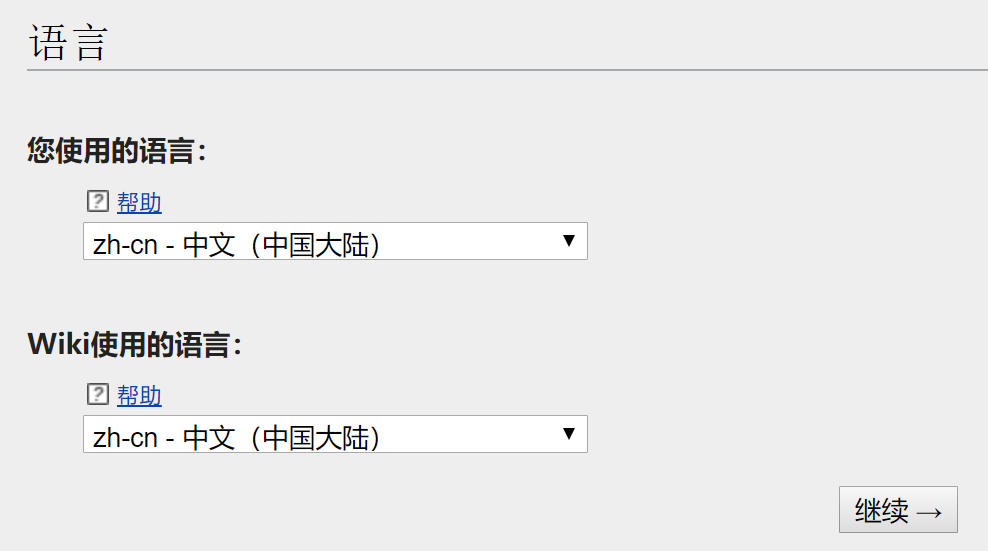


环境检查存在告警，可以后续自行处理，不影响后续安装：


数据库的设置：数据库名称选前面创建的库（wiki）；数据库表前缀用于共享数据库时避免冲突，生产用不考虑共享，因此置空即可；设置数据库用户和密码（wiki/***）：

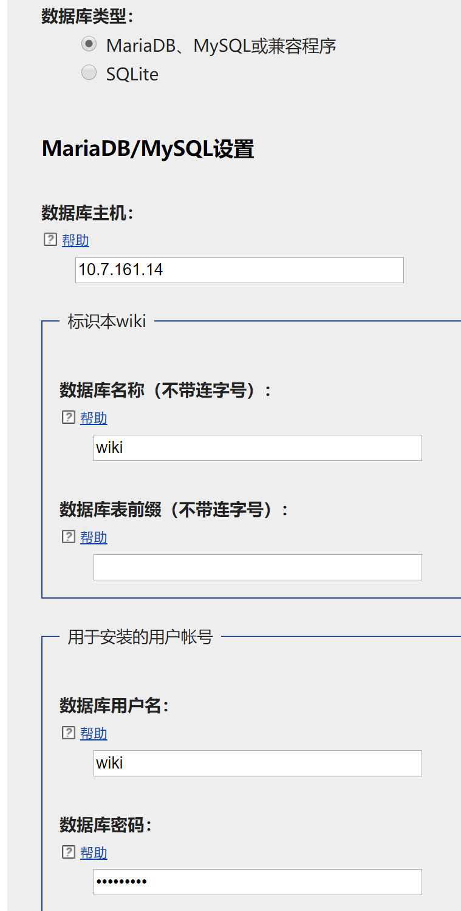


WIKI的名称设置为“科技WIKI”，命名空间为ITWIKI；管理员账号设置为admin，密码：***

注：密码要求10个字符且不能简单密码

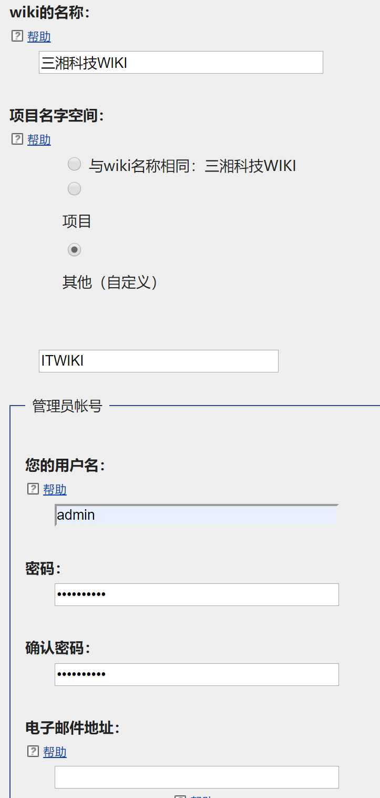


接下来是高级的设置：

-  用户权限配置：需要注册帐号 
-  版权和许可证：GNU自由文档许可证1.3或更高版本 
-  电子邮件设置 : 先全部默认
-  皮肤 ：默认
-  扩展程序 ：全选
-  图像和文件上传 ： 启用文件上传
- 对象缓存设置：无缓存


然后一路下一步，可以生成配置文件“LocalSettings.php”，需要将这个文件下载并复制到wiki的根目录（/sxapp/itwiki/）：

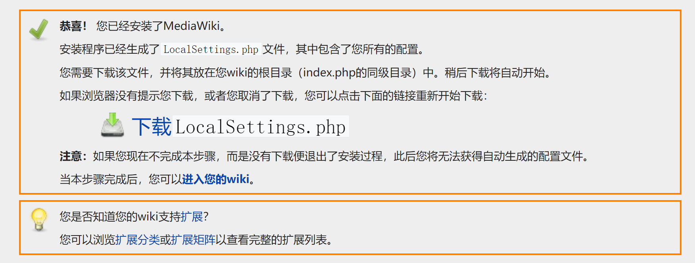


5、安装完成，打开 http://10.7.12.15/ 看到以下页面，说明安装成功：

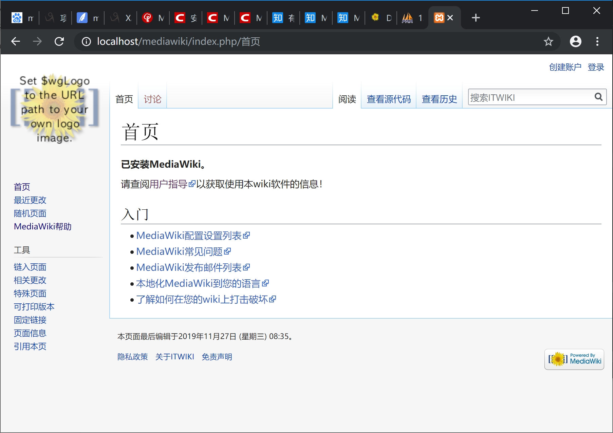

**提示：**
*如果你想重新设置MediaWiki，可以在浏览器中输入*`*http://localhost/mw-config/index.php*`*（ 将 directory 换成您MediaWiki的解压位置 如果是本地安装的话将 domain 替换成*`*localhost*`*），然后点击右侧的“重新开始安装”。*

**注意：一旦你的配置完成，需要将mw-config目录备份后从目录中删除，以防止被别人利用破坏。**


6、进行一些操作系统权限授权

```
# 给images目录可读写权限，用于上传文件
chmod 777 /sxapp/itwiki/images
# 给cache权限可读写权限，用户缓存
chmod 777 /sxapp/itwiki/cache
```


7、安装 ImageMagick 作为上传文件缩略图转换

下载地址： https://imagemagick.org/script/download.php 

tiff库下载地址：http://www.imagemagick.org/download/delegates/tiff-4.0.8.tar.gz

root用户

```
tar -zxvf tiff-4.0.8.tar.gz
cd tiff-4.0.8/
./configure 
make && make install

tar -zxvf ImageMagick.tar.gz 
cd ImageMagick-7.0.9-6
./configure 
make && make install
ldconfig /usr/local/lib
检测是否成功 convert -version
```


8、修改配置文件LocalSettings.php中的缩略图配置：

```
$wgUseImageMagick = true;
$wgImageMagickConvertCommand = "convert";
```


## MediaWiki依赖库

官网下载的安装包并没有包含所有的依赖库，正常功能不会出错，但在安装一些插件的时候就会出现异常，建议出错后与官网对比一下缺失的包，看是否有可能是出错的原因。

如果是离网环境，可以在一个可以联网的机器安装php和composer，然后把mediawiki整个目录复制到联网的机器上进行依赖包的安装，命令如下：

```
# 安装composer.json不存在的依赖包
composer require 包名

# 根据本地目录的composer.json的包进行安装
composer install
```

对于MediaWiki可以在maintenance目录下执行php update.php进行依赖检查和数据库表的更新，如果怀疑是依赖包及数据表不一致导致的问题，可以执行这个操作尝试修复。

注意：执行有时候会提示composer的依赖包版本不一致的错误，这个可能最主要的是对依赖包写入的版本和实际安装的版本有差异，不一定要重新更新依赖包（更新了不一定没问题），最好的办法是重新执行一次composer install，然后根据提示的错误修改composer.json文件的版本号，修改后就不会再报错。


### 附录：在Windows安装Composer（PHP的包管理）方法

1、从 https://getcomposer.org/download/ 下载composer.phar文件：https://getcomposer.org/download/1.9.1/composer.phar

2、新建composer.bat文件，内容如下：

```
@php "%~dp0composer.phar" %*
```

3、将两个文件放入php目录：D:\xampp\php

4、在Path环境变量中增加以下目录：D:\xampp\php 、D:\xampp\php\ext

5、用管理员用户执行composer.bat ，一闪而过

6、打开一个cmd窗口，执行composer -v ，如果有正常显示，代表安装成功

7、修改镜像地址，提高下载速度

```
composer config -g repositories.packagist composer https://packagist.phpcomposer.com
```


## 安装MediaWiki扩展

### Lockdown

辅助进行页面访问及编辑权限控制的扩展

官网介绍： https://www.mediawiki.org/wiki/Extension:Lockdown 

**安装**

1、下载地址： https://extdist.wmflabs.org/dist/extensions/Lockdown-REL1_33-9117e2f.tar.gz 

2、将压缩包解压，并将“Lockdown”文件夹复制到“/sxapp/itwiki/extensions”

3、在配置文件LocalSettings.php的后面加上以下配置（# Add more configuration options below.）：

```
wfLoadExtension('Lockdown');
```

4、 打开版本信息页面检查是否已安装成功：http://localhost/mediawiki/index.php/Special:Version 

**使用**

1、$wgSpecialPageLockdown 限制指定用户组对Special命名空间的指定工具页面不能访问，例如：

```
# 限制注册用户组不能访问Special:Version工具页面
$wgSpecialPageLockdown['Version'] = ['user'];
```

注： A full list of special page titles is available in the ["MessagesEn.php" file (`$specialPageAliases` array)](https://phabricator.wikimedia.org//r/p/mediawiki/core;browse/master/languages/messages/MessagesEn.php) 

2、$wgActionLockdown 可以限制指定用户组对页面的某一操作不可用，例如：

```
# 限制注册用户组不能使用页面的'history'操作
$wgActionLockdown['history'] = [ 'user' ];
```

注：具体操作类型参见官网的  [action](https://www.mediawiki.org/wiki/Special:MyLanguage/Manual:Actions)  章节，同时这个指令不支持限制 ajax 操作。

3、$wgNamespacePermissionLockdown 限制指定用户组对指定命名空间有指定的权限，例如：

```
# 指定sysop在NS_PROJECT命名空间具有edit权限
$wgNamespacePermissionLockdown[NS_PROJECT]['edit'] = [ 'sysop' ];

# 第一行把NS_PROJECT的所有权限给与sysop（意味禁止其他人访问）; 第2行则放开了NS_PROJECT的read权限给所有人; 第三行则把所有命名空间的move权限给了autoconfirmed; 整体权限可以按优先顺序进行了组合
$wgNamespacePermissionLockdown[NS_PROJECT]['*'] = [ 'sysop' ];
$wgNamespacePermissionLockdown[NS_PROJECT]['read'] = [ '*' ];
$wgNamespacePermissionLockdown['*']['move'] = [ 'autoconfirmed' ];
```

$wgNamespacePermissionLockdown 并不能将用户组本身没有的权限授权给一个用户组；如果要授权则应先要让用户组具有权限：

```
# 用户组原本并没有NS_MAIN的patrol权限，这个指令不会生效（该没有权限还是没有权限）
$wgNamespacePermissionLockdown[NS_MAIN]['patrol'] = [ 'user' ];

# 应该先授权给用户组，然后再进行限制和放开授权
$wgGroupPermissions['user']['patrol'] = true;
$wgNamespacePermissionLockdown['*']['patrol'] = [ 'sysop' ];
$wgNamespacePermissionLockdown[NS_MAIN]['patrol'] = [ 'user' ];
```

要注意在禁止其他用户组读权限的情况下，用户组是可以通过有权限的命名空间，用包含模板的操作绕过限制访问对应的保护页面，如果要防止，应通过 [`$wgNonincludableNamespaces`](https://www.mediawiki.org/wiki/Special:MyLanguage/Manual:$wgNonincludableNamespaces)  参数将保护的命名空间加到禁止作为模板使用，例如：

```
$wgNamespacePermissionLockdown[NS_PROJECT]['read'] = [ 'user' ];
$wgNonincludableNamespaces[] = NS_PROJECT;
```

对于自定义命名空间的支持：

```
// define constants for your custom namespaces, for a more readable configuration
define('NS_PRIVATE', 100);
define('NS_PRIVATE_TALK', 101);

// define custom namespaces
$wgExtraNamespaces[NS_PRIVATE] = 'Private';
$wgExtraNamespaces[NS_PRIVATE_TALK] = 'Private_talk';

// restrict "read" permission to logged in users
$wgNamespacePermissionLockdown[NS_PRIVATE]['read'] = [ 'user' ];
$wgNamespacePermissionLockdown[NS_PRIVATE_TALK]['read'] = [ 'user' ];

// prevent inclusion of pages from that namespace
$wgNonincludableNamespaces[] = NS_PRIVATE;
$wgNonincludableNamespaces[] = NS_PRIVATE_TALK;
```


###  **VisualEditor** 

增强的编辑器

官网介绍： https://www.mediawiki.org/wiki/Extension:VisualEditor 

**安装 nodejs** 

VisualEditor依赖Parsoid，而Parsoid依赖nodejs，因此需要先安装nodejs

注意：Parsoid 0.10.0在nodejs 12上运行有问题，因此我们选择10.x的版本

1、下载地址： https://nodejs.org/dist/latest-v10.x/ 

2、将压缩包 node-v10.17.0-linux-x64.tar.gz 上传到 /sxapp/sxappopt/software ，执行以下命令进行安装：

```
# 解压缩
tar -xvf node-v10.17.0-linux-x64.tar.gz
# 删除安装包
rm node-v10.17.0-linux-x64.tar.gz
# 建立软连接，变为全局
ln -s /sxapp/sxappopt/software/node-v10.17.0-linux-x64/bin/npm /usr/local/bin/
ln -s /sxapp/sxappopt/software/node-v10.17.0-linux-x64/bin/node /usr/local/bin/
# 检查版本及安装是否有效
node -v
npm -v
```

**安装Parsoid服务**

1、通过联网的机器下载源码：git clone https://gerrit.wikimedia.org/r/mediawiki/services/parsoid

2、把源码目录上传到服务器目录：/sxapp/sxappopt/software

3、进入目录执行安装：

```
cd parsoid/
npm install
```

注：如果机器没有联网，可以找一台联网且已安装nodejs的机器通过安装获取离线包，利用离线包进行安装：

```
cd parsoid/
npm install --global-style

# 安装完以后将parsoid整个目录parsoid.zip，上传到服务器，解压到/sxapp/sxappopt/software中
unzip parsoid.zip
```

4、修改配置，复制config.example.yaml到正式的配置文件config.yaml，然后进行修改

```
cp config.example.yaml config.yaml
# 然后修改编辑
vi config.yaml 
```

将配置文件中的mwApis节点内容中的uri和domain修改正确：

```
mwApis:
    - # This is the only required parameter, the URL of you MediaWiki API endpoint.
      uri: 'http://localhost/api.php'
      # The "domain" is used for communication with Visual Editor and RESTBase.
      # It defaults to the hostname portion of the `uri` property below, but you can manually set it to an arbitrary string.
      domain: 'localhost'  # optional
```

5、启动服务进行初始验证：node bin/server.js

服务默认开启8000端口，可以在浏览器访问看是否正常： http://10.7.12.15:8000/ 

6、设置服务自启动

第一、手工新建parsoid服务环境配置文件

```
touch /sxapp/sxappopt/software/parsoid/parsoid.env
vi /sxapp/sxappopt/software/parsoid/parsoid.env
```

按照一下文件添加内容

```
PORT=8000
NODE_PATH=/sxapp/sxappopt/software/parsoid/node_modules
```

第二、手工新建parsoid.service服务

```
touch /usr/lib/systemd/system/parsoid.servicevim /sxapp/sxappopt/software/parsoid/parsoid.env
vi /usr/lib/systemd/system/parsoid.service
```

按照以下文件添加内容

```
[Unit]
Description=Mediawiki Parsoid web service on node.js
Documentation=http://www.mediawiki.org/wiki/Parsoid
Wants=local-fs.target network.target
After=local-fs.target network.target

[Install]
WantedBy=multi-user.target

[Service]
Type=simple
User=root
Group=root
WorkingDirectory=/sxapp/sxappopt/software/parsoid
EnvironmentFile=-/sxapp/sxappopt/software/parsoid/parsoid.env
ExecStart=/usr/local/bin/node /sxapp/sxappopt/software/parsoid/bin/server.js
KillMode=process
Restart=on-success
PrivateTmp=true
StandardOutput=syslog
```

第三、启动parsoid.service服务

```
systemctl start parsoid.service
```

第四、设置parsoid.service服务自启动

```
systemctl enable parsoid.service
```

**安装**

1、下载地址：https://extdist.wmflabs.org/dist/extensions/VisualEditor-REL1_33-8c9c37e.tar.gz 

2、将压缩包解压，并将“Lockdown”文件夹复制到“/sxapp/itwiki/extensions”

3、在配置文件LocalSettings.php的后面加上以下配置：

```
wfLoadExtension( 'VisualEditor' );

// 对所有用户默认开启
$wgDefaultUserOptions['visualeditor-enable'] = 1;

// Optional: Set VisualEditor as the default for anonymous users
// otherwise they will have to switch to VE
$wgDefaultUserOptions['visualeditor-editor'] = "visualeditor";

// Don't allow users to disable it
$wgHiddenPrefs[] = 'visualeditor-enable';

// OPTIONAL: Enable VisualEditor's experimental code features
#$wgDefaultUserOptions['visualeditor-enable-experimental'] = 1;

// 让Help和AMT命名空间启用该编辑器，否则只会默认在"Main", "User", "File" and "Category"启用
$wgVisualEditorAvailableNamespaces = [
    "Help" => true,
    "AMT" => true
];

// 接入Parsoid服务
$wgVirtualRestConfig['modules']['parsoid'] = array(
    // URL to the Parsoid instance
    'url' => 'http://localhost:8000',
    // Parsoid "domain", see below (optional)
    'domain' => 'localhost',
    // Parsoid "prefix", see below (optional)
    'prefix' => 'localhost'
);
```

###  **MsUpload** 

加强的文件上传插件，支持多文件同时上传

官网介绍： https://www.mediawiki.org/wiki/Extension:MsUpload 

1、下载地址： https://extdist.wmflabs.org/dist/extensions/MsUpload-REL1_33-2c533f8.tar.gz 

2、将压缩包解压，并将“MsUpload”文件夹复制到“/sxapp/itwiki/extensions”

3、在配置文件LocalSettings.php的后面加上以下配置（# Add more configuration options below.）：

```
wfLoadExtension('MsUpload');
$wgMSU_useDragDrop = true; // Should the drag & drop area be shown? (Not set by default)
$wgMSU_showAutoCat = true; // Files uploaded while editing a category page will be added to that category
$wgMSU_checkAutoCat = true; // Whether the checkbox for adding a category to a page is checked by default
$wgMSU_useMsLinks = false; // Insert links in Extension:MsLinks style?
$wgMSU_confirmReplace = true; // Show the "Replace file?" checkbox
$wgMSU_imgParams = 'thumb|none'; // Any image parameter separated by a semicolon. Examples are: {width}px, left, right, center, none, border, frameless, frame, thumb etc etc
```

###  **Comments** 

增加评论框

官网介绍： https://www.mediawiki.org/wiki/Extension:Comments 

1、下载地址： https://extdist.wmflabs.org/dist/extensions/Comments-REL1_33-752d201.tar.gz  

2、将压缩包解压，并将“Comments”文件夹复制到“/sxapp/itwiki/extensions”

3、在配置文件LocalSettings.php的后面加上以下配置（# Add more configuration options below.）：

```
wfLoadExtension('Comments');

# 增加相应权限
$wgGroupPermissions['sysop']['commentadmin'] = true;  # 允许管理员删除评论
$wgGroupPermissions['user']['commentlinks'] = true;  # 允许注册用户在评论中增加链接
$wgGroupPermissions['user']['comment'] = true;  # 允许注册用户在发评论
```

4、跳转到 **maintenance** 目录，执行“php update.php”进行数据库表的检查更新；

使用方法，在发布的页面中增加以下标签，就会出来评论框：

```
<comments /> — 基础评论框
<comments allow="Derfel,Jack Phoenix,Misza" /> — 只允许特定用户进行评论
<comments voting="Plus" /> — prevents users from rating comments negatively (thumb down), allowing only positive (thumb up) votes - 没有看到在哪里有投票

另外还可以用这些魔术语言：
{{NUMBEROFCOMMENTS}} gives the entire number of comments on the wiki. - wiki网站的总评论数
{{NUMBEROFCOMMENTSPAGE}} gives number of comments on the current page.  - 当前页面的评论数
{{NUMBEROFCOMMENTSPAGE:<pagename>}} gives number of comments on the given page.  - 指定页面的评论数
```

### EmbedVideo

支持集成视频

官网介绍： https://www.mediawiki.org/wiki/Extension:EmbedVideo 

**安装**

1、下载源码

```
git clone https://gitlab.com/hydrawiki/extensions/EmbedVideo.git
```

2、将“EmbedVideo”文件夹复制到“D:\xampp\htdocs\mediawiki\extensions”目录下

3、在配置文件LocalSettings.php的后面加上以下配置（# Add more configuration options below.）：

```
wfLoadExtension("EmbedVideo");
```

**使用**

在编辑文件时，可用通过以下标签签入视频：

```
[[File:Example.mp4]]  - 使用HTML5 <video> tag进行视频播放
[[File:Example.mp4|start=2|end=6]] - 定义视频的开始播放和结束时间，时间格式可以为以下之一: ss, :ss, mm:ss, hh:mm:ss, or dd:hh:mm:ss.
```

更高级的用法，可以到开源项目官网了解： https://gitlab.com/hydrawiki/extensions/EmbedVideo 

###  **SandboxLink** 

创建个人沙箱小工具链接

官网介绍：https://www.mediawiki.org/wiki/Extension:SandboxLink

1、下载地址： https://extdist.wmflabs.org/dist/extensions/SandboxLink-REL1_33-eb19f89.tar.gz   

2、将压缩包解压并复制到“/sxapp/itwiki/extensions”

```
tar -xzf SandboxLink-REL1_33-eb19f89.tar.gz -C /sxapp/itwiki/extensions/
```

3、在配置文件LocalSettings.php的后面加上以下配置（# Add more configuration options below.）：

```
wfLoadExtension('SandboxLink');
$wgSandboxLinkDisableAnon = true;  # 是否对匿名用户隐藏
```

###  **CodeMirror** 

在页面编辑器高亮显示

官网介绍： https://www.mediawiki.org/wiki/Extension:CodeMirror

1、下载地址：  https://extdist.wmflabs.org/dist/extensions/CodeMirror-REL1_33-fc4d4b0.tar.gz    

2、将压缩包解压并复制到“/sxapp/itwiki/extensions”

```
tar -xzf CodeMirror-REL1_33-fc4d4b0.tar.gz -C /sxapp/itwiki/extensions/
```

3、在配置文件LocalSettings.php的后面加上以下配置（# Add more configuration options below.）：

```
wfLoadExtension('CodeMirror');
$wgDefaultUserOptions['usecodemirror'] = 1;  # 设置默认开启，但允许用户关闭
```

###  **TemplateStyles** 

支持模板标签\<templatestyles\> 指定css文件，例如： \<templatestyles src="..." /\> 

注：这个功能依赖css-sanitizer库，必须通过composer安装

官网介绍：  https://www.mediawiki.org/wiki/Extension:TemplateStyles 

1、下载地址   https://extdist.wmflabs.org/dist/extensions/TemplateStyles-REL1_33-c76fd84.tar.gz 

2、将压缩包解压并复制到“/sxapp/itwiki/extensions”

```
tar -xzf TemplateStyles-REL1_33-c76fd84.tar.gz -C /sxapp/itwiki/extensions/
```

3、在配置文件LocalSettings.php的后面加上以下配置（# Add more configuration options below.）：

```
wfLoadExtension('TemplateStyles');
```

### DeletePagesForGood

允许永久删除页面（从数据库）

官网介绍： https://www.mediawiki.org/wiki/Extension:DeletePagesForGood/en 

1、下载地址   https://extdist.wmflabs.org/dist/extensions/DeletePagesForGood-REL1_33-2dd3e22.tar.gz 

2、将压缩包解压并复制到“/sxapp/itwiki/extensions”

```
tar -xzf DeletePagesForGood-REL1_33-2dd3e22.tar.gz -C /sxapp/itwiki/extensions/
```

3、在配置文件LocalSettings.php的后面加上以下配置（# Add more configuration options below.）：

```
wfLoadExtension('DeletePagesForGood');
# 只有管理员组允许删除
$wgGroupPermissions['*']['deleteperm'] = false;
$wgGroupPermissions['user']['deleteperm'] = false;
$wgGroupPermissions['bureaucrat']['deleteperm'] = false;
$wgGroupPermissions['sysop']['deleteperm'] = true;
# 设置可以删除的命名空间
$wgDeletePagesForGoodNamespaces = [
	NS_MAIN => true,
	NS_IMAGE => true,
	NS_IMAGE_TALK => true,
	NS_CATEGORY => true,
	NS_CATEGORY_TALK => true,
	NS_TEMPLATE => true,
	NS_TEMPLATE_TALK => true,
	NS_TALK => true,
	NS_USER => true,
	NS_USER_TALK => true,
	NS_FILE => true,
	NS_FILE_TALK => true,
];
```

### CSS

 CSS扩展允许将CSS样式表载入到特定文章中。CSS样式表可以是另一个文档，也可以是直接在解析器函数中定义的规则 

官网介绍： https://www.mediawiki.org/wiki/Extension:CSS/zh 

1、下载地址   https://extdist.wmflabs.org/dist/extensions/CSS-REL1_33-1ab8e01.tar.gz 

2、将压缩包解压并复制到“/sxapp/itwiki/extensions”

```
tar -xzf CSS-REL1_33-1ab8e01.tar.gz -C /sxapp/itwiki/extensions/
```

3、在配置文件LocalSettings.php的后面加上以下配置（# Add more configuration options below.）：

```
wfLoadExtension('CSS');

# 可选配置
$wgCSSPath = false;  # 默认，与$wgScriptPath有关
$wgCSSPath = '';  # 与服务器根基（root）有关
$wgCSSPath = 'https://localhost/stylesheets';  # 与不同的站点有关
```

使用

例如，如果你有一个名为“MyStyles.css”的CSS样式表，它们是用于页面“MyFancyUserPage”的样式，你可以为后者添加以下解析器函数语法：

```
{{#css:MyStyles.css}}
```

再者，如果“MyStyles.css”是位于*/wiki/skins*目录之下的**文件**，那么路径应该也被写进去，如下所示。请注意，档案路径必须是带有文件根目录斜杠的绝对路径，以将其与档名区分开来。

```
{{#css:/skins/MyStyles.css}}
```

或者，CSS规则可以直接包含在解析器函数（*inline*）中，如下例所示：

```
{{#css:
  body {
    background: yellow;
    font-size: 20pt;
    color: red;
  }
}}
```

### TemplateData

 引入了 \<templatedata\> 标记和API ，用于将JSON数据展示为便于查看的表格

官网介绍： https://www.mediawiki.org/wiki/Extension:TemplateData/zh  

1、下载地址    https://extdist.wmflabs.org/dist/extensions/TemplateData-REL1_33-7ffe97a.tar.gz 

2、将压缩包解压并复制到“/sxapp/itwiki/extensions”

```
tar -xzf TemplateData-REL1_33-7ffe97a.tar.gz -C /sxapp/itwiki/extensions/
```

3、在配置文件LocalSettings.php的后面加上以下配置（# Add more configuration options below.）：

```
wfLoadExtension('TemplateData');
```

在页面中可以用以下方式定义表格和数据：

```
<templatedata>
{
    "description": "Label unsigned comments in a conversation.",
    "params": {
        "user": {
            "label": "User's name",
            "type": "wiki-user-name",
            "required": true,
            "description": "User name of person who forgot to sign their comment.",
            "aliases": ["1"]
        },
        "date": {
            "label": "Date",
            "suggested": true,
            "description": {
                "en": "Timestamp of when the comment was posted, in YYYY-MM-DD format."
            },
            "aliases": ["2"],
            "autovalue": "{{subst:#time:Y-m-d}}"
        },
        "year": {
            "label": "Year",
            "type": "number"
        },
        "month": {
            "label": "Month",
            "inherits": "year"
        },
        "day": {
            "label": "Day",
            "inherits": "year"
        },
        "comment": {
            "required": false
        }
    },
    "sets": [
        {
            "label": "Date",
            "params": ["year", "month", "day"]
        }
    ],
    "maps": {
        "ExampleConsumer": {
            "foo": "user",
            "bar": ["year", "month", "day"],
            "quux": [
                "date",
                ["day", "month"],
                ["month", "year"],
                "year"
            ]
        }
    }
}
</templatedata>
```

### Scribunto

 可以在MediaWiki软件中嵌入脚本。 目前唯一被支持的脚本语言是 [Lua](https://www.lua.org/) 

官网介绍： https://www.mediawiki.org/wiki/Extension:Scribunto/zh 

1、下载地址    https://extdist.wmflabs.org/dist/extensions/Scribunto-REL1_33-8328acb.tar.gz 

2、将压缩包解压并复制到“/sxapp/itwiki/extensions”

```
tar -xzf Scribunto-REL1_33-8328acb.tar.gz -C /sxapp/itwiki/extensions/
```

3、在配置文件LocalSettings.php的后面加上以下配置（# Add more configuration options below.）：

```
wfLoadExtension( 'Scribunto' );
$wgScribuntoDefaultEngine = 'luastandalone';
$wgScribuntoUseGeSHi = true;
$wgScribuntoUseCodeEditor = true;
```

4、设置执行权限

```
# Set execute permissions for the Lua binaries bundled with this extension:
chmod a+x /sxapp/itwiki/extensions/Scribunto/includes/engines/LuaStandalone/binaries/lua5_1_5_linux_64_generic/lua
# Set type to httpd_sys_script_exec_t if SELinux is enforced:
chcon -t httpd_sys_script_exec_t /sxapp/itwiki/extensions/Scribunto/includes/engines/LuaStandalone/binaries/lua5_1_5_linux_64_generic/lua
```

在页面中可以使用以下方式调用：

```
{{#invoke: Module_name | function_name | arg1 | arg2 | arg3 ... }}
```

###  **FileExporter** 

用于导出文件到另一个wiki网站

官网介绍： https://www.mediawiki.org/wiki/Extension:FileExporter/zh 

1、下载地址    https://extdist.wmflabs.org/dist/extensions/FileExporter-REL1_33-3f39b57.tar.gz 

2、将压缩包解压并复制到“/sxapp/itwiki/extensions”

```
tar -xzf FileExporter-REL1_33-3f39b57.tar.gz -C /sxapp/itwiki/extensions/
```

3、在配置文件LocalSettings.php的后面加上以下配置（# Add more configuration options below.）：

```
wfLoadExtension('FileExporter');
```

### MobileFrontend

设置移动端的访问站点

官网介绍：  https://www.mediawiki.org/wiki/Extension:MobileFrontend/zh 

1、下载地址    https://extdist.wmflabs.org/dist/extensions/MobileFrontend-REL1_33-91eb242.tar.gz

2、将压缩包解压并复制到“/sxapp/itwiki/extensions”

```
tar -xzf MobileFrontend-REL1_33-91eb242.tar.gz -C /sxapp/itwiki/extensions/
```

3、在配置文件LocalSettings.php的后面加上以下配置（# Add more configuration options below.）：

```
wfLoadExtension('MobileFrontend');
```

4、下载皮肤并安装

皮肤:Minerva Neue ：  https://www.mediawiki.org/wiki/Skin:Minerva_Neue/zh 


###  **TemplateWizard** 

模板精灵助手

官网介绍： https://www.mediawiki.org/wiki/Extension:TemplateWizard 

1、下载地址    https://extdist.wmflabs.org/dist/extensions/TemplateWizard-REL1_33-096f34e.tar.gz

2、将压缩包解压并复制到“/sxapp/itwiki/extensions”

```
tar -xzf TemplateWizard-REL1_33-096f34e.tar.gz -C /sxapp/itwiki/extensions/
```

3、在配置文件LocalSettings.php的后面加上以下配置（# Add more configuration options below.）：

```
wfLoadExtension( 'TemplateWizard' );
```


### TwoColConflict

 用于编辑冲突解决页面的双栏视图 

官网介绍： https://www.mediawiki.org/wiki/Extension:TwoColConflict/zh 

1、下载地址    https://extdist.wmflabs.org/dist/extensions/TwoColConflict-REL1_33-894f705.tar.gz

2、将压缩包解压并复制到“/sxapp/itwiki/extensions”

```
tar -xzf TwoColConflict-REL1_33-894f705.tar.gz -C /sxapp/itwiki/extensions/
```

3、在配置文件LocalSettings.php的后面加上以下配置（# Add more configuration options below.）：

```
wfLoadExtension( 'TwoColConflict' );
```

4、打开新特性并启用

https://localhost/Special:Preferences#mw-prefsection-betafeatures

###  **GlobalCssJs** 

允许全局CSSJS

官网介绍：  https://www.mediawiki.org/wiki/Extension:MultimediaViewer  

1、下载地址    https://extdist.wmflabs.org/dist/extensions/GlobalCssJs-REL1_33-0403ec9.tar.gz

2、将压缩包解压并复制到“/sxapp/itwiki/extensions”

```
tar -xzf GlobalCssJs-REL1_33-0403ec9.tar.gz -C /sxapp/itwiki/extensions/
```

3、在配置文件LocalSettings.php的后面加上以下配置（# Add more configuration options below.）：

```
wfLoadExtension( 'GlobalCssJs' );

# 后面两个配置会导致网站出错，需要研究有什么问题
$wgUseGlobalSiteCssJs = true;
$wgGlobalCssJsConfig = array(
	'wiki' => 'ITWIKI',
	'source' => 'ITWIKI',
);
```


## 配置MediaWiki

### 设置多国语言的wiki

在数据库上增加相应配置：

```
mysql -h10.7.161.14 -P3306 -uwiki -p*
use wiki
INSERT INTO `interwiki`(iw_prefix, iw_url, iw_api, iw_wikiid, iw_local, iw_trans) VALUES('zh-cn','./$1','','',0,0);
INSERT INTO `interwiki`(iw_prefix, iw_url, iw_api, iw_wikiid,iw_local, iw_trans) VALUES('en','./$1',0,0);
```


### 外观相关配置

####  修改默认logo

将logo文件放在目录$wgResourceBasePath/images下，再在根目录下打开LocalSettings.php文件，找到wgLogo= “$wgResourceBasePath/resources/assets/wiki.png”，修改为wglogo=”$wgResourceBasePath/images/logo文件名”

注：图片大小必须为135 x 135像素，否则会按实际大小显示，影响显示效果。

#### 其他外观及行为控制

在配置文件LocalSettings.php中加入如下行：

```
# 外观及行为控制
unset($wgFooterIcons['poweredby']);  # 去除底部powered by图标
$wgNamespacesWithSubpages[NS_MAIN] = true;  # 主命名空间支持子页面
$wgExternalLinkTarget = '_blank';  # 所有链接都从新窗口打开
$wgAllowJavaUploads = true;  # 解决office 2007新文件格式问题
$wgAllowUserCss = true;  # 允许用户使用CSS
$wgUseSiteCss = true;  # 使用位于MediaWiki:Common.css的网站级联样式表（CSS）
$wgAllowSiteCSSOnRestrictedPages = true;
$wgUseTidy = false;

# 支持上传的文件类型
$wgFileExtensions = array('png','gif','jpg','jpeg','doc','xls','pdf','ppt','tiff','bmp','docx','xlsx','pptx', 'mp4', 'svg', 'msi', 'exe');
# 避免上传文件检查失败的问题（安全性会降低）
$wgStrictFileExtensions = false;
$wgVerifyMimeType = false; 
$wgAllowExternalImages = true;  # 允许通过外部图片URL进行上传
$wgAllowCopyUploads = true;  # 允许通过复制上传
# $wgMaxUploadSize = xxx;  # 单位为字节，上传文件大小限制，应同步修改/etc/php5/apache2/php.ini中的post_max_size和upload_max_filesize变量的值
$wgUseDatabaseMessages = true;
```


### 权限控制相关

官网的用户权限手册参考： https://www.mediawiki.org/wiki/Manual:User_rights/zh 

在配置文件LocalSettings.php中加入如下行（其中第1行如果前面配置已有则无需添加）：

```
# 基本权限控制
$wgGroupPermissions['*']['edit'] = false;  # 禁止匿名用户编辑页面
$wgGroupPermissions['*']['createaccount'] = false;  # 禁止新用户自助注册
$wgGroupPermissions['user']['upload'] = true;  # 允许注册用户上传文件
$wgGroupPermissions['sysop']['commentadmin'] = true;  # 允许管理员删除评论
$wgGroupPermissions['user']['commentlinks'] = true;  # 允许注册用户在评论中增加链接
$wgGroupPermissions['*']['comment'] = true;  # 允许注册用户在发评论

# 修订版本权限控制
$wgGroupPermissions['sysop']['deletelogentry'] = true;  # 允许管理员对用户隐藏日志项
$wgGroupPermissions['sysop']['deleterevision'] = true;  # 允许管理员对用户隐藏修订版本
```


