# MacOS-M1安装虚拟机及Win11

## 安装UTM虚拟机

UTM官网：[https://mac.getutm.app/](https://mac.getutm.app/)

直接在官网下载最新的UTM.dmg安装包，并直接进行安装即可。

## 下载Win11镜像

可以到sysin博客，找到最新的Win11发布版本下载：https://sysin.org/blog/windows-11/

网站提供的是百度网盘的下载方式，不开会员的情况下下载速度非常慢。

**注意：要下载ARM的版本，适应M1的CPU架构**

## 创建Win11虚拟机

1、打开UTM应用，点击“新建一个虚拟机”按钮；

2、选择“虚拟化”。“虚拟化”采用原生的 hypervisor 引擎，要求操作系统支持的处理器架构与电脑一致，运行速度更快，而“模拟”速度较慢，但架构不受限制。

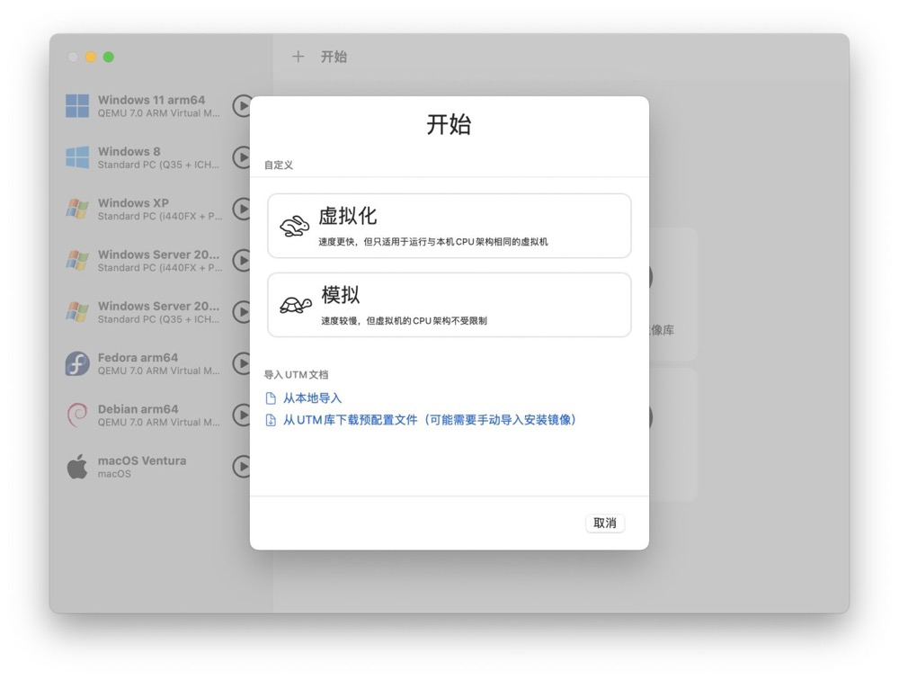

3、操作系统选择Windows；

4、取消导入VHDX磁盘镜像的勾线，然后倒入光盘镜像，点击“下一步”。

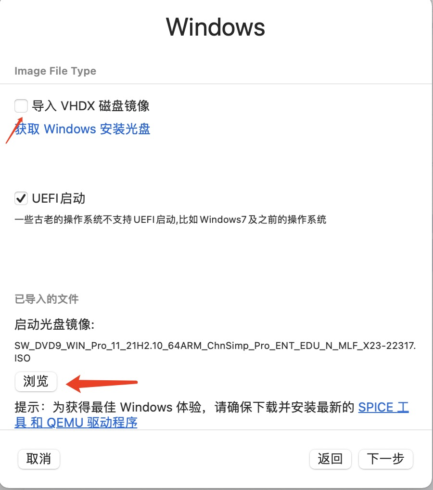

5、内存使用默认（4G），下一页的存储器填入100G（磁盘空间，Win11安装要求至少54G）；

6、文件共享，可以选择一个目录与虚拟机进行共享，方便和宿主机交互文件，这里可以创建一个UTMShare目录并进行指向；

7、最后一步是总结，名称可以按需要调整，然后点击保存按钮。如果需要进行高级设置，可以勾选“打开VM设置”，这样在虚拟机创建以后会打开设置界面，我们这里可以暂时不设置。

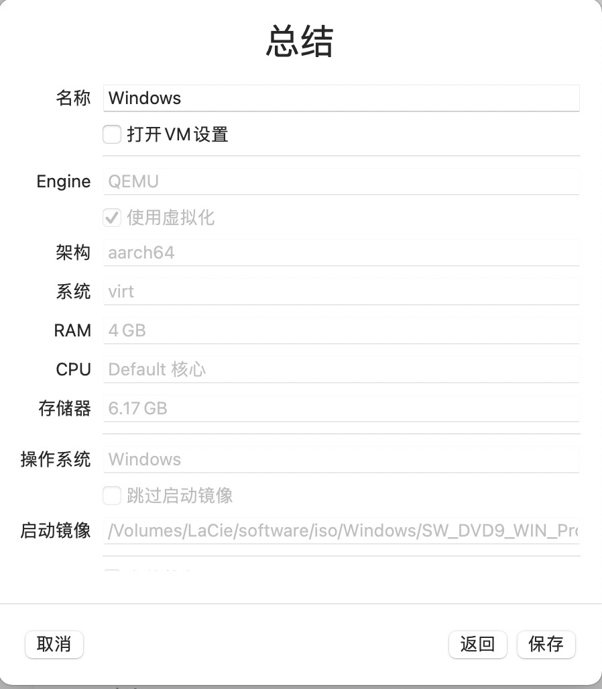

8、等待应用创建虚拟机，创建完成有以下界面：

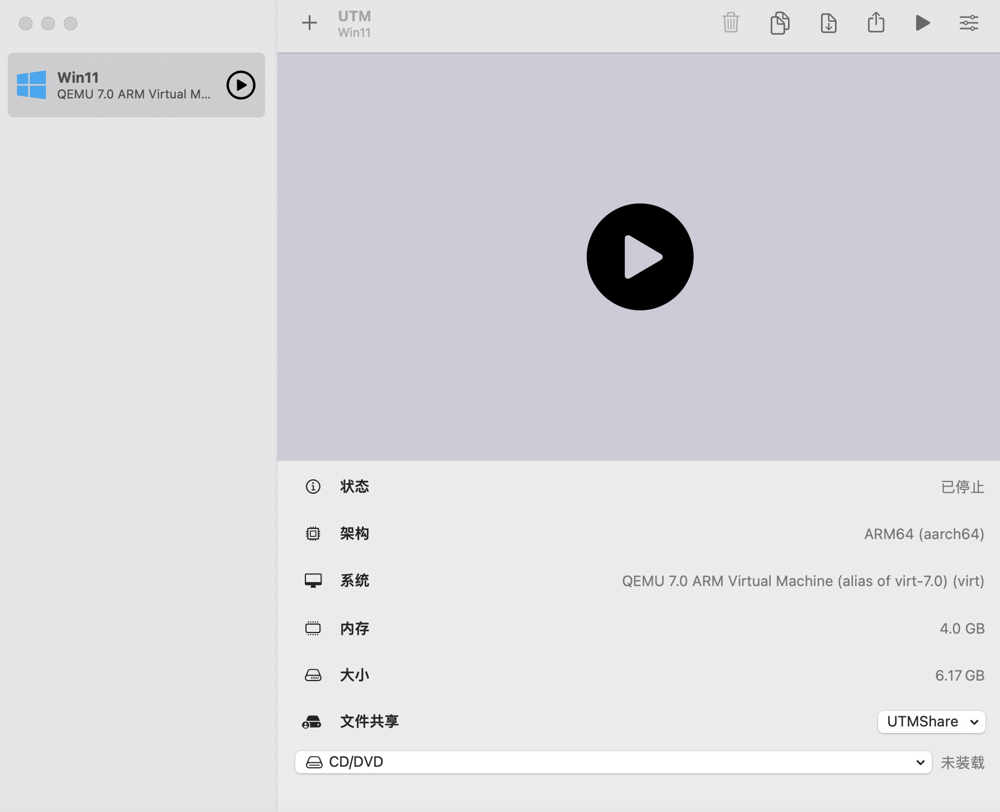

## 移动虚拟机到移动硬盘（可选）

由于MacBook的硬盘空间吃紧，可以将虚拟机复制到移动硬盘的目录下，具体操作如下：

1、点击右上角的移动虚拟机的按钮，弹出提示选择确认：

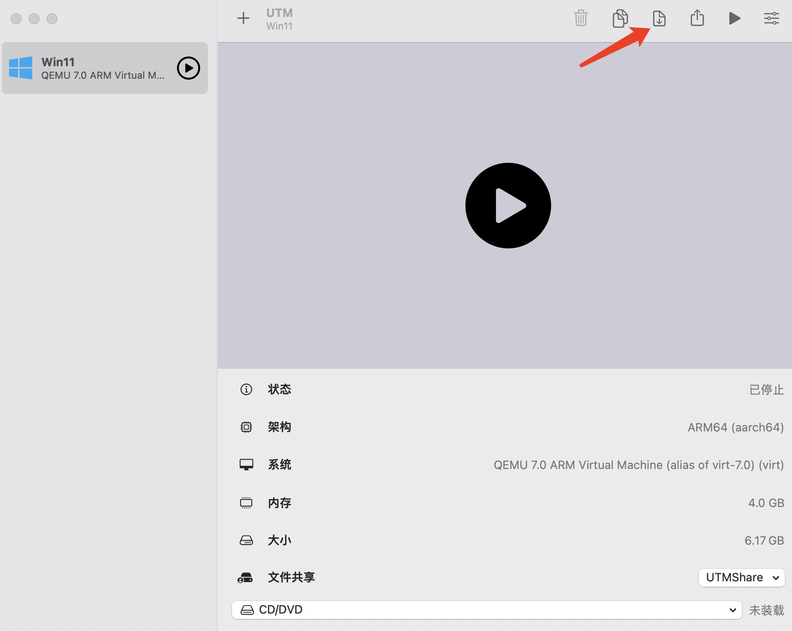

2、选择要移动到的移动硬盘上的目录，确认后等待应用完成即可。

## 运行虚拟机

1、点击左边列表上虚拟机的运行按钮，启动虚拟机；

2、启动后，根据提示，按空格使用CD/DVD启动，这样运行后会进入Windows的安装界面；

3、Mac的虚拟机，在硬件资源配置足够的情况下，一般会缺少两个安装条件，一个是安全启动，另一个是TPM平台的检测，因此安装的时候会出现“电脑不符合最低系统要求”的提示，处理方案如下，在启动安装后的安装界面上执行以下操作：

（1）Shift+F10（Shift+fn+F10），调出命令行窗口；

（2）输入regedit回车，打开注册表；

（3）找到HKEY_LOCAL_MACHINE\SYSTEM\Setup，在Setup下新建 项：LabConfig；

（4）在LabConfig项里创建2个DWORD(32为)值：BypassTPMCheck，数值设定为1，BypassSecureBootCheck，数值设定为1；

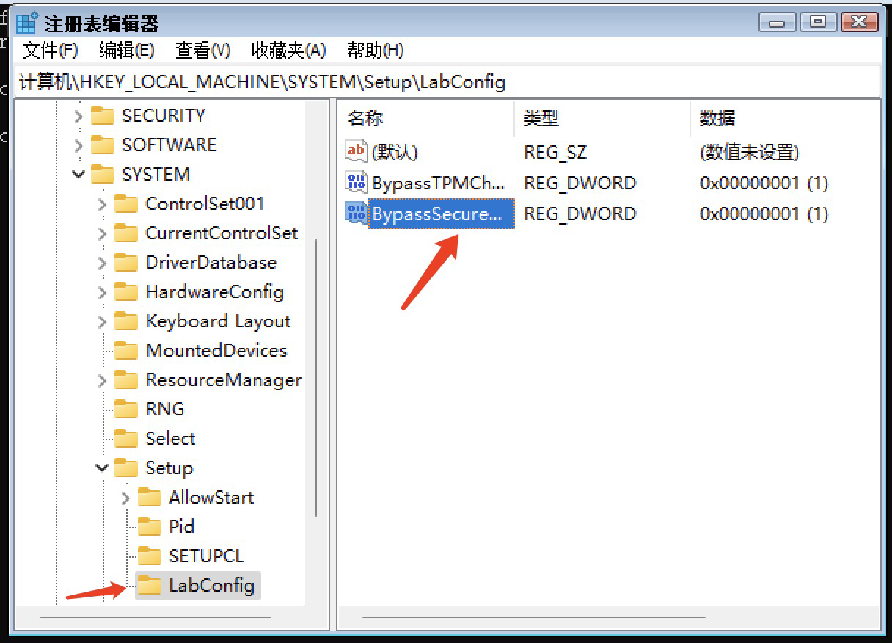

（5）添加完之后，直接点击关闭，注册表是自动保存的。

3、安装过程中也有可能会出现找不到介质驱动程序，此时点击右上角的光盘按钮，把ISO文件装载进光盘，就会自动找到对应的驱动程序：

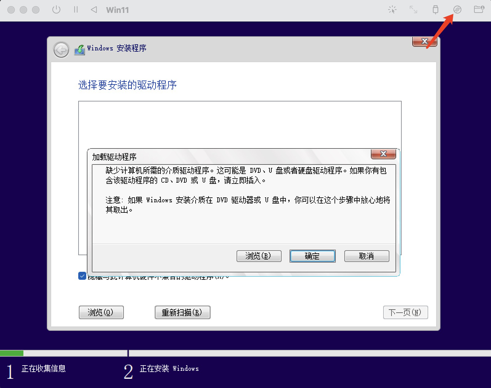

4、Windows的安装版本选择安装专业版；

5、安装类型选择自定义：仅安装Windows；

6、然后一路默认，等待Windows进行自动安装处理，期间有自动重启也无需操作；等到遇到下面的界面，就要开始配置了：

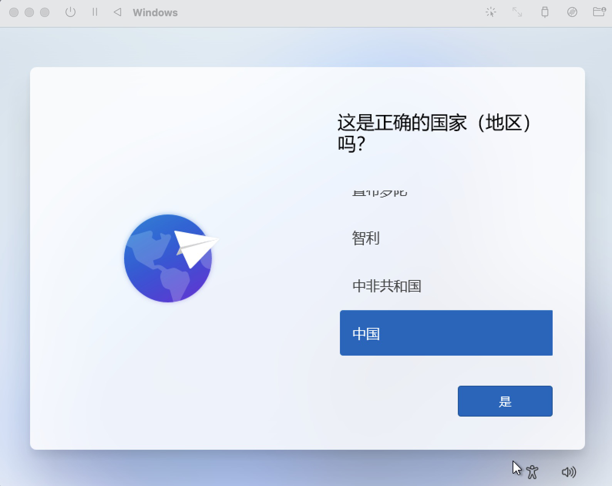

7、是否设置第二个键盘布局，选择跳过；

8、连网部分，选择“我没有internet连接”，以及“继续执行受限限制”；

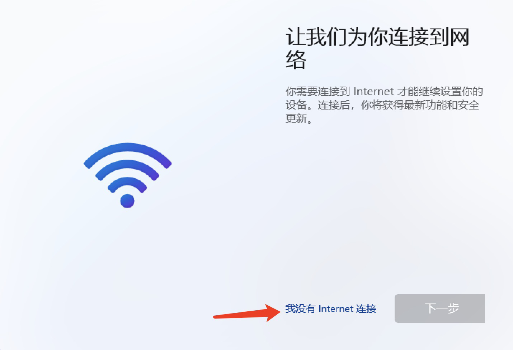

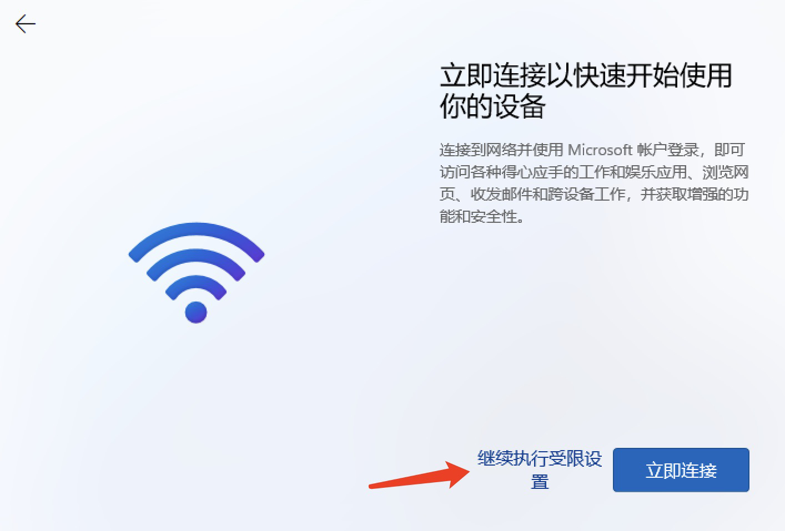

9、输入登录名，例如“lhj”，登录密码以及安全问题；

10、隐私设置全部关闭就好；

11、再等待一段时间的配置，终于可以看到Windows的界面了：

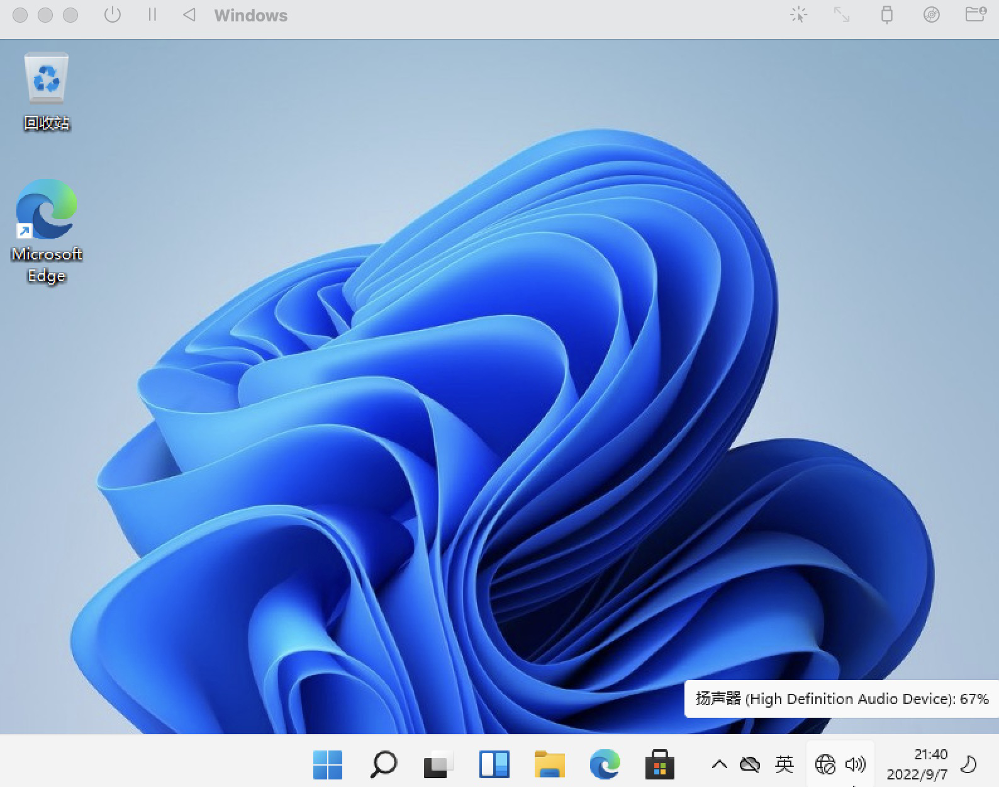

## 安装spice-guest-tools

1、在虚拟机的光盘（右上角）加载spice-guest-tools-0.164.3.iso文件；

2、运行光盘中的spice-guest-tools-0.164.exe程序；

3、安装完按提示重启虚拟机；

4、关闭虚拟机，编辑虚拟机的现实配置，按照下图方式设置：

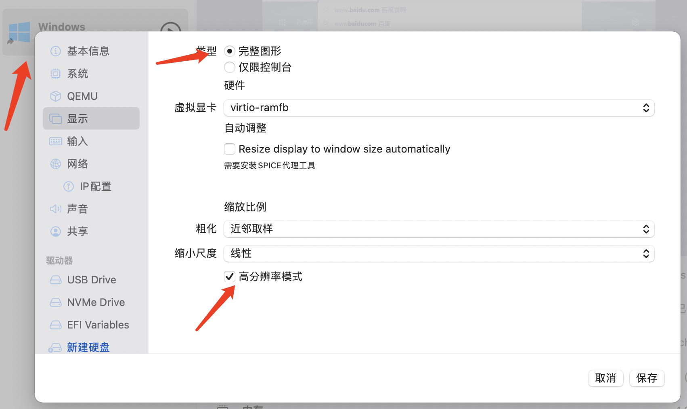

5、安装这个插件以后，除了显示优化外，虚拟机和宿主机也可以可以相互访问剪贴板。
