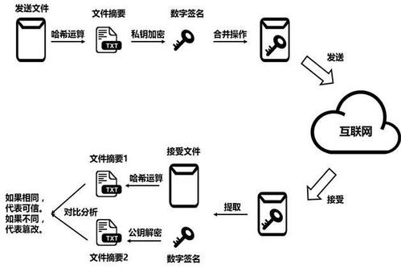
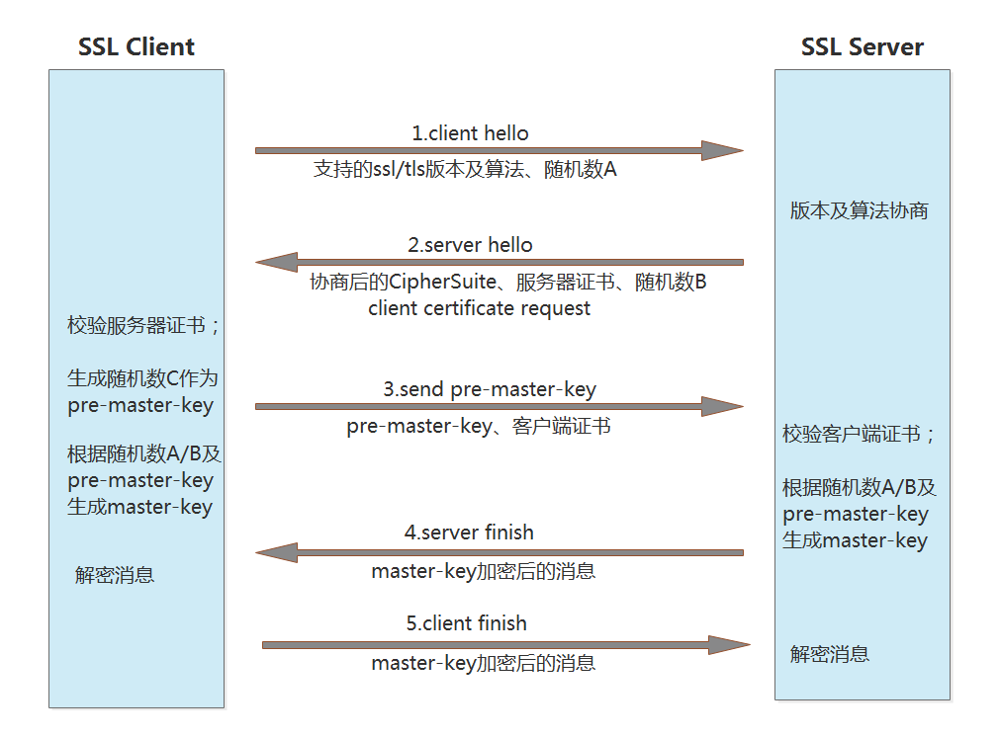
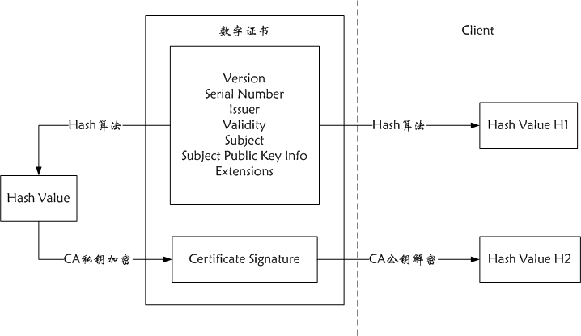
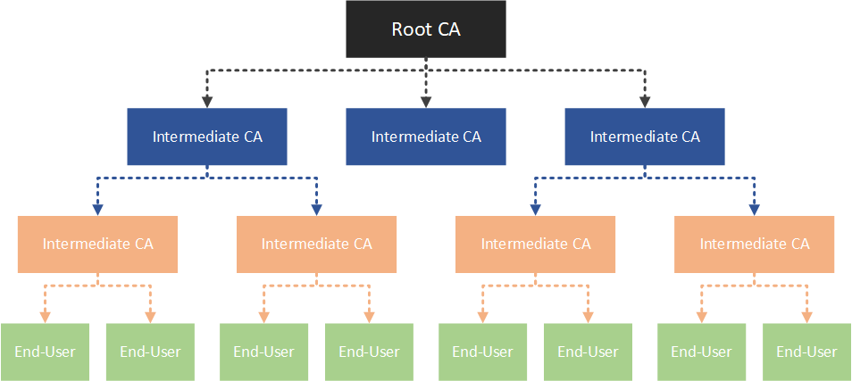
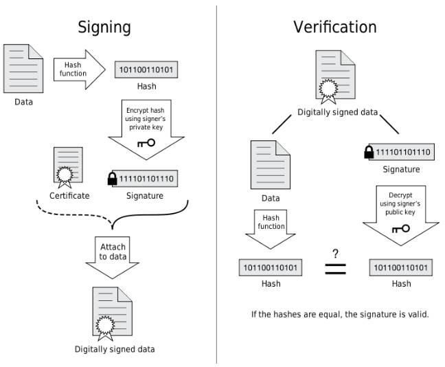

# SSL&TSL原理

## 非对称加密

### 概念说明

非对称加密算法是一种密钥的保密方法，需要两个密钥：公开密钥（publickey:简称公钥）和私有密钥（privatekey:简称私钥），公开密钥与私有密钥是一对，如果用公开密钥对数据进行加密，只有用对应的私有密钥才能解密；如果用私有密钥对数据进行加密，那么只有用对应的公开密钥才能解密。

私钥和公钥是一对，谁都可以加解密，只是谁加密谁解密是看应用情景，常见的两个场景：

**数据加密**

不希望数据所有人都能看到，只有持有私钥的接收方才能看；所以发送方使用公钥对数据进行加密，接收方使用私钥进行数据解密和使用。


**签名验签**

希望接收方能验证数据是否从指定的合法机构发出，所以发送方使用私钥对签名数据进行加密，接收方使用公钥对数据解密后与明文比对确认数据发出方是合法机构。




### 应用流程示例

1. 机构A需要与合作方B、C、D进行数据交互，由A生成一对密钥（公钥和私钥）并将公钥提供给B、C、D
2. 合作方B需要传输数据给A，B使用公钥进行数据加密并发送给A
3. A收到加密数据后，使用私钥进行解密和业务处理
4. 当A需要向B发送报文时（数据无需加密的情况），生成数据摘要（例如获取关键字段进行哈希处理），并使用私钥对数据摘要进行加密形成签名数据，并附在报文中一并发送给B
5. B收到报文时，使用同样算法对报文生成数据摘要，并使用公钥对签名数据进行解密，然后比较两种方式获取到的摘要数据是否一致，如果一致则代表签名验签通过，可以确定数据是从A机构提交


### 常见算法

[RSA](https://baike.baidu.com/item/RSA)、[Elgamal](https://baike.baidu.com/item/Elgamal)、背包算法、Rabin、D-H、[ECC](https://baike.baidu.com/item/ECC)（椭圆曲线加密算法）。

使用最广泛的是RSA算法，Elgamal是另一种常用的非对称加密算法。


## SSL & TSL

### 概念说明

**SSL（Secure Socket Layer，安全套接字层）**

SSL为Netscape所研发，用以保障在Internet上数据传输之安全，利用数据加密(Encryption)技术，可确保数据在网络上之传输过程中不会被截取。SSL当前版本为3.0，已被广泛地用于Web浏览器与服务器之间的身份认证和加密数据传输。

SSL协议位于TCP/IP协议与各种应用层协议之间，为数据通讯提供安全支持。

SSL协议可分为两层： 

- SSL记录协议（SSL Record Protocol）：它建立在可靠的传输协议（如TCP）之上，为高层协议提供数据封装、压缩、加密等基本功能的支持。 
- SSL握手协议（SSL Handshake Protocol）：它建立在SSL记录协议之上，用于在实际的数据传输开始前，通讯双方进行身份认证、协商加密算法、交换加密密钥等

**TLS(Transport Layer Security，传输层安全协议)**

TLS 1.0是IETF（Internet Engineering Task Force，Internet工程任务组）制定的一种新的协议，它**建立在SSL 3.0协议规范之上，是SSL 3.0的后续版本，可以理解为SSL 3.1**(可简单理解为同一事物不同阶段的不同称呼)，它是写入了 RFC 的。

该协议由两层组成： TLS 记录协议（TLS Record）和 TLS 握手协议（TLS Handshake）。较低的层为 TLS 记录协议，位于某个可靠的传输协议（例如 TCP）上面。


### SSL简要流程说明

SSL/TSL的处理流程是协议本身定义的，正常情况下直接通过“浏览器/Web服务器/开发库”等支持协议的产品或组件负责处理，以下流程示例只是用于简单理解协议本身，不影响协议的具体应用。

| **浏览器**                                                   |                                                           | **服务器**                                                   |
| ------------------------------------------------------------ | --------------------------------------------------------- | ------------------------------------------------------------ |
| 发起                                                         | —>  1.浏览器通知服务器浏览器所支持的加密协议              | 接收                                                         |
| 接收                                                         | <—  2.服务器通知浏览器从1中选用的加密协议,并给予证书      | 发起                                                         |
| 3.用CA的公钥鉴别服务器的证书是否有效,有效则生成一个随机数(秘密数),秘密数加上2确定的加密协议产生会话密钥 |                                                           |                                                              |
| 发起                                                         | —> 4.浏览器用服务器的公钥加密秘密数发给服务器             | 接收                                                         |
|                                                              |                                                           | 5.服务器用私钥对4解密获得秘密数再加上2确定的加密协议产生会话密钥 |
|                                                              | <— 握手结束,使用相同的会话密钥加密传输的数据(对称加密) —> |                                                              |

**注意:** 过程有所简化,比方说在正式使用会话密钥通话前,浏览器和服务器各自会发送一段用会话密钥加密的 Finish 消息,以检验之前通过握手建立起来的加解密通道是否成功。

### SSL详细流程示例




**1、客户端发出请求（ClientHello）**

在这一步，客户端主要向服务器提供以下信息：

- 支持的协议版本，比如TLS 1.0版
- 一个客户端生成的随机数A，稍后用于生成”对话密钥”
- 支持的加密方法，比如RSA公钥加密
- 支持的压缩方法

**2、服务器回应（SeverHello)**

在这一步，服务器的回应包含以下内容：

- 协商采用的SSL/TLS 版本号，比如TLS 1.0版本。如果浏览器与服务器支持的版本不一致，服务器关闭加密通信
- 会话ID
- 一个服务器生成的随机数B，稍后用于生成”对话密钥”
- 确认使用的加密方法，比如RSA公钥加密
- 服务器证书（用于证明服务器是指定的合法机构，该证书是由专门的数字证书认证机构(CA)通过非常严格的审核之后颁发的电子证书，颁发证书的同时会产生一个私钥和公钥；分发给客户端的证书附带着公钥信息，同时也附带一个证书电子签名用来验证证书的完整性和真实性，可以防止证书被串改，以及有效期信息用于判断证书是否已过期）
- Server Key Exchange：如果服务端向客户端发送的证书中没有提供足够的信息（证书公钥）的时候，还可以向客户端发送一个 Server Key Exchange提供相关信息
-  Cerficate Request ：由于双向认证需求，服务端需要对客户端进行认证，会同时发送一个 client certificate request，表示请求客户端的证书

**3、客户端回应（Certificate Verify）**

在这一步，客户端处理及回应的内容包括：

- 客户端校验服务端的数字证书，如果证书不是可信机构颁布、或者证书中的域名与实际域名不一致、或者证书已经过期，就会向访问者显示一个警告，由其选择是否还要继续通信
- 校验通过之后发送随机数C，该随机数称为pre-master-key，使用数字证书中的公钥加密后发出
- 如果服务端发起了 client certificate request，客户端使用私钥加密一个随机数 clientRandom随客户端的证书 clientCA一并发出

**4、服务器的最后回应（Server Finish）**

在这一步，服务器处理及回应的内容包括：

- 服务端校验客户端的证书，并成功将客户端加密的随机数clientRandom 解密
- 根据 随机数A/随机数B/随机数C(pre-master-key) 产生动态密钥 master-key，加密一个finish 消息发至客户端；

**5、客户端的最后回应（client Finish）**

客户端根据 同样的随机数和算法 生成master-key，加密一个finish 消息发送至服务端。

**6、进行后续的数据传输**

服务端和客户端分别解密成功，至此握手完成，之后的数据包均采用master-key进行加密传输。


### SSL密钥协商的形象化比喻

这里我们用个形象的比喻，我们假设A与B通信，A是SSL客户端，B是SSL服务器端，加密后的消息放在方括号[]里，以突出明文消息的区别。双方的处理动作的说明用圆括号（）括起。

A：我想和你安全的通话，我这里的对称加密算法有DES,RC5，密钥交换算法有RSA和DH，摘要算法有MD5和SHA。

B：我们用DES－RSA－SHA这对组合好了。 这是我的证书，里面有我的名字和公钥，你拿去验证一下我的身份（把证书发给A）。 

A：（查看证书上B的名字是否无误，并通过手头早已有的CA的证书验证了B的证书的真实性，如果其中一项有误，发出警告并断开连接，这一步保证了B的公钥的真实性） 
（产生一份秘密消息，这份秘密消息处理后将用作加密密钥，加密初始化向量（IV）和hmac的密钥。将这份秘密消息-协议中称为per_master_secret-用B的公钥加密，封装成称作ClientKeyExchange的消息。由于用了B的公钥，保证了第三方无法窃听） 
我生成了一份秘密消息，并用你的公钥加密了，给你（把ClientKeyExchange发给B） 
注意，下面我就要用加密的办法给你发消息了！ 
（将秘密消息进行处理，生成加密密钥，加密初始化向量和hmac的密钥） 
[我说完了]

B：（用自己的私钥将ClientKeyExchange中的秘密消息解密出来，然后将秘密消息进行处理，生成加密密钥，加密初始化向量和hmac的密钥，这时双方已经安全的协商出一套加密办法了） 
注意，我也要开始用加密的办法给你发消息了！ 
[我说完了]

A: [我的秘密是…]

B: [其它人不会听到的…]


## 数字证书介绍

### 概念说明

**数字证书(certificate)**

数字证书是用来认证公钥持有者身份合法性的电子文档，以防止第三方冒充行为。在因特网、公司内部网或外部网中，使用数字证书实现身份识别和电子信息加密。数字证书中含有密钥对（公钥和私钥）所有者的识别信息，通过验证识别信息的真伪实现对证书持有者身份的认证。

数字证书涉及到一个名为 **PKI（Public Key Infrastructure）** 的规范体系，包含了数字证书格式定义、密钥生命周期管理、数字签名及验证等多项技术说明。



数字证书包含以下内容：

(1) Validity也即有效期，有效期包含生效时间和失效时间，是一个时间区间；

(2) 公钥信息Subject Public Key Info，包括公钥的加密算法和公钥内容；

(3) Fingerprints信息，fingerprints用于验证证书的完整性，也就是说确保证书没有被修改过。 其原理就是在发布证书时，发布者根据指纹算法(此处证书使用了SHA-1和SHA-256算法)计算整个证书的hash值(指纹)并和证书放在一起，client在打开证书时，自己也根据指纹算法计算一下证书的hash值(指纹)，如果和刚开始的值相同，则说明证书未被修改过；如果hash值不一致，则表明证书内容被篡改过；

(4) 证书的签名Certificate Signature Value和Certificate Signature Algorithm，对证书签名所使用的Hash算法和Hash值；

(5) 签发该证书的CA机构Issuer；

(6) 该证书是签发给哪个组织/公司信息Subject；

(7) 证书版本Version、证书序列号Serial Number以及Extensions扩展信息等。


**证书链（certificate chain）**

在获取到一个数字证书后，如何确认这个证书是否可信，避免该证书是仿冒的？由于证书自身的信息是没有办法确保可信，因此需要通过另外一个可信的证书来证明当前证书的可信，如此类推，从而形成多个证书之间的信任链条，这个链条就叫证书链。

以百度的证书为例，其证书链如下：GlobalSign Root CA -> GlobalSign Organization Validation CA -> baidu.com

这个层次可以抽象为三个级别：

1. end-user：即 baidu.com，该证书包含百度的公钥，访问者就是使用该公钥将数据加密后再传输给百度，即在 HTTPS 中使用的证书

2. intermediates：即证书的 **签发人 Issuer**，用来认证公钥持有者身份的证书（GlobalSign Organization Validation CA），负责确认 HTTPS 使用的 end-user 证书确实是来源于百度。这类 intermediates 证书可以有很多级，也就是说 **签发人 Issuer 可能会有有很多级** 

3. root：可以理解为 **最高级别的签发人 Issuer**，负责认证 intermediates 身份的合法性（GlobalSign Root CA）。

   

结合实际的使用场景对证书链进行一个归纳：

1. 为了获取 end-user 的公钥，需要获取 end-user 的证书，因为公钥就保存在该证书中
2. 为了证明获取到的 end-user 证书是可信的，就要看该证书是否被 intermediate 权威机构认证，等价于是否有权威机构的数字签名
3. 有了权威机构的数字签名，而权威机构就是可信的吗？需要继续往上验证，即查看是否存在上一级权威认证机构的数字签名
4. 信任链条的最终是Root CA，他采用自签名，对他的签名只能无条件的信任

**注意：对于没有证书链信息的证书属于自签名证书，只能无条件信任，Root CA就是属于自签名证书，但一般Root CA都是由操作系统或浏览器内置的权威证书机构发布的证书，或者使用者从可信任机构中获取到证书后导入操作系统或浏览器进行使用；当证书链的Root CA不在浏览器的可信证书列表时，访问时浏览器将提示连接不受信任。**


**根证书(root certificates)**

就是上面证书链中提到的Root CA，应该不用再进行解释。由于根证书是内置在操作系统或浏览器中，如果使用自签root证书需要使用者自行导入，因此推广起来非常困难，这也导致目前的证书市场基本上被 Symantec(VeriSign/GeoTrust) / Comodo / GoDaddy 等证书颁发机构所垄断。百度使用的是Versign，google使用的是GeoTrust。

目前HTTPS的推广已经不可避免，也已经有一些公益组织开始提供免费、自动化、开放的证书签发服务，例如：[Let's  Encrypt](https://letsencrypt.org/) 。详细使用可以参考奇舞周刊的这篇文章，[Let's  Encrypt，免费好用的 HTTPS 证书](http://mp.weixin.qq.com/s?__biz=MzA4NjE3MDg4OQ==&mid=403223622&idx=1&sn=d130ee884814cc46524386e679f49bda&scene=23&srcid=0506RAlMrmCbTpP1R50vxKRO#rd) 。


### 证书签发及验证流程



##### 签发证书（Signing）的过程

1. 撰写证书元数据：包括 **签发人(Issuer)**、**地址**、**签发时间**、**有效期** 等，还包括证书持有者(Owner)基本信息，比如 **DN(DNS Name，即证书生效的域名)**、 **Owner 公钥** 等信息
2. 使用通用的 Hash 算法（如SHA-256）对证书元数据计算生成 **数字摘要** 
3. 使用 Issuer 的私钥对该数字摘要进行加密，生成一个加密的数字摘要，也就是Issuer的 **数字签名** 
4. 将数字签名附加到数字证书上，变成一个 **签过名的数字证书** 
5. 将签过名的数字证书与 **Issuer 的公钥**，一同发给证书使用者（注意，将公钥主动发给使用者是一个形象的说法，只是为了表达使用者最终获取到了 Issuer 的公钥）

##### 验证证书（Verification）的过程

1. 证书使用者获通过某种途径（如浏览器访问）获取到该数字证书，解压后分别获得 **证书元数据** 和 **数字签名** 
2. 使用同样的Hash算法计算证书元数据的 **数字摘要** 
3. 使用 **Issuer 的公钥** 对数字签名进行解密，得到 **解密后的数字摘要** 
4. 对比 2 和 3 两个步骤得到的数字摘要值，如果相同，则说明这个数字证书确实是被 Issuer 验证过合法证书，证书中的信息（最主要的是 Owner 的公钥）是可信的

**上述是对数字证书的签名和验证过程，对普通数据的数字签名和验证也是利用了同样的方法。**

我们再来总结一下“签发证书”与“验证证书”两个过程，Issuer（CA）使用 **Issuer 的私钥** 对签发的证书进行数字签名，证书使用者使用 **Issuser 的公钥** 对证书进行校验，如果校验通过，说明该证书可信。


### 常见数字证书格式

证书格式分为2大类：密钥库（含私钥，也可能有公钥）和公钥证书（仅含公钥）

#### 密钥库文件格式【Keystore】

**1、JKS**
扩展名  : .jks/.ks
描述     : 【Java Keystore】密钥库的Java实现版本，provider为SUN
特点     :  密钥库和私钥用不同的密码进行保护

**2、JCEKS**
扩展名  :  .jce
描述     : 【JCE Keystore】密钥库的JCE实现版本，provider为SUN JCE
特点     :  相对于JKS安全级别更高，保护Keystore私钥时采用TripleDES

**3、PKCS12**
扩展名  :  .p12/.pfx
描述     : 【PKCS #12】个人信息交换语法标准
特点     :  1、包含私钥、公钥及其证书
                2、密钥库和私钥用相同密码进行保护

**4、BKS**
扩展名  : .bks
描述     :  【Bouncycastle Keystore】密钥库的BC实现版本，provider为BC
特点     :  基于JCE实现

**5、UBER**
扩展名  : .ubr
描述     : 【Bouncycastle UBER Keystore】密钥库的BC更安全实现版本，provider为BC

#### 证书文件格式【Certificate】

**1、DER** 
扩展名       :  .cer/.crt/.rsa
描述          : 【ASN .1 DER】用于存放证书 
特点          :  不含私钥、二进制

**2、PKCS7** 
扩展名       : .p7b/.p7r 
描述          : 【PKCS #7】加密信息语法标准
特点          : 1、p7b以树状展示证书链，不含私钥
                   2、p7r为CA对证书请求签名的回复，只能用于导入

**3、CMS** 
扩展名       :  .p7c/.p7m/.p7s 
描述          : 【Cryptographic Message Syntax】 
特点          : 1、p7c只保存证书
                   2、p7m：signature with enveloped data
                   3、p7s：时间戳签名文件

**4、PEM**
扩展名       : .pem 
描述          : 【Printable Encoded Message】 
特点          : 1、该编码格式在RFC1421中定义，其实PEM是【Privacy-Enhanced Mail】的简写，但他也同样广泛运用于密钥管理
                   2、ASCII文件
                   3、一般基于base 64编码
                   4、.pem 文件可以存放证书或私钥，或者两者都包含；如果只包含私钥，一般用.key文件代替

**5、PKCS10** 
扩展名      : .p10/.csr 
描述         : 【PKCS #10】公钥加密标准【Certificate Signing Request】
特点         :  1、证书签名请求文件
                   2、ASCII文件
                   3、CA签名后以p7r文件回复

**6、 SPC** 
扩展名      : .pvk/.spc 
描述          : 【Software Publishing Certificate】 
特点          :  微软公司特有的双证书文件格式，经常用于代码签名，其中
                  1、pvk用于保存私钥
                  2、spc用于保存公钥 

#### 数字证书文件格式（cer和pfx）的区别

作为文件形式存在的证书一般有这几种格式：

1.带有私钥的证书由Public Key Cryptography Standards #12，PKCS#12标准定义，包含了公钥和私钥的二进制格式的证书形式，以pfx作为证书文件后缀名。

2.二进制编码的证书 证书中没有私钥，DER 编码二进制格式的证书文件，以cer作为证书文件后缀名。

3.Base64编码的证书证书中没有私钥，BASE64 编码格式的证书文件，也是以cer作为证书文件后缀名。

由定义可以看出，只有pfx格式的数字证书是包含有私钥的，cer格式的数字证书里面只有公钥没有私钥。


### 数字证书格式转换

#### 主流 Web 服务软件

一般来说，主流的 Web 服务软件，通常都基于 OpenSSL 和 Java 两种基础密码库。

- Tomcat、Weblogic、JBoss等Web服务软件，一般使用Java提供的密码库。通过Java Development Kit （JDK）工具包中的Keytool工具，生成Java Keystore（JKS）格式的证书文件。

- Apache、Nginx等Web服务软件，一般使用OpenSSL工具提供的密码库，生成PEM、KEY、CRT等格式的证书文件。

- IBM的Web服务产品，如Websphere、IBM Http Server（IHS）等，一般使用IBM产品自带的iKeyman工具，生成KDB格式的证书文件。

- 微软Windows Server中的Internet Information Services（IIS）服务，使用Windows自带的证书库生成PFX格式的证书文件。

  


#### 简单查看文本格式的证书文件

可以使用记事本直接打开证书文件。如果显示的是规则的数字字母，例如：

```
—–BEGIN CERTIFICATE—–
MIIE5zCCA8+gAwIBAgIQN+whYc2BgzAogau0dc3PtzANBgkqh......
—–END CERTIFICATE—–
```

那么，该证书文件是文本格式的。

- 如果存在——BEGIN CERTIFICATE——，则说明这是一个证书文件。
- 如果存在—–BEGIN RSA PRIVATE KEY—–，则说明这是一个私钥文件。


#### 证书格式转换

您可使用以下方式实现证书格式之间的转换：

- 将JKS格式证书转换成PFX格式您可以使用JDK中自带的Keytool工具，将JKS格式证书文件转换成PFX格式。例如，您可以执行以下命令将 server.jks证书文件转换成 server.pfx证书文件：

  ```
  keytool -importkeystore -srckeystore D:\server.jks -destkeystore D:\server.pfx
          -srcstoretype JKS -deststoretype PKCS12
  ```

  

- 将PFX格式证书转换为JKS格式您可以使用JDK中自带的Keytool工具，将PFX格式证书文件转换成JKS格式。例如，您可以执行以下命令将 server.pfx证书文件转换成 server.jks证书文件：

  ```
  keytool -importkeystore -srckeystore D:\server.pfx -destkeystore D:\server.jks
          -srcstoretype PKCS12 -deststoretype JKS
  ```

  

- 将PEM/KEY/CRT格式证书转换为PFX格式您可以使用 OpenSSL工具，将KEY格式密钥文件和CRT格式公钥文件转换成PFX格式证书文件。例如，将您的KEY格式密钥文件（server.key）和CRT格式公钥文件（server.crt）拷贝至OpenSSL工具安装目录，使用OpenSSL工具执行以下命令将证书转换成 server.pfx证书文件：

  ```
  openssl pkcs12 -export -out server.pfx -inkey server.key -in server.crt
  ```

  

- 将PFX转换为PEM/KEY/CRT

  您可以使用 OpenSSL工具，将PFX格式证书文件转化为KEY格式密钥文件和CRT格式公钥文件。例如，将您的PFX格式证书文件拷贝至OpenSSL安装目录，使用OpenSSL工具执行以下命令将证书转换成server.pem证书文件KEY格式密钥文件（server.key）和CRT格式公钥文件（server.crt）：

  - openssl pkcs12 -in server.pfx -nodes -out server.pem
  - openssl rsa -in server.pem -out server.key
  - openssl x509 -in server.pem -out server.crt

  **说明** 此转换步骤是专用于通过Keytool工具生成私钥和CSR申请证书文件的，并且通过此方法您可以在获取到PEM格式证书公钥的情况下分离私钥。在您实际部署数字证书时，请使用通过此转换步骤分离出来的私钥和您申请得到的公钥证书匹配进行部署。