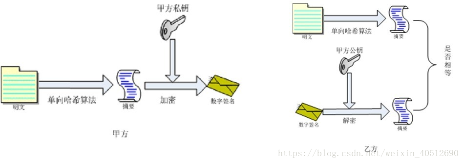

# openssl安装及使用

github: https://github.com/openssl/openssl


## Window安装说明

1、下载安装包，我们选择“Win64 OpenSSL v1.1.1c Light”的MSI版本进行下载和安装

windows安装包下载地址：http://slproweb.com/products/Win32OpenSSL.html

2、执行安装包，有以下选项需要调整（其他可以选择默认）：

Copy OpenSSL DLLs to：选择openssl的bin目录

3、将安装目录（例如：D:\Program Files\OpenSSL-Win64\bin）添加到path环境变量的中

4、打开命令行工具，执行openssl命令，可看到“OpenSSL>”的提示符代表安装成功


## openssl的使用

1.生成私钥

```
openssl genrsa -out rsa_private_key.pem  1024
```

2、通过私钥生成公钥

```
openssl rsa -in rsa_private_key.pem -pubout -out rsa_public_key.pem
```

3、对私钥进行pkcs8编码

```
openssl pkcs8 -in rsa_private_key.pem -topk8 -out pkcs9_rsa_private_key.pem  -inform PEM -outform PEM  -nocrypt
```

4、生成加密的私钥

```
openssl genrsa -aes256 -passout pass:123456 -out aes_rsa_private_key.pem 1024
```

5、通过加密私钥生成公钥

```
openssl rsa -in aes_rsa_private_key.pem -passin pass:123456 -pubout  -out rsa_public_key.pem
```

6、非加密私钥转加密

```
openssl rsa -in rsa_private_key.pem -aes256 -passout pass:123456 -out t_aes_rsa_private_key.pem
```

7、加密转非加密

```
openssl rsa -in t_aes_rsa_private_key.pem -passin pass:123456 -out t_rsa_private_key.pem
```

8、私钥pem转der

```
openssl rsa -in rsa_private_key.pem -outform der  -out rsa_private_key.der
```

9、查看私钥明细

```
openssl rsa -in rsa_private_key.pem -text -noout
```

10、通过已有的私钥生成签名证书

```
openssl req -new -x509 -days 365 -key aes_rsa_private_key.pem -out cert.crt
```

11、生成私钥和签名证书

```
openssl req -newkey rsa:2048 -nodes -keyout rsa_private_key.pem -x509 -days 365 -out cert.crt  #-nodes指的是不用密码
```

12、通过私钥生成CA签名

```
openssl req  -new -key aes_rsa_private_key.pem -passin pass:123456 -out server.csr
```

*** 此时生成的 csr签名请求文件可提交至 CA进行签发 ***

  

13、查看csr细节信息

```
openssl req -noout -text -in server.csr
```

14、查看证书细节

```
openssl x509 -in server.crt -noout -text
```

15、通过pem证书和私钥生成pkcs#12证书

```
openssl pkcs12 -export  -password pass:123456 -in server.crt  -inkey rsa_private_key.pem -out server.p12
```

其中-export指导出pkcs#12 证书，-inkey 指定了私钥文件，-passin 为私钥(文件)密码(nodes为无加密)，-password 指定 p12文件的密码(导入导出)


**签名摘要算法**



1.使用md5指定sha1算法，明文输出签名文件（所以建议做摘要和签名验证时使用dgst指令，以免误导）

```
openssl dgst  -sha1 -sign rsa_private_key.pem cert.crt -out sign.txt
---一样的结果
openssl md5  -sha1 -sign rsa_private_key.pem cert.crt -out sign.txt
---指定-c -hex参数，以16进制打印结果
openssl dgst  -sha256 -c -hex  -sign rsa_private_key.pem cert.crt
```


2.使用RSA秘钥进行签名验证操作

```
--公钥验证
openssl dgst -verify rsa_public_key.pem -sha1  -signature sign.txt  cert.crt
--私钥验证
openssl dgst -prverify rsa_private_key.pem -sha1  -signature sign.txt  cert.crt
```

