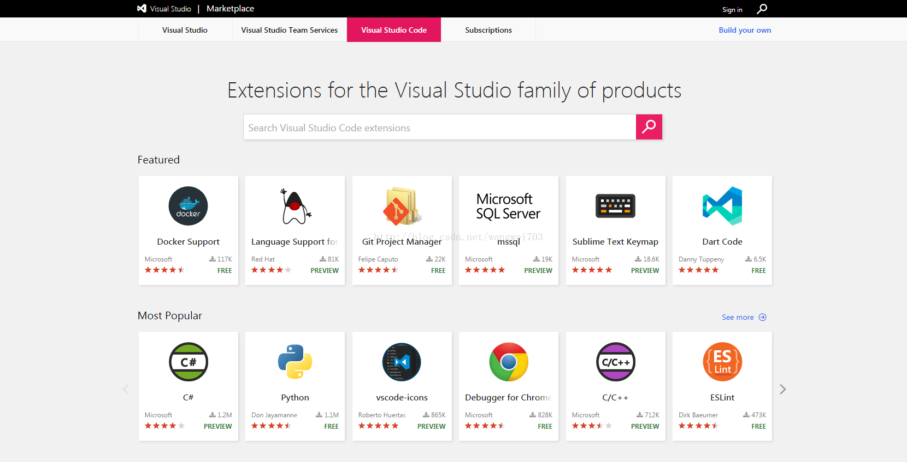
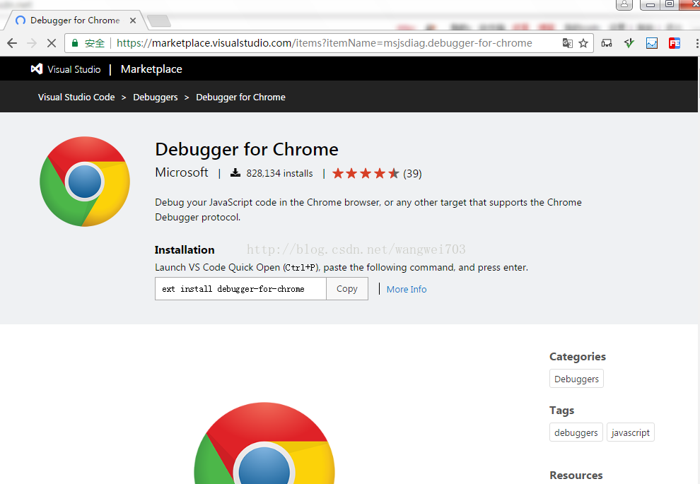
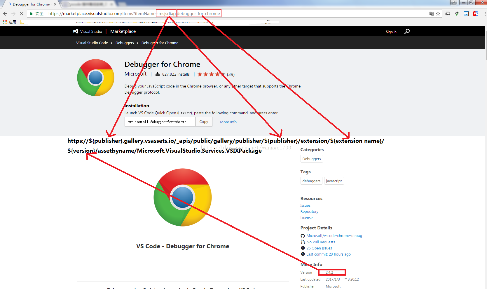
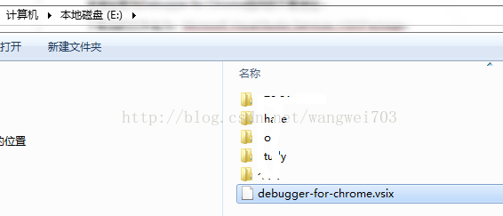
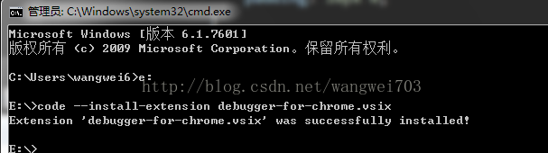
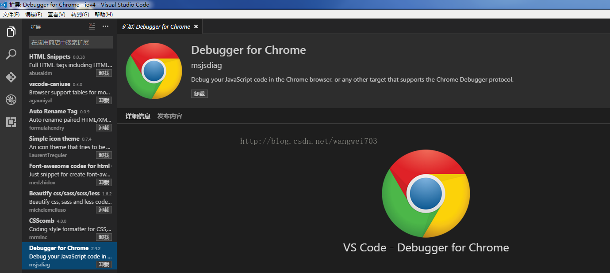

# VSCode 插件离线安装

注：该文章是基于CSDN博客[wangwei703的专栏](https://blog.csdn.net/wangwei703) 的《[VSCode 插件离线安装](https://blog.csdn.net/wangwei703/article/details/54020712)》整理得出。

## 如何下载插件

 

### 1、进入vscode插件官网（<https://marketplace.visualstudio.com/>）



 

### 2、找到需要安装的插件

找到需要安装的插件，进入插件主页（以Debugger for Chrome为例），但是在页面上找不到下载链接



 

 


### 3、如何下载

<https://code.visualstudio.com/docs/editor/extension-gallery?pub=HookyQR&ext=beautify#_common-questions>

该网站上提供了插件下载地址的拼接方式：

```
https://${publisher}.gallery.vsassets.io/_apis/public/gallery/publisher/${publisher}/extension/${extension name}/${version}/assetbyname/Microsoft.VisualStudio.Services.VSIXPackage
```

通过插件主页上面的信息对该地址进行替换



 

 

### 4、下载

替换后的地址如下：

https://msjsdiag.gallery.vsassets.io/_apis/public/gallery/publisher/msjsdiag/extension/debugger-for-chrome/2.4.2/

assetbyname/Microsoft.VisualStudio.Services.VSIXPackage

该地址即为Debugger for Chrome插件的下载地址。

下载后的文件名为：Microsoft.VisualStudio.Services.VSIXPackage，

 

## 如何安装插件

  下面安装方式是在windows环境下

### 1、重命名

将下载的文件Microsoft.VisualStudio.Services.VSIXPackage进行重命名为debugger-for-chrome.vsix ;文件名可以随意取，
 但是后缀一定要是vsix；

 

### 2、使用cmd进行安装

打开CMD，进入插件文件所在目录（debugger-for-chrome.vsix文件所在目录）；

我是将插件直接复制到了E盘根目录；

 



 

同样CMD也进入E:，然后执行： code --install-extensiondebugger-for-chrome.vsix

 



 

### 3、安装成功

打开或重启VSCode，看到插件已经安装成功；



 

 

