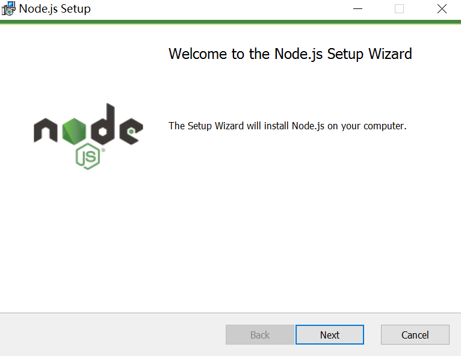
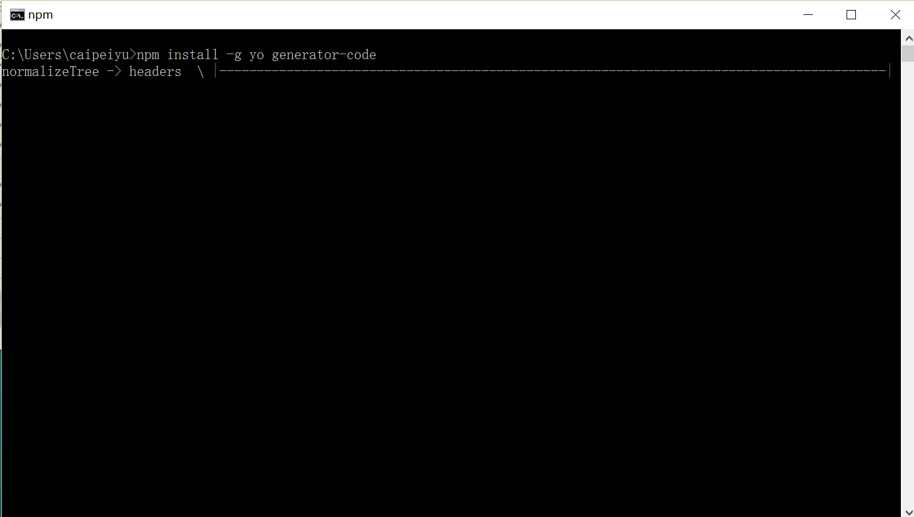
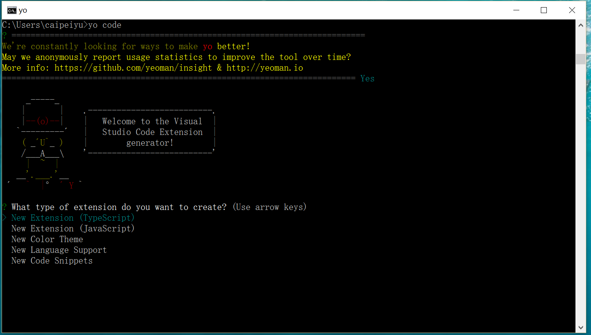
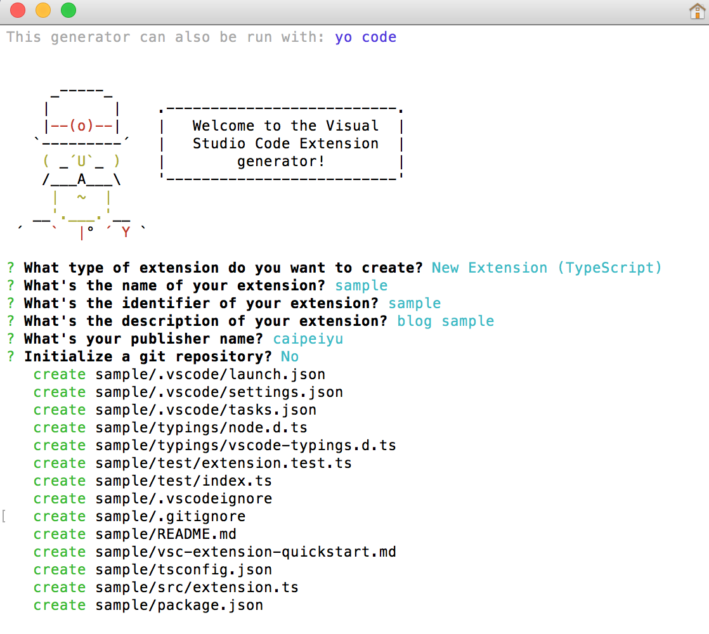
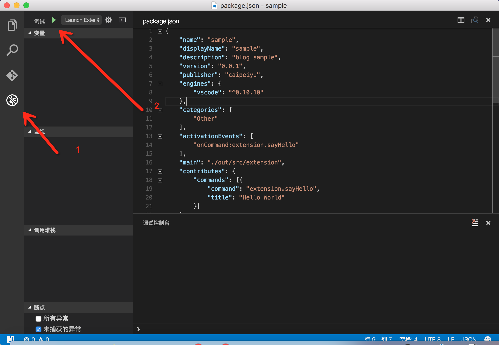
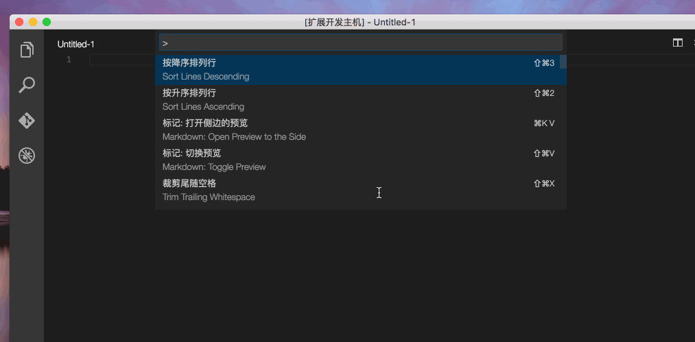
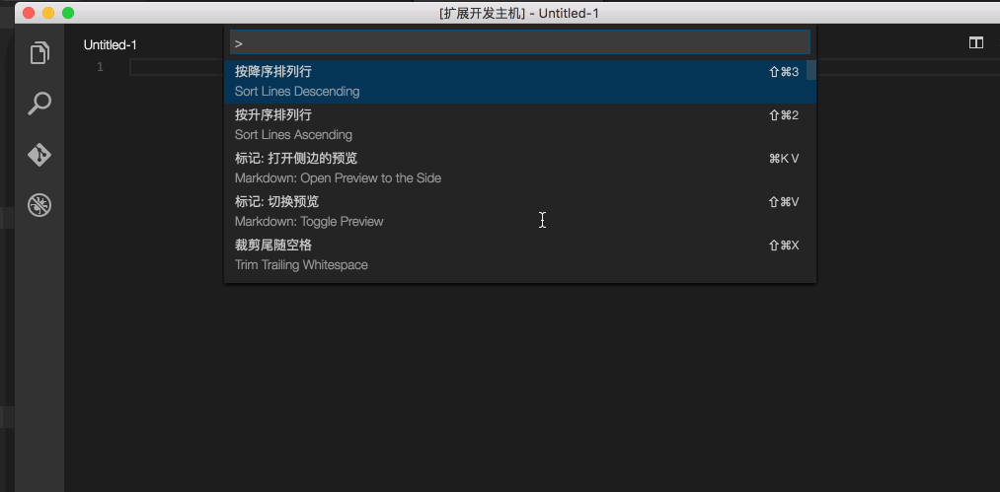
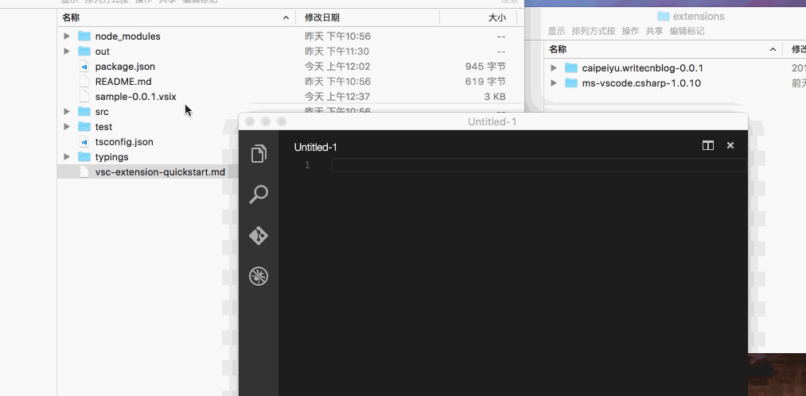

# [vscode编写插件详细过程](https://www.cnblogs.com/caipeiyu/p/5507252.html) (转载)

文章来源于[蛀牙](http://www.cnblogs.com/caipeiyu/)在cnblogs的博客，连接地址直接点击标题。


## 前言

之前编写了一个vscode插件[用vscode写博客和发布](http://www.cnblogs.com/caipeiyu/p/5475761.html)，然后有园友要求写一篇来介绍如何开发一个vscode扩展插件，或者说介绍开发这个插件的过程。然而文章还没有写，园子里面已经有人发布一个文章，是园友上位者的怜悯的[VSCODE 插件初探](http://www.cnblogs.com/lianmin/p/5499266.html)介绍了自己开发的一个插件与如何简单的开发一个插件。虽然已经有这么一个文章，但是我觉得还是可以更仔细的来介绍如何来开发一个vscode插件，也算之前说好要写这么一个文章的一个承诺吧，于是就有了还这么篇文章。

## 一、开发环境介绍与安装

为了演示一个安装环境，我安装了一个干净的win10系统来操作截图。

1.首先我们需要安装一个最基本的[Visual Studio Code](https://code.visualstudio.com/)，我们可以先到官网下载一最新版本的来进行安装，点击上面的连接，进去下载总是懂的吧。下载完后点击安装，然后一直下一步安装就可以。


2.安装完vscode后呢，我们就需要来看如何开发我们的自己的插件了，参考官方文档[Your First Extension(Example - Hello World)](https://code.visualstudio.com/docs/extensions/example-hello-world)。根据文档我们得知我们需要安装一个 [node.js](http://nodejs.cn/download/),同样的点击前面的连接，到nodejs的中文网站下载一个安装程序，下载完点击安装下一步就可以。


3.在安装完上面两个工具后，我们还需要一个生产插件代码的东西，也就是 [Yeoman](http://yeoman.io/) 和 [VS Code Extension generator](https://code.visualstudio.com/docs/tools/yocode).Yeoman的介绍不在本文章中，自己点击上面的连接去了解。我们可以打开cmd来执行下面的命令来安装这两个工具。[npm使用介绍](http://www.runoob.com/nodejs/nodejs-npm.html)

> npm install -g yo generator-code



在完成上面的安装后，可以通过输入命令

> yo code

来生成我们要的基本代码。


```
 在os系统上可以通过用上下键来选择要创建哪种类型的项目，在win可以通过输入1、2、3这样的数字然后按回车来选择。
```

## 二、生成基本代码的讲解与简单的修改

在几个项目类型中，我们选择了第一个TypeScript来作为我们编写扩展的语言，其他几个项目类型这里不做介绍。

[TypeScript语法自行理解](http://www.typescriptlang.org/docs/tutorial.html)

#### 项目结构介绍

我们创建的一个项目结构如下：



> 选择创建项目后有四个输入和一个选择

1. 输入你扩展的名称
2. 输入一个标志（项目创建的文件名称用这个）
3. 输入对这个扩展的描述
4. 输入以后要发布用到的一名称（和以后再发布时候有一个名字是对应上的）
5. 是问你要不要创建一个git仓库用于版本管理

> 以上几个输入都会在package.json 这个文件里面有对应的属性来表示。输入完之后就创建了如上图的一个目录结构。这里不要脸的复制了一下别人的目录说明，由于我这个项目没有让生成git仓库，所以没有.gitignore 这个文件。还有node_modules等其他多出来的目录结构是创建项目后运行 `npm install` 这个命令生成出来的。

```
.
├── .gitignore                  //配置不需要加入版本管理的文件
├── .vscode                     // VS Code的整合
│   ├── launch.json
│   ├── settings.json
│   └── tasks.json
├── .vscodeignore                //配置不需要加入最终发布到拓展中的文件
├── README.md
├── src                         // 源文件
│   └── extension.ts            // 如果我们使用js来开发拓展，则该文件的后缀为.js
├── test                        // test文件夹
│   ├── extension.test.ts       // 如果我们使用js来开发拓展，则该文件的后缀为.js
│   └── index.ts                // 如果我们使用js来开发拓展，则该文件的后缀为.js
├── node_modules
│   ├── vscode                  // vscode对typescript的语言支持。
│   └── typescript              // TypeScript的编译器
├── out                         // 编译之后的输出文件夹(只有TypeScript需要，JS无需)
│   ├── src
│   |   ├── extension.js
│   |   └── extension.js.map
│   └── test
│       ├── extension.test.js
│       ├── extension.test.js.map
│       ├── index.js
│       └── index.js.map
├── package.json                // 该拓展的资源配置文件
├── tsconfig.json               // 
├── typings                     // 类型定义文件夹
│   ├── node.d.ts               // 和Node.js关联的类型定义
│   └── vscode-typings.d.ts     // 和VS Code关联的类型定义
└── vsc-extension-quickstart.md 
```

#### 运行与简单修改

介绍完目录结构后，我们可以来运行一下看看效果如果。我们打开一个vscode并把我们的sample目录自己拖拉到vscode的界面上，然后选择调试窗口，并点击开始调试`或者直接按快捷键 F5`


项目运行起来后，会调用一个新的vscode窗口在标题栏的地方显示一个[扩展开发主机]的标题，然后这个窗口是支持我们刚才运行的插件项目的命令。



我们可以看到扩展插件已经正常的运行了，接下来我们可以来简单修改一下代码以实现不同的简单功能。在修改之前需要简单的认识两个文件

> package.json

```
   {
    "name": "sample",              //插件扩展名称（对应创建项目时候的输入）
    "displayName": "sample",
    "description": "blog sample",  //插件扩展的描述（对应创建项目时候的输入）
    "version": "0.0.1",
    "publisher": "caipeiyu",       //发布时候的一个名称（对应创建项目时候的输入）
    "engines": {
        "vscode": "^0.10.10"
    },
    "categories": [
        "Other"
    ],
    "activationEvents": [          //这是我们要理解的地方，是触发插件执行一些代码的配置
        "onCommand:extension.sayHello" //这种是通过输入命令来触发执行的
    ],
    "main": "./out/src/extension",  //这个是配置TypeScript编译成js的输出目录
    "contributes": {
        "commands": [{             //title 和 command是一个对应关系的
            "command": "extension.sayHello", //这个是对应上面那个命令触发的，在代码里面也要用到
            "title": "Hello World"   //这个是我们在vscode里面输入的命令
        }]
    },
    "scripts": {                     //是在发布打包，或者其他运行时候，要执行的一些脚本命令
        "vscode:prepublish": "node ./node_modules/vscode/bin/compile",
        "compile": "node ./node_modules/vscode/bin/compile -watch -p ./",
        "postinstall": "node ./node_modules/vscode/bin/install"
    },
    "devDependencies": {           //这是开发的依赖包，如果有其他的依赖包，并要打包的话，需要把dev去掉
        "typescript": "^1.8.5",
        "vscode": "^0.11.0"
    }
   }
 
```

> extension.ts

```
'use strict';
// The module 'vscode' contains the VS Code extensibility API
// Import the module and reference it with the alias vscode in your code below
import * as vscode from 'vscode';

// this method is called when your extension is activated
// your extension is activated the very first time the command is executed
export function activate(context: vscode.ExtensionContext) {

    // Use the console to output diagnostic information (console.log) and errors (console.error)
    // This line of code will only be executed once when your extension is activated
    console.log('Congratulations, your extension "sample" is now active!');

    // The command has been defined in the package.json file
    // Now provide the implementation of the command with  registerCommand
    // The commandId parameter must match the command field in package.json
    let disposable = vscode.commands.registerCommand('extension.sayHello', () => {
        //只看这个地方'extension.sayHello'和 package.json 里面的 "onCommand:extension.sayHello" 是一个对应关系
        // The code you place here will be executed every time your command is executed

        // Display a message box to the user
        vscode.window.showInformationMessage('Hello World!');
    });

    context.subscriptions.push(disposable);
    }

    // this method is called when your extension is deactivated
    export function deactivate() {
    }
    
```

这两个文件是很重要的，基本整个插件编写都是围绕着这两个文件来修改的，例如我们现在要增加多一个命令叫做 Hello Sample 那么我们先在 `package.json` 里面添加两个配置

```
...
"activationEvents": [
    "onCommand:extension.sayHello",
    "onCommand:extension.saySample"
],
"contributes": {
    "commands": [{
        "command": "extension.sayHello",
        "title": "Hello World"
    },{
        "command": "extension.saySample",
        "title": "Hello Sample"
    }]
}, 
...      
```

添加完这两个配置后，我们就需要在 `extension.ts` 里来注册这个命令事件

```
let disposable = vscode.commands.registerCommand('extension.sayHello', () => {
    vscode.window.showInformationMessage('Hello World!');
});

context.subscriptions.push(disposable);

let saySample = vscode.commands.registerCommand('extension.saySample', () => {
    vscode.window.showInformationMessage('This is a new sample command!');
});
context.subscriptions.push(saySample);
```

修改完代码后，再次运行效果如下图



## 三、 打包与发布

我们编写完一个插件，总不能要用的时候来运行代码然后来使用吧，而且要分享给别人也不方便啊。有个很low的办法，就是拷贝项目到插件目录，但是这不靠谱吧。所以我们需要一个打包工具叫 [vsce](https://code.visualstudio.com/docs/tools/vscecli) 同样的可以用npm来安装，打开cmd执行命令

> npm install -g vsce

安装完成后可以用命令窗口 cd 到你的项目目录下去，然后执行命令

> vsce publish

来发布到marketplace.visualstudio.com上面去。发布成功后可以在vscode里面用 `ext install` 来按这个插件。这种做法我个人觉得特别的麻烦，还需要去配置一个token，然后这个token还的找个地方记住，还会过期，而且在发布过程中还得祈祷网络好。所以这里不介绍，有兴趣的自己看[这里](https://code.visualstudio.com/docs/tools/vscecli)。那么这里来介绍一个打包成 .vsix 的插件，而且这个插件也可以通过[这个页面上传分享](https://marketplace.visualstudio.com/manage)。

cd到项目目录下，然后执行命令 `vsce package` 来打包一个

> vsce package

> Executing prepublish script 'node ./node_modules/vscode/bin/compile'...

> Created: /sample/sample-0.0.1.vsix

我们可以看到执行了这个命令后，再执行一个 script 'node ./node_modules/vscode/bin/compile' 这个命令是在 `package.json`里面有配置

```
"scripts": {
    "vscode:prepublish": "node ./node_modules/vscode/bin/compile",
    "compile": "node ./node_modules/vscode/bin/compile -watch -p ./",
    "postinstall": "node ./node_modules/vscode/bin/install"
},
```

执行完之后再创建了一个sample-0.0.1.vsix，这个就是我们打包好的插件安装包了，只要把这个直接拖到vscode的窗口上，就会提示你安装成功重启vscode，我们重启完之后就使用相关的命令。而且在插件的目录下也多了对应sample的目录。



至于[上传分享](https://marketplace.visualstudio.com/manage)就自行研究咯。

------

由于本人水平有限，知识有限，文章难免会有错误，欢迎大家指正。如果有什么问题也欢迎大家回复交流。要是你觉得本文还可以，那么点击一下推荐。

作者：[健康的蛀牙](http://www.cnblogs.com/caipeiyu/) 
出处：<http://www.cnblogs.com/caipeiyu/> 
本文版权归作者和博客园共有，欢迎转载，但未经作者同意必须保留此段声明，且在文章页面明显位置给出原文连接。 